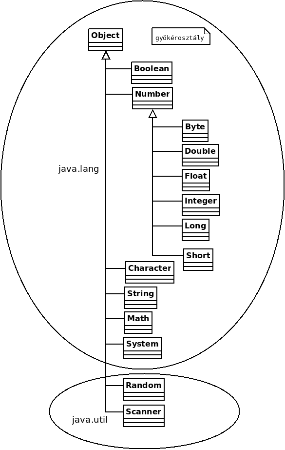

# 3. Tétel: Objektumorientált paradigma

<!--## Az objektumorientált paradigma alapfogalmai-->

Az _objektumorientált_ (OO) paradigma középpontjában a programozási nyelvek absztrakciós
szintjének növelése áll. Ezáltal egyszerűbbé, könnyebbé válik a modellezés, a valós világ jobban
leírható, a valós problémák hatékonyabban oldhatók meg. Az OO szemlélet szerint az _adatmodell_
és a _funkcionális_ modell _egymástól elválaszthatatlan_, külön nem kezelhető. Alapját az **absztrakt
adattípusok** jelentik.

:::tip Példa
Az osztályok fogják megvalósítani az absztrakt adattípust az oo nyelvekben.

:::

:::info Az egységbezárás elve
A valós világot egyetlen modellben kell leírni és együtt kell kezelni a statikus és dinamikus
jellemzőket.

- Statikus jellemzők: adat
- Dinamikus jellemzők: viselkedés

:::

---

## Osztály

Az OO nyelvek legfontosabb alapeszköze, az absztrakt adattípust megvalósító _osztály_.
Az osztály egy absztrakt nyelvi eszköz. Rendelkezik **attribútumokkal** és **metódusokkal**.

- Attribútumok: statikus jellemzőket definiálnak. Segítségével írjuk le az osztályokhoz kötődő
  _adatokat_, _adatmodelleket_. Megvalósítása tetszőleges bonyolultságú adatstruktúrák lehetnek.
- Metódusok: dinamikus jellemzőket definiálnak (eljárás-orientált nyelvekben ~ alprogramok).
  Eljárás metódusok; függvény metódusok.

---

## Objektum

Az objektum egy másik alapeszköze az oo nyelveknek. Konkrét nyelvi eszköz, amely mindig egy osztály
példányaként jön létre. Önmagukban nem léteznek. Az objektum létrejöttét **példányosításnak**
nevezzük. Egy osztálynak egyszerre több példánya is lehet, amelyek az osztályhoz hasonló
adatstruktúrával és viselkedésmóddal rendelkeznek. A memóriában helyezkednek el, ezért van
memóriabeli címük, ahol tárolódik az objektum adatstruktúrája.

## Példányosítás

Példányosításkor lefoglalódik a memóriában egy terület az objektum számára, ott elhelyezésre
kerülnek a példányszintű attribútumok és ezzel meghatározódik az objektum kezdőállapota. Az
objektum ettől kezdve él, van öntudata és tudja melyik osztály példányaként jött létre.

Objektumok kezdőállapotának beállítására az objektum orientált nyelvek egy speciális metódust
szoktak használni. Ezt a metódust nevezik úgy, hogy **konstruktor**.

---

## Öröklődés, osztályhierarchia

### Öröklődés

Az OO nyelvekben az osztályok között létező aszimmetrikus kapcsolat, az újrafelhasználhatóság
eszköze. Az öröklődési viszonynál egy már létező osztályhoz kapcsolódóan hozunk létre egy új
osztályt.

- **Szülőosztály**: más néven szuperosztály vagy alaposztály.
- **Gyermekosztály**: más néven alosztály vagy származtatott osztály.

Öröklődés során az alosztály átveszi (örökli) a szuperosztályának minden (bezárás által
megengedett) attribútumát és metódusát, amelyeket azonnal fel is tud használni. Az alosztály ezen
felül új attribútumokat és metódusokat definiálhat, az átvett neveket átnevezheti, újra deklarálhatja,
vagy megváltoztathatja a láthatóságaikat és újra implementálhatja a metódusokat.

Az imperatív objektum orientált nyelvek szétválasztják a fordítási és futtatási időt. A deklarációt
_fordítási időben_ végzik el, az _öröklődés_ is itt történik. Egy új osztály tehát a fordítási időben jön létre
és emiatt az öröklődés is itt történik -> az öröklődés _statikus_.

A Smalltalk nyelvekben mindez a futási időben történik, azaz az öröklődés _dinamikus_.

#### Egyszeres és többszörös öröklődés

_Egyszeres öröklődés_ során egy osztálynak pontosan egy szuperosztálya lehet, míg _többszörös
öröklődés_ esetén több is. Bármely osztálynak tetszőleges számú alosztálya lehet. Természetesen
egy alosztály lehet egy másik osztály szuperosztálya, így egy **osztályhierarchia** jön létre.

#### Névütközés

Akkor fordul elő, ha a szuperosztályok között van 2 azonos nevű, amely miatt az azonosítás nem
lehetséges egyértelműen.

<!-- TDOD -->

#### Helyettesíthetőség elve, Liskov-elv:

Öröklődéshez kapcsolódóan az újrafelhasználhatóságnak egy jellegzetes megnyilvánulási
formája. Egy leszármaztatott osztály példánya a program szövegében minden olyan helyen megjelenhet,
ahol az előd osztály egy példánya áll.

Példány: Csak egy osztályhoz köthető
Objektum: A példányosító osztályhoz és az ő összes elődosztályaként tekinthetünk rá.

### Osztályhierarchia

Az osztályhierarchia egyszeres öröklődés esetén _fa_, többszörös öröklődés esetén _hálós_
hierarchia (ciklikus gráf).

Mindkettőben értelmezhetőek utak, egy úton elhelyezkedő osztályok iránytól függően egymás
_leszármazott_ - vagy _elődosztályai_. Az egymással öröklődési viszonyban nem lévő osztályok
a kliensosztályok. Az öröklődési viszony aszimmetrikus, a leszármazott látja a szuperosztály
eszközeit, a szuperosztály viszont a leszármazott új eszközeit már nem.

:::info Levél osztály
Az osztályhierarchiában kiemelt elem a **gyökérosztály**, melynek nincs szuperosztálya.

:::

:::tip Példa
A JAVA az egyszeres öröklődést vallja.

Egyes nyelvekben különböző néven:

- gyökérosztály: Object. (java, c#)

:::

:::info Levél osztály
Meg kell említeni még a **levélosztályt**, melynek nincs alosztálya.

A levélosztályok nem szoktak _absztraktak_ lenni. A nyelvekben van lehetőség arra, hogy az
osztályhierarchia egyes osztályait levélosztálynak definiáljuk. Ebben az esetben a levél osztály
tovább már nem örököltethető.

:::

:::tip Példa
Egyes nyelvekben különböző néven:

- levélosztályok: final, sealed. (java, c#)

:::

---

## Polimorfizmus, metódustúlterhelés

### Polimorfizmus

A polimorf metódusok fogalma az öröklődéshez kapcsolódik. Örökölt metódusok
újra implementálását jelenti. Az ilyen újra implementált metódusokat egymás polimorf
metódusának nevezzük.

#### Kötés

Az a mechanizmus, amely megszólítás esetén megmondja, hogy az adott metódus _melyik
osztályban van implementálva_.

:::info Statikus kötés
Már fordítási időben eldől, hogy a metódus melyik osztályban van implementálva és ekkor a helyettesíthetőség
már nem játszik szerepet.

Végrehajtása gyorsabb, mivel nem kell dinamikus kötéseket figyelni, viszont a fordítónak többet
kell dolgoznia, a program lassabban és több memóriát igénybe véve fordul.
:::

:::info Dinamikus kötés
Csak futási időben dől el, hogy a metódus melyik osztályban van implementálva.
Itt a helyettesíthetőség is szerepet játszik. A futtató rendszer megnézi, hogy mely osztály
példányaként hoztuk létre és megkeresi, hogy az a példányosító osztály mely implementációját ismeri.

Rugalmasabb, de lassítja a futást, tehetővé teszi a kacsaszerű típusosságot (duck typing).

:::

### Metódustúlterhelés

Akkor beszélünk ilyenről, ha egy osztályon belül azonos névvel rendelkezik 2 vagy több
metódus. Kell hozzá egy osztály, és osztályon belül azonos nevű metódusok. Ezek a metódusok
eltérő specifikációval kell rendelkezzenek, hiszen csak a specifikációik alapján tudjuk megkülönböztetni őket.

Három féle módon különböztethetjük meg:

- formális paraméterek _száma különbözik_.
- formális paraméterek száma megegyezik, de _típusai különböznek_.
- formális paraméterek száma megegyezik, típusai is megegyeznek, de _sorrendjük eltérő_.
  Ha nem tudjuk megkülönböztetni őket, akkor fordítási hiba keletkezik.

---

## A bezárási eszközrendszer

### Bezárás, láthatóság

Az osztályok eszközeinek a láthatóságát szabályozza. Az eddigi fogalmaink szerint eszköznek
tekintjük a az osztályban deklarált attribútumokat és metódusokat.
Alapvető három szint:

- publikus (public)
- védett (protected)
- privát (private) - láthatatlan öröklődés

:::info Publikus
A publikusként (public) deklarált elemek bárhonnan elérhetőek.

:::

:::info Védett
A védetteket (protected) csak az öröklő és szülő osztályokból lehet elérni (és abból az osztályból, amelyik definiálja az elemet).

:::

:::info Privát
A privát (private) láthatóságúakat csak a definiáló osztály éri el.

:::

---

## Absztrakt osztályok és interfészek

### Absztrakt osztály

_Absztrakt osztályt_ nem lehet példányosítani. Tartalmazhat **viselkedési mintákat**.
Szolgálhat más osztályok ősosztályaként.

Egy absztrakt osztályból származtatott osztálynak implementálnia kell az absztrakt szülő összes viselkedési mintáját.
Ha ezt nem teszi meg, akkor _absztrakt_ osztály marad, viszont ha ennek eleget tesz akkor **konkrét osztállyá** válik.

Ha egy osztályban létezik _implementáció nélküli metódusspecifikáció_, akkor az osztály csak _absztrakt_ osztály lehet.
Egy **konkrét osztály** nem tartalmazhat _implementáció nélküli metódusspecifikációkat_.

Az implementáció nélküli metódusspecifikációk lesznek az absztrakt metódusok. Nem szoktak a _hierarchia_ levél elemei lenni.

:::info Viselkedési minta
Implementáció nélküli metódusspecifikáció.

:::

:::info Konkrét osztály
Akkor konkrét, ha nem absztrakt, illetve nem lehetnek benne absztrakt metódusok.

:::

### Interfész

Viselkedésmódot definiál. Gyakorlatilag egy művelethalmaz deklarációját jelenti. Ha egy osztály
implementál egy adott interfészt, akkor példányai az interfészben meghatározott viselkedéssel
fognak rendelkezni. Csak konstans adattagokat tartalmazhat és minden tagja nyilvános.

Egy interfésznek lehetnek metódusai és változói, de a metódusok egy interfészben mind absztraktak.
Azt mondja meg, hogy egy osztálynak mit kell csinálnia, nem azt, hogy hogyan (blueprint of a class).
Ha egy osztály implementál egy interfészt, akkor muszáj implementálni az összes metódusát is.
Egy osztály egyszerre több interfészt is implementálhat.

---

<!-- TDOD -->

## Típustagok

A típustagok határozzák meg a tárolási helyeket és a végrehajtható kódot. Ezek lehetnek metódusok,
konstruktorok, konstansok, változók és tulajdonságok.

:::info Típusok
osztály, interface, struktúra, felsorolás, metódusreferencia

:::

:::info Típustagok
tulajdonságok, metódusok, konstruktorok, mezők

:::

---

## További információk

- https://arato.inf.unideb.hu/panovics.janos/Programozas220040330.pdf
- https://aries.ektf.hu/~hz/pdf-tamop/pdf-xx/MProg-II-OOP-Jegyzet.pdf
- https://www.studocu.com/hu/document/debreceni-egyetem/magas-szintu-programozasi-nyelvek-2/jegyzet-elmeleti-anyag/2568854
- https://www.studocu.com/hu/document/debreceni-egyetem/magas-szintu-programozasi-nyelvek-2/jegyzet-2-elmeleti-anyag/2568853
