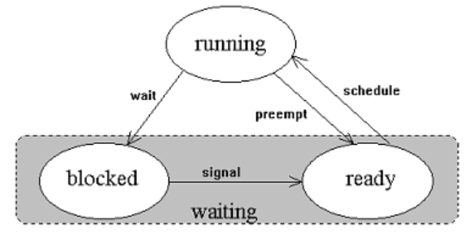

import Tabs from "@theme/Tabs";
import TabItem from "@theme/TabItem";

# 4. Tétel: Operációs rendszerek

## Operációs rendszerek fogalma, felépítése, osztályozásuk.

### Operációs rendszerek fogalma

Az ISO nemzetközi szabványosítási szervezet definíciója szerint az operációs rendszer : "Olyan programrendszer, amely a számítógépes
rendszerben a programok végrehajtását vezérli: így például ütemezi a programok végrehajtását, elosztja az erőforrásokat, biztosítja a
felhasználó és a számítógépes rendszer közötti kommunikációt."

### Operációs rendszerek felépítése

- Rendszermag (kernel): Feladata a hardver optimális kihasználásának irányítása, a kért programok futtatása, alkalmazói kéréseknek kiszolgálása.

- API (Application Programing Interface): Olyan szabálygyűjtemény, mely leírja hogyan kell kérni a szolgáltatásokat a kerneltől, és a kernel válaszát hogyan kapjuk meg.

- Rendszerhéj (shell): Feladata a parancsértelmezés. Lehet a shell parancssoros ( CLI - Command Line Interface - mint, pl. DOS), vagy grafikus - GUI - felületű (pl. Windows)

- Szerviz- és segédprogramok (utility): a felhasználói "élményt" fokozó kiegészítő programok (pl szövegszerkesztők, fordítóprogramok), amelyek nem képzik a rendszer elválaszthatatlan részét.


### Operációs rendszerek osztályozása

1. Felhasználók szempontjából

   - Egyfelhasználós (single user) : DOS
   - Többfelhasználós (multiuser) : UNIX, Novell, Windows XP

2. Egyidőben futtatható programok száma

   - Egyfeladatos (single task): egyszerre csak egy program futhat a gépen : DOS
   - Többfeladatos (multitask): egyszerre több akár különböző alkalmazás képes futni a gépen (pl. míg a háttérben nyomtat addig írom a következő fejezetet) : UNIX, Windows

3. Megvalósítás szerint

   - Interaktív: üzenet alapú
   - Nem interaktív: végrehajtás alapú

4. A gép méretétől függő

   - Mikrogépes
   - Kisgépes
   - Nagygépes (mainframe)

5. Terjesztési licenc alapján

   - kereskedelmi (DOS, Windows és a UNIX bizonyos kiadásai)
   - szabad (UNIX egyes változatai)

## Fájlok és fájlrendszerek.

### Fájl

A számítógépen lévő információtárolási egysége a fájl (file). Egy fájl tartalma a gép szempontjából vagy adat, vagy program. Hagyományos értelemben véve bináris vagy szöveges adatot tartalmazó állományok. A bináris fájlok között érdemes megkülönböztetni legalább a processzor által végrehajtható utasításokat tartalmazókat, amelyeket futtatható fájloknak is nevezhetünk. (megj: a szöveges fájlok között is létezik minden platformon végrehajtható, ezek szokták szkripteknek hívni. Windows alatt ezek a .bat kiterjesztésűek, míg az .exe és a .com a bináris változatuk.)

A fájlban tárolt adat tetszőleges, lehet szöveg, kép, hang stb. Az adatok formájára nézve nincs előírás, a gyakorlatban nagyon sokféle formátum létezik. A fájlt minden operációs rendszer használja, konkrét megjelenése azonban már az operációs rendszertől függ.

A fájlok alapvető jellemzői:

- fájlnév: a név amin keresztül elérhetjük
  - DOS esetén legalább 1, maximum 8 betű szóköz nélkül. Tartalmazhatja az angol ABC 26 betűjét, számjegyeket, kötőjelet és alulvonást.
  - Windows 95... 7: legalább 1, max. 255 betű, szóköz, több pont és ékezet is megengedett.
  - Linux ext2: legalább 1, max. 255 betű, szóköz, több pont és ékezet is megengedett.
- kiterjesztés: nem kötelező, DOS esetén maximum 3 karakter lehet. Általában a fájl jellegére utal.
- méret: a fájl mérete bájtokban.
- dátum: Általában három különbözőt is tárolnak: fájl létrehozásának, utolsó módosításának és utolsó hozzáférésnek dátuma.
- idő: Itt már csak a fájl létrehozásának és utolsó módosításának idejét tárolják.

### Fájlrendszer

A fájlrendszer szűkebb értelemben nem más, mint a fájlok tárolására és rendszerezésére kialakított struktúra egy háttértároló eszközön (pl. floppy lemezen vagy merevlemezen vagy CD-ROM-on), vagy annak egy részén (pl.: merevlemez egy partícióján). A fájlok azonosítása a fájlnév alapján történik a fájlrendszeren belül. Kezdetben itt meg is állt minden, később a CP/M részéről bevezetésre került a - már rég elavultnak tekintendő - meghajtó betűjel (A:, C:, stb.) rendszere, míg a UNIX irányából a könyvtárszerkezet fogalma jelent meg. (A betűjelek használatának több hátránya is van, egyfelől korlátozott számban állnak rendelkezésre (az angol ábécé 26 betűjét használhatjuk) másfelől jelentősen csökkenhet az egész fájlrendszer áttekinthetősége (ha leülünk egy ismeretlen gép elé nem biztos, hogy azonnal rájövünk, mit rejt a T: vagy az S: meghajtó). )

A fájlrendszer UNIX esetén egy tiszta fogalom, mert egyetlenegy gyökér (root - / ) könyvtárral rendelkezik, míg a DOS és Windows estén nem, mert ott meghajtónként van egy-egy. UNIX esetén további fájlrendszerek a meglévő struktúra tetszőleges könyvtárába csatolhatóak, azaz mountolhatóak ( érdemes megjegyezni, hogy ez a lehetőség Reparse Point ( szabad fordításban kevés jelentést hordozó újraelemző pont ) formájában a Microsoft Windows vonatkozásában is megjelent, bár jelentősen lassítva az ezzel az állományok elérését).

A hagyományos fájlrendszerek az alábbi legalapvetőbb szolgáltatásokat nyújtják: létrehoznak, mozgatnak vagy törölnek fájlokat vagy mappákat. Biztosítják a csonkolás (truncate), a kibővítés (append to), a létrehozás (create), a mozgatás (move), a törlés (delete) és a helyben módosítás funkciókat a fájlokra. Nem támogatják viszont a csonkolás a fájl elejétől funkciókat, de esetleg megengednek korlátlan beszúrást a fájl tetszés szerinti helyén, vagy törlést a fájlon belül. Ezeken felül viszont már óriási eltérések adódnak az egyes fájlrendszerek között. Ami viszont még ezek előtt fontos, hogy megismerjük részletesebben a mappák működését.

Precízebben meghatározva: egy fájlrendszer absztrakt adattípusok halmaza, amelyeket adatok tárolására, hierarchikus rendezésére, kezelésére, megtalálására illetve navigálásra, hozzáférésre, és visszakeresésére valósítottak meg.

:::info Metaadatok
A fájlnevek és a fájlok összekapcsolását végzik, öbbnyire valamilyen index.

DOS esetén a FAT táblázat, Unix vonalon az i-node számok.

:::

:::info Mappa
Mappa alatt egy fájlrendszeren belüli entitást értünk, ami valójában egy speciális fájl amely fájlok neveit és a fájlrendszer függvényében a nevekhez tartozó további információkat tartalmaz.

UNIX alapú fájlrendszer (ext2) esetén például az iNode számot, míg mondjuk a Windowsnál használható FAT esetén a fájl további attribútumait, dátumait, stb.

Ami ebből levezethető, hogy ha a mappa fájlokat tárol és ha önmaga is egy fájl akkor következésképp a mappákban létrehozhatunk további (al)mappákat is.
:::

## Speciális fájlok Unix alatt.

A Unix rendszerben található speciális fájltípusok:

- **link**: hivatkozás más fájlra (később részletes leírás találhatsz róla).

  A linkeket egy 'l' betű azonosítja. (szintén később lesz részletezve, hogy léteznek még hard linkek is, amelyek megkülönböztethetetlenek )

  ```
  lrwxrwxrwx termcap
  ```

- **nevesített csővezeték** (named pipe): folyamatok közötti kommunikációra ad lehetőséget, oly módon hogy az egyik alkalmazás kimenetét egy másik alkalmazás bemenetére köti. Egyszerű FIFO (First In First Out) pufferekről van szó, amikbe írni és amikből olvasni lehet. Például a különböző terminálokon futó processzeket is pipe-al lehet összekapcsolni.

  A pipeokat egy 'p' betű azonosítja a hozzáférési jogok sztringjében és a létrehozásuk a mkfifo vagy mknode utasítással történhet. Részletesebb bemutatásuk a csővezetékekről szóló részben található.

  ```
  prw-rw---- mypipe
  ```

- **socket**: speciális fájl melyet a pipeokhoz hasonlóan, folyamatok közötti kommunikációra használnak, de immár hálózatos környezetbe szerver-kliens kommunikáció során.

  Socketre példaként a /var/run/printer fájlt hozhatjuk fel azokon a rendszereken, amelyeken a printer démon fut, ez a fájl socket-ként létezik. Közvetlenül a felhasználó számára szolgáló (parancssoros) socket alkalmazás nincs, arra csak programon belül a bind rendszerhívás segítségével utasíthatjuk a rendszert.

  A socketeket az 's' betűvel jelzett fájlok jelentenek

  ```
  srwxrwxrwx printer
  ```

- eszköz (device) fájlok: ezek a hardver elemeit reprezentálják a fájlrendszerben így hozzáférési jogokat adhatunk az egyes elemeknek, és utasításokban használhatjuk közvetlenül magát az eszközöket. Ide tartozik a billentyűzet, a terminál, a merevlemez, a memória, a floppy stb.

  Az eszközök a hozzáférési jogok sztringjében a c (karakteres elérésű) vagy a b (blokk elérésű eszköz) betű az eszköz kommunikációs módját mutatja, azaz karakterekben (kódtáblának megfeleltetve) vagy blokkokban (átalakítás nélkül) történik az átvitel.

  ```
  crw------- /dev/kbd            # billentyűzet
  brw-rw---- /dev/hda            # első IDE buszos HD (primary master)
  # A merevlemezen található partíciók /dev/hda1 - /dev/hda15 eszköznévvel érhetőek el.
  # Ebből az első négy szolgál az elsődleges partíciók jelölésére, a felette lévőek a logikai meghajtók, illetve az 5-ös a
  # kiterjesztett partíció.
  brw-rw---- /dev/hdb            # második IDE buszos HD (primary slave)
  brw-rw---- /dev/hdc            # harmadik IDE buszos HD (secondary master)
  brw-rw---- /dev/hdd            # negyedik IDE buszos HD (secondary slave)

  brw-rw----  /dev/sda           # első SCSI merevlemez egység
  # Hasonlóan a merevlemezekhez /dev/sda1 - /dev/sda15 néven érhetőek el az egyes partíciók.
  # /dev/sdb ... /dev/sdd szintén azonos értelemben.

  lrwxrwxrwx /dev/cdrom  -> hda  # link a CD-ROM meghajtóra

  crw-rw---- /dev/ttyS0 to /dev/ttyS3 # 0 –3 sz. soros portok

  crw------- /dev/tty1 - /dev/tty6    # virtuális konzolok (AltF1-F6)
  ```

:::tip A 3 legfontosabb, fizikailag nem létező eszköz:

<Tabs>
<TabItem value="1" label="crw-rw-rw- /dev/null" default>
Elfogad és elnyel minden bejövő adatot, kimenetet nem produkál. Teljesen hasonló, mint a DOS
speciális fájlainál említett NUL eszköz. Tipikus felhasználása egy parancs kimenetének
eltüntetése.

```
cat $filename 2>/dev/null >/dev/null
# Ha "$filename" nem létezik nem lesz hibaüzenet (2>)
# Ha "$filename" létezik, akkor a tartalma nem jelenik meg (>)
# Ez így tipikusan akkor hasznos, ha egy programnak a visszatérési értékét akarjuk tesztelni
# és nem érdekes semmilyen kimenete sem.
# A 2> és a > részletes jelentése a -következő- átirányítást bemutató alfejezetben.
```

</TabItem>
<TabItem value="2" label="crw-rw-rw- /dev/random" default>
Változó hosszúságú, véletlenszerűen generált karaktersorozatokat állít elő. Közvetlenül nem
igazán hasznos, de nézzük az alábbi példákat a használatához:

```
Két bájtos decimális egész kinyerése:
od -An -N2 -i /dev/random
# -An kikapcsolja a cím megjelenítését
# -N a megadott méret bájtokban
# -ia kimeneti formátum megadása (egész)

Ha pedig egy tartományból szeretnénk kapni számokat - itt most 100 és 1000 között:
echo $(( 100+(`od -An -N2 -i /dev/random` )%(1000-100+1) ))
# itt most kihasználtuk, hogy a shell képes alapvető egész aritmetikás számításokat végezni- ez a $(( ... )) jel jelentése
# illetve, hogy egy parancson belül egy másik parancs kimenetét szeretnénk felhasználni - ez a `...` rész jelentése.

Lehet használni átmeneti (temp) fájlok létrehozására is:
touch `od -An -N2 -i /dev/random`.tmp
```

</TabItem>
<TabItem value="3" label="crw-rw-rw- /dev/zero" default>
Csupa 0 karakterekből álló karaktersorozatot állít elő. Használható például fájlok
biztonsági törlésére úgy, hogy az eredeti tartalmat több lépcsőben nullákkal írjuk felül.

```
dd if=/dev/zero of=$FILE bs=$BLOCKSIZE count=$BLOCKS
# Fájl kinullázása - a $ jellel bevezetett változókat kell lecserélni a megfelelő értékekre.
# fájl neve, blokkméret - fájlrendszer függő - a fájl mérete blokkokban megadva
# if= bemeneti fájl
# of= kimeneti fájl neve
```

</TabItem>
</Tabs>
:::

## Átirányítás, csővezetékek.

### Átirányítás

A szabványos bemenet (stdin), a szabványos kimenet (stdout) és a szabványos hibakimenet (stderr) átirányítása. Minden egyes elindított folyamat esetén három alapértelmezett eszköz kerül hozzárendelésre a folyamathoz. Ez a szabványos bemenet, ahonnan a program a futás során a beérkező adatokat olvassa, a szabványos kimenet, ahova a program ír és a szabványos hibakimenet (stderr), ahol a program a futás során fellépő hibákra adott hibaüzeneteit írja. Alapesetben a stdin a billentyűzet, az stdout és stderr pedig a képernyő - egészen pontosan pedig a szülő folyamat által használt fájlok, mert egy folyamat a kimenetét mindig a szülőjének adja át!

Mind a bemenet, mind pedig a kimenet (hibakimenet) átirányítható egy tetszőleges állományba. Az átirányítás jelöléseit a program utolsó paramétere után kell feltüntetni. Több átirányítás esetén azok végrehajtása balról jobbra történik.

**< állomány**: stdin átirányítása (a megadott állományból olvas)

**> állomány**: stdout átirányítása (a megadott fájlba ír, létező állomány estén annak tartalmának törlésével és felülírásával)

**>> állomány**: stdout átirányítása (a megadott fájlba ír, létező állomány esetén annak végéhez való hozzáfűzéssel)

**2> állomány**: stderr átirányítása (a megadott fájlba írja a hibaüzenetet)

**&> állomány**: stdout és stderr átirányítása ugyanabba a fájlba

**2>&1**: a stderr-t ugyanoda irányítja, ahova a stdout irányítva lett

**1>&2**: a stdout-ot ugyanoda irányítja, ahova a stderr irányítva lett

:::tip Példa

`dir > lista.txt` a dir átirányítása a lista.txt állományba - ha a fájl eddig nem létezett, létrehozza - ha létezett, felülírja

`dir >> lista.txt` a dir átirányítása a lista.txt állományba - ha a fájl eddig nem létezett, létrehozza - ha létezett, a végéhez hozzáfűzi

`sort < nevek.txt > lista.txt` a nevek.txt rendezése a lista.txt állományba
:::

### Csővezetékek

A cső vagy csővezeték (pipe, pipeline) a programok egy olyan sorozata, amelyek a szabványos folyamaik által vannak összekötve, azaz a Program1 kimenetét (stdout) a Program2 bemenetére (stdin) köti. A második program az első által produkált eredményt tekinti bemenetként. Több programból álló csővezeték is létrehozható. A cső létrehozása az esetleges átirányítások elvégzése előtt történik. Megadása: a két (vagy több) parancsot a | (függőleges vonal) jellel elválasztva adjuk ki egy sorban.

Ennek során egy névtelen csővezeték jön létre, ami a folyamatok közötti kommunikációt hivatott lekezelni és leggyakrabban az operációs rendszer I/O alrendszerén keresztül kerül megvalósításra. Emlékezzünk vissza, hogy Unix alatt speciális fájlként is létre lehet hozni őket, ezek lesznek a nevesített csővezetékek.

:::tip Példák névtelen csővezetékekre:

`dir | sort` a dir kimenetének rendezése

`dir | sort > \temp\lista.txt` a dir kimenetének rendezése, a kimenet a lista.txt állományba átirányítása

`dir | sort | more` a dir kimenetének rendezése majd képernyőnkénti megjelenítése a more által
:::

## Folyamatkezelés.

A Linux többfeladatos (multitask) és többfelhasználós (multiuser) rendszer. Ebből következik, hogy akár egy felhasználó egy időben több programot is futtathat. Az elindított program a processz, azaz folyamat, más megfogalmazásban egy végrehajtható fájl "élő" változata. Gyakran taszknak is nevezik. A folyamatok jól definiált hierarchiát alkotnak. Minden folyamatnak pontosan egy szülője (parent) van, és egy vagy több gyermek folyamata (child process) lehet. A folyamat hierarchia tetején az init folyamat helyezkedik el. Az init folyamat az első létrehozott felhasználói folyamat, a rendszer indulásakor jön létre. Minden felhasználói folyamat az init folyamat leszármazottja. Néhány rendszer folyamat, mint például a swapper és a page daemon (a háttértár kezelésével kapcsolatos folyamatok), szintén a rendszer indulásakor jön létre és nem az init folyamat leszármazottja. Ha egy folyamat befejeződésekor még léteznek aktív gyermek folyamatai, akkor azok árvákká (orphan) válnak és azokat az init folyamat örökli - majd egyben meg is szünteti azokat. A Linux minden egyes feladathoz két számot (PID, process identificator - feladat azonosítót és a PPID, parent process identification - szülő azonosítója) rendel. A rendszer a PID-et automatikusan növeli. Az init folyamat PID-je 1.

Az "életre keltett" folyamatok szekvenciálisan hajtódnak végre, azaz a felhasználó csak akkor kapja vissza a készenléti jelet, ha a végrehajtás befejeződött - alapvetően szinkron módon működik. A processz futhat előtérben (billentyűzetet és a képernyőt magához ragadva), és háttérben (manuálisan is elő lehet idézni, melynek formája:parancsnév&). Ha egy előtérben futó folyamatot szeretnénk háttérbe helyezni, a suspend funkcióhoz rendelt karakterrel (ez rendszerint a Ctrl+Z) tudjuk az előtérben futó folyamatot felfüggeszteni. Ezután pedig a megfelelő parancsokkal tudjuk folytatni a futását, háttérbe helyezni, végleg leállítani, stb.).

Minden processz önálló entitás a saját programszámlálójával és kontextusával. Lehet közöttük együttműködési kapcsolat, akár szinkron, amikor az egyik processz készít valamilyen output-ot, ami a majd másik processz bemenete lesz, illetve aszinkron, amikor már két futó folyamat kommunikál. Szinkron esetben a két processz futásának relatív sebességétől függően előfordulhat, hogy a második processznek várnia kell, amíg az első a kimenetét elkészíti. A második u.m. blokkolt amíg az inputja elkészül. Kérdés merülhet fel, hogyan "billen" ki ebből az állapotból a blokkolt processz. Másrészt az is előfordulhat, hogy egy processz ugyan nem vár semmire, tehát futhatna, de az operációs rendszer egy másik processznek adja át a CPU-t: ekkor is "vár" a processzünk, most a CPU-ra, ezt az állapotát feltétlenül meg kell különböztetni az inputra való várakozástól. Azt mondhatjuk, hogy a processzek - életük során - különböző állapotokban (state) lehetnek, az állapotok között különböző állapotátmenetek lehetségesek. A legegyszerűbb és legáltalánosabb állapot és állapotátmenet diagram a következő:



#### Daemon

Egy speciális háttérfolyamat a **daemon**. Ezek nagy részét a Linux rendszer már a rendszerbetöltéskor elindítja. Számos démon fut a háttérben és figyeli, pl. a lokális hálózatba belépőket, a nyomtatási kérelmeket, stb. Pl.: inetd (tcpd), ftpd, httpd. Tipikusan a szolgáltatásokkal lehet őket azonosítani. Talán ezért is lehet őket a /sbin mappa alatt található service utasítással vezérelni. Inaktív állapotban várakoznak arra, hogy a szolgáltatásuk igénybevételre kerüljön, ekkor aktív állapotba kerülnek, kiszolgálják a kérést, majd visszamennek inaktív állapotba.

#### Zombie

Egy másik speciális helyzetű folyamat a **zombie**, a már halott (leállt), de még a rendszerből el nem tűnt folyamat: akkor lehetséges ez, ha a gyermek folyamat már kilépett, de a szülő még nem fogadta a gyermek visszatérési értékét - még nem vett tudomást gyermeke haláláról (befejeződéséről).

A rendszeren belüli egyes állapotok és a közöttük fellelhető állapotátmeneteket az alábbi ábra szemlélteti:


### Folyamatkezelő parancsok

#### ps

A Process Sate parancs processzusok állapotát jeleníti meg.

Szintaktika:
`ps [kapcsolók]`

Kapcsolók:

- -e : az összes folyamat megjelenítése
- -f: részletes lista
- -u username : megjeleníti az adott felhasználó összes folyamatát

Mezők jelentése:

- PID : a folyamat azonosítója
- TTY : a vezérlő terminál azonosítója
- STAT : a folyamat állapota
- TIME : a processz által eddig elhasznált processzor idő
- CMD : a processz neve

:::tip Példa

```
user@it:~$ ps
PID   TTY   TIME     CMD
15573 pts/4 00:00:00 bash
16407 pts/4 00:00:00 ps
user@it:~$
```

:::

#### pstree

Az initből induló folyamathierarchiát lehet a parancs segítségével megtekintetni fa szerkezetű ábrázolásban.

#### nohup

Mikor a rendszerből kijelentkezünk (azaz a bash bezáródik) minden gyerekfolyamatát a rendszer automatikusan kilövi. Lehetőségünk van azonban arra is, hogy egy folyamatot immúnissá tegyünk kilépésünkre. Hosszan, több óráig, több napig futó programokat a nohup paranccsal indíthatunk.

:::tip Példa

```
user@it:~$ nohup program
user@it:~$
```

:::

#### top

A top a kill és a ps parancs egyesített változata mely folyamatosan futva listázza az éppen aktív folyamatokat, információt nyújt a rendszer állapotáról és terheltségi mutatóiról illetve lehetőséget ad szignálok küldésére folyamatok számára. A top-ot a parancssorban kiadott top utasítással indíthatjuk.

## Jelzések, szignálok.

A Linux rendszer a folyamatok vezérlését a folyamatoknak küldött ún. szignálok segítségével végzi: a Ctrl+Z billentyű például egy STOP szignált küld az előtérben futó processznek. Igen sok (kb. 60 db) szignál létezik, ezek közül csak néhányat tárgyalunk. Processzt megszüntetni szintén szignál(ok) segítségével lehet: az előtérben futó program a Ctrl+C megnyomására egy INT szignált kap, amely rendszerint a program elhalálozását vonja maga után. Háttérben futó folyamatainkat a kill paranccsal állíthatjuk le.

#### kill

A kill a nevével ellentétben nem csak folyamatok megölésére használható, hanem tetszőlegese signalt küldhetünk vele bármely folyamatnak melynek tudjuk a tudjuk a PID számát és rendelkezünk a folyamat kezeléséhez megfelelő jogokkal. Alapértelmezés szerint (signal paraméter nélkül használva) a kill egy TERM (terminate) szignált küld a megadott folyamatnak.

Szintaktika:

`kill [signal] [PID]`

Példa a kill parancs használatára:

```
user@it:~$ ps
PID TTY STAT TIME COMMAND
310 pp0 S    0:00 -bash
313 pp0 R    0:00 ps
321 pp0 R    0:00 find -name= doksi

user@it:~$ kill 321

user@it:~$ ps
PID TTY STAT TIME COMMAND
310 pp0 S    0:00 -bash
334 pp0 R    0:00 ps
user@it:~$
```

Ha más (nem TERM) szignált akarunk küldeni, a kill parancsot megfelelően paraméterezni kell. Folyamatot megölni még a HUP (hangup) és a KILL (9-es) szignálokkal is lehet. (a nohup parancs ezen HUP szignál ellen teszi immúnissá a folyamatot.) A sokféle látszólag azonos hatású szignál oka, hogy korántsem azonos hatásúak: például a HUP és a TERM szignálokat a folyamat felülbírálhatja, saját szignál-kezelő rutint állíthat be. Ezeket a szignálokat a folyamat kapja meg, és alapértelmezés szerinti kezelő rutinjuk lép ki. A KILL szignál hatására viszont a kernel öli meg a folyamatot, annak megkérdezése nélkül. Ezért nem probléma Unixban, ha egy folyamat "lefagy", végtelen ciklusba kerül: egy KILL szignál mindig megoldja a problémát. Szignált csak saját processzeinknek küldhetünk (kivéve a root-ot, aki bármely processzről rendelkezhet). Fontos még az ALARM szignál. Ezzel a rendszert megkérhetjük, hogy megadott idő elteltével küldjön egy jelet. Ezt használják időzítési célokra, többek között a sleep utasítás is így működik.

## Ütemezett végrehajtás.

A UNIX multitaszking képessége nem korlátozódik csak a jelenben a futó folyamatokra. Tartalmaz programokat, amelyek lehetővé teszik a programok ütemezett futtatását, akár egyszeri, akár ismétlődő időközönként. Egy adott időben az at program segítségével indíthatunk el folyamatokat, ismétlődő esetekben pedig a corntab alkalmazással.

#### at

Az at parancs lehetővé teszi a programok,parancsok vagy shell skriptek egy jövőbeli dátum és időben történő futtatását. Például ha e-mailben szeretnénk egy fájl tartalmát elküldeni, vagy a find segítségével szeretnénk egy keresést indítani, akkor amikor a rendszer terheltsége alacsony, például egy hajnali órában.

Az at használatához az alábbi lépéseket hajtsuk végre:

- Adjuk meg az at parancsot egy időspecifikációval,ahol az idő meghatározása lehet:

  - $at 10:30am today
  - $at midnight
  - $at 12:01 1 jan 2012
  - Lásd még a man oldalt további példákért.

- Az at promptjánál (at>) adjuk meg a végrehajtandó parancsot.
- Több utasítás megadásához üssünk Enter-t, vagy CTRL-D-t a befejezéshez.

Ezután egy azonosító rendelődik az ütemezett feladathoz és bekerül a végrehajtási sorba. A sor állapotát az atq paranccsal tekinthetjük meg, ha pedig el szeretnénk távolítani egy ütemezett feladatot, akkor az atrm [job#] paranccsal tehetjük meg.

Ha csak egy parancsot szeretnénk futtatni, akkor azt megtehetjük az interaktív mód használata nélkül is: $at [időspec][szkriptfájl neve]. Például a $at midnight whoison segítségével megnézhetjük kik dolgoznak még éjfélkor is a gépen.

#### crontab

A crontabbal lehetőségünk nyílik időzített programfuttatásra, melynek kimenetéről e-mailben kapunk értesítést.

Mindig csak egy-egy felhasználóra vonatkozó crontabot lehet módosítani. Csak a superuser adhat meg a magáétól különböző felhasználónevet, illetve más crontab könyvtárat a parancshoz. Általában a -e opció jeleneti a saját crontab-unk módosítását. A crontab-ok módosításához a vi vagy a joe szövegszerkesztőt, használja a parancs.

Az egyes mezők tartalmazhatnak időpontot, időintervallumot, skip faktoros időintervallumot, szimbolikus intervallumot a hét napjaira, illetve az év hónapjaira, valamint további részintervallumokat vesszővel elválasztva. A crontab file -ban lévő üres, vagy kettős kereszttel kezdődő sorokat a parancs nem veszi figyelembe. Ha megadtuk a hét és a hónap egyik napját is, akkor a crontab bejegyzés le fog futni minden héten a megadott napon, valamint minden hónapban a megadott napon (a két feltétel vagy kapcsolatát képezzük.).

```
# m h dom mon dow command
# PERC ÓRA NAP HÓNAP AHÉTEGYNAPJA PARANCS # MIN HOUR DAY MONTH DAYOFWEEK COMMAND
# minden nap reggel 6:10-kor
10 6 * * * date

# minden második órában az óra végén
0 */2 * * * date

# minden második órában reggel 11-től este 7-ig , valamint este 8-kor
0 23-7/2,8 * * * date

# este 11-kor negyedikén, valamint minden hétfőn, kedden, és szerdán
0 11 4 * mon-wed date 0 11 4 * mon-wed date

# január elsején délután 4-kor
0 4 1 jan * date 0 4 1 jan * date

# óránként egyszer, és minden kimenet a log file -ba menjen
0 4 1 jan * date >>/var/log/messages 2>&1 0 4 1 jan * date >>/var/log/messages 2>&1
```

## További információk

- https://gyires.inf.unideb.hu/KMITT/b19/pt01.html
- https://gyires.inf.unideb.hu/KMITT/b19/ch03.html
