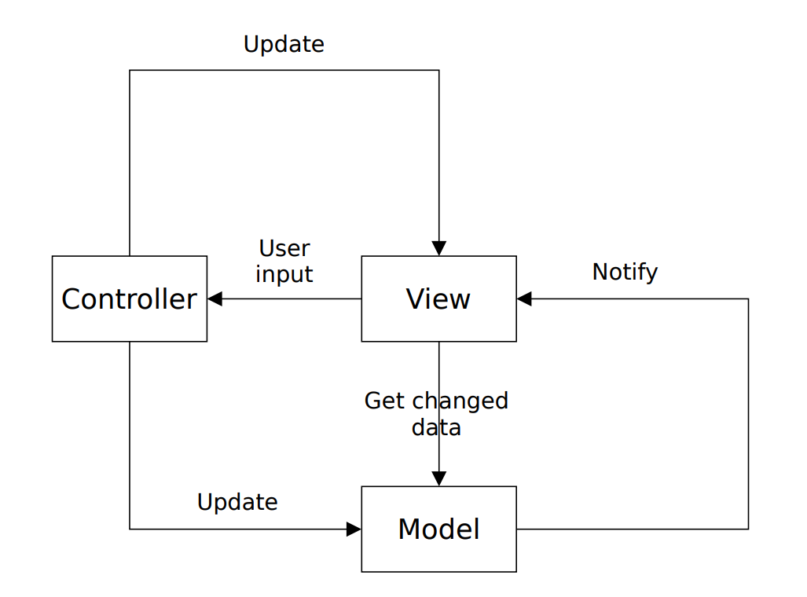

# 5. Tétel: Programozási technológiák

## Verziókezelés, verziókezelő rendszerek

A **verziókezelő rendszer** (version control system, VCS), más néven revíziókezelő vagy forráskezelő rendszer, olyan szoftveres segédprogram, amely nyomon követi és kezeli a fájlrendszerben végzett módosításokat. A VCS ezenkívül együttműködési segédeszközöket is kínál a fájlrendszerben történt módosítások integrálására és más VCS-felhasználókkal való megosztására. Amikor fájlrendszer szintjén működik, a VCS nyomon követi a fájlokon és könyvtárakon végzett hozzáadási, törlési és módosítási műveleteket. Az adattár VCS-kifejezés, amely leírja, hogy a VCS nyomon követ egy fájlrendszert. Az egyedi forráskódfájlok esetében a VCS nyomon követi az adott fájl szövegsorain végzett hozzáadási, törlési és módosítási műveleteket. Az ágazat népszerű szoftveres VCS-megoldásai közé tartozik a Git, a Mercurial, az SVN és a Preforce.

A VCS rendkívül hasznos eszköz, amely számos előnyt biztosít az együttműködési szoftvert használó csapatok munkafolyamatában. A VCS használata határozottan javasolt minden olyan szoftverprojektnél, amelyben egynél több fejlesztő végzi a forráskódfájlok karbantartását. Emellett azonban az egyszemélyes projektek is profitálhatnak a VCS használatából. A modern szoftverfejlesztési projektek tekintetében nincs olyan érv, amely megalapozottá tenné a VCS használatának elhagyását.

:::info Ütközésfeloldás
A csapatok által készített szoftveres projektek élettartama során nagy valószínűséggel előfordul, hogy egyszerre több csapattagnak is módosítania kell ugyanazt a forráskódfájlt. A VCS nyomon követi a több fejlesztő által okozott ütközéseket, és segít a megoldásukban. Ezek az ütközésfeloldási műveletek olyan auditálási nyomot hagynak, amelyek betekintést engednek a projekt előzményeibe.
:::

:::info A forráskód visszaállítása és módosításainak visszavonása
Ha a VCS megkezdi a forráskódfájlok rendszerének nyomon követését, megőrzi a módosítások előzményeit és a forráskód állapotát a projekt teljes időtartama során. Ez lehetővé teszi a forráskód visszavonását vagy visszaállítását a legutóbbi jól működő állapotra. Ha hibát fedeznek fel az élő alkalmazásban, a kódot gyorsan vissza lehet állítani valamelyik biztosan stabil verzióra.
:::

:::info Forráskód biztonsági mentése külső helyszínen
Amikor többen használják a VCS-t, létre kell hozni a VCS távoli példányát, hogy a módosításokat meg lehessen osztani a fejlesztők között. Ezt a távoli VCS-példányt lehet helyszínen kívül, egy megbízható harmadik félnél (például a Bitbucketben) tárolni. Ebben az esetben lesz egy biztonságos, helyszínen kívüli biztonsági másolat. Amennyiben például olyan szerencsétlen helyzet adódik, hogy ellopnak egy laptopot, a távoli VCS-példány továbbra is megőrzi a forráskód egy példányát.
:::

A VCS-eszközök kétféle elsődleges távoliarchitektúra-típussal rendelkeznek. Ez a két architektúratípus a **központosított** és az **elosztott**.

Az egyes architektúratípusok _előnyeinek_ és _hátrányainak_ mérlegelésekor a helyszínen kívüli _biztonsági mentés_ funkció az elsődleges szempont. A _központosított_ VCS egyetlen hibaponttal rendelkezik, amely a távoli központi VCS-példány. Ha ez a példány elveszik, hátrányt okozhat a produktivitásban és adatvesztést eredményezhet, majd pótolni kell a forráskód egy másik példányával. Ha ideiglenesen hozzáférhetetlenné válik, akkor a fejlesztők nem tudják kiadni, összefésülni vagy visszaállítani a kódot. Az _elosztott_ modellnél nem jelentkeznek ezek a buktatók, ugyanis mindegyik VCS-példány megőrzi a forráskód teljes másolatát. Ha a központosított modellnél leírt hibaesemények valamelyike bekövetkezik az elosztott modellnél, új VCS-példányt lehet használni a fő fejlesztési vonalon, így nem kerül sor komoly visszaesésre a produktivitásban.

## Szoftvertesztelési alapfogalmak (tesztszintek, teszttípusok, teszttervezési módszerek)

Tesztelésre azért van szükség, hogy a szoftver termékben meglévő hibákat még az üzembe helyezés előtt megtaláljuk, ezzel növeljük a termék minőségét, megbízhatóságát. Abban szinte biztosak lehetünk, hogy a szoftverben van hiba, hiszen azt emberek fejlesztik és az emberek hibáznak. Gondoljunk arra, hogy a legegyszerűbb programban, mondjuk egy szöveges menü kezelésben, mennyi hibát kellett kijavítani, mielőtt működőképes lett. Tehát abban szinte biztosak lehetünk, hogy tesztelés előtt van hiba, abban viszont nem lehetünk biztosak, hogy tesztelés után nem marad hiba. A tesztelés után azt tudjuk elmondani, hogy a letesztelt részekben nincs hiba, így nő a program megbízhatósága. Ez azt is mutatja, hogy a program azon funkcióit kell tesztelni, amiket a felhasználók legtöbbször fognak használni.

A tesztelés alapjait a következő alapelvekben foglalhatjuk össze:

1. **A tesztelés hibák jelenlétét jelzi**: A tesztelés képes felfedni a hibákat, de azt nem, hogy nincs hiba. Ugyanakkor a szoftver minőségét és megbízhatóságát növeli.
2. **Nem lehetséges kimerítő teszt**: Minden bemeneti kombinációt nem lehet letesztelni (csak egy 10 hosszú karakterláncnak 256^10 lehetséges értéke van) és nem is érdemes. Általában csak a magas kockázatú és magas prioritású részeket teszteljük.
3. **Korai teszt**: Érdemes a tesztelést az életciklus minél korábbi szakaszában elkezdeni, mert minél hamar találunk meg egy hibát (mondjuk a specifikációban), annál olcsóbb javítani. Ez azt is jelenti, hogy nemcsak programot, hanem dokumentumokat is lehet tesztelni.
4. **Hibák csoportosulása**: A tesztelésre csak véges időnk van, ezért a tesztelést azokra a modulokra kell koncentrálni, ahol a hibák a legvalószínűbbek, illetve azokra a bemenetekre kell tesztelnünk, amelyre valószínűleg hibás a szoftver (pl. szélsőértékek).
5. **A féregirtó paradoxon**: Ha az újratesztelés során (lásd később a regressziós tesztet) mindig ugyanazokat a teszteseteket futtatjuk, akkor egy idő után ezek már nem találnak több hibát (mintha a férgek alkalmazkodnának a teszthez). Ezért a tesztjeinket néha bővíteni kell.
6. **A tesztelés függ a körülményektől**: Másképp tesztelünk egy atomerőműnek szánt programot és egy beadandót. Másképp tesztelünk, ha a tesztre 10 napunk vagy csak egy éjszakánk van.
7. **A hibátlan rendszer téveszméje**: Hiába javítjuk ki a hibákat a szoftverben, azzal nem lesz elégedett a megrendelő, ha nem felel meg az igényeinek. Azaz használhatatlan szoftvert nem érdemes tesztelni.

### Tesztszintek

Szoftvertesztelés különböző szinteken végezhető a szoftverfejlesztési folyamatokban:

1. **Egységtesztelés/komponens tesztelés** (unit testing/component testing)
2. **Integrációs tesztelés** (integration testing)
3. **Rendszertesztelés** (system testing)
4. **Elfogadási tesztelés** (acceptance testing)

:::info Egységtesztelés

- A függetlenül tesztelhető komponensekre összpontosít.
- Az egységtesztelést általában az a fejlesztő végzi, aki a kódot írja, de legalább a tesztelt kódhoz való hozzáférés szükséges.
- A fejlesztők gyakran egy komponens kódjának megírása után írnak és hajtanak végre egységteszteket.
- Azonban az automatikus egységtesztek megírása megelőzheti az alkalmazáskód megírását, lásd például a tesztvezérelt fejlesztést (TDD).

:::

:::info Integrációs tesztelés

- Komponensek vagy rendszerek közötti kommunikációra összpontosít.
- Az integrációs teszteknek magára az integrációra kell koncentrálnia, nem pedig az egyes komponensek/rendszerek működésére.

Az integrációs tesztelés két különböző szintje:

- **Komponens integrációs tesztelés**: az integrált komponensek közötti kommunikációra és interfészekre összpontosít.
  - Az egységtesztelés után végzik és általában automatizált.
  - A komponens integrációs tesztelés gyakran a fejlesztők felelősége.
- **Rendszerintegrációs tesztelés**: rendszerek közötti kommunikációra és interfészekre összpontosít.
  - Kiterjedhet külső szervezetekkel és általuk szolgáltatott interfészekkel (például webszolgáltatásokkal) való interakciókra.
  - Történhet a rendszertesztelés után vagy a folyamatban lévő rendszertesztelési tevékenységekkel párhuzamosan.
  - A rendszerintegrációs tesztelés általában a tesztelők felelősége.

:::

:::info Rendszertesztelés

- A rendszer egészének (funkcionális és nem funkcionális) viselkedésére összpontosít.
- Jellemzően független tesztelők végzik jelentős mértékben specifikációkra támaszkodva.

:::

:::info Elfogadási tesztelés

- Annak meghatározására összpontosít, hogy a rendszer kész-e a telepítésre és az ügyfél (végfelhasználó) általi használatra.
- Gyakran az ügyfél vagy a rendszerüzemeltetők felelőssége, de más érintettek is bevonhatók.
- A szoftver kiadása előtt azt néha odaadják potenciális felhasználok egy kis kiválasztott csoportjának kipróbálásra **(alfa tesztelés)** és/vagy reprezentatív felhasználók egy nagyobb halmazának **(béta tesztelés)**.

**Alfa tesztelés**:

- Felhasználók és fejlesztők együtt dolgoznak egy rendszer tesztelésén a fejlesztés közben.
- A fejlesztő szervezet telephelyén történik.

**Béta tesztelés**:

- Akkor történik, amikor egy szoftverrendszer egy korai, néha befejezetlen kiadását elérhetővé teszik kipróbálásra ügyfelek és felhasználók egy nagyobb csoportjának.
- A felhasználók helyén történik.
- Főleg olyan szoftvertermékekhez alkalmazzák, melyeket sok különböző környezetben használnak.
- A marketing egy formája is.

:::

### Teszttípusok

A tesztelés átfogó célja szerint az alábbi teszttípusokat különböztetjük meg:

- **Funkcionális tesztelés** (functional testing)
- **Nem funkcionális tesztelés** (non-functional testing)
- **Fehér dobozos tesztelés** (white-box testing)
- **Változással kapcsolatos tesztelés** (change-related testing)
  - Megerősítő tesztelés (confirmation testing)
  - Regressziós tesztelés (regression testing)

Bármely teszttípus alkalmazható bármely tesztelési szinten.

:::info Funkcionális tesztelés
A rendszer által nyújtott funkciók tesztelése.

Más szóval annak tesztelése, amit a rendszer csinál.

Funkcionális teszteket minden tesztelési szinten ajánlott végezni.

:::

:::info Nem funkcionális tesztelés
Rendszerek olyan jellemzőinek értékelése, mint például a használhatóság, teljesítmény vagy biztonság.

Más szóval annak tesztelése, hogy a rendszer mennyire jól teszi a dolgát.

:::

:::info Fehér dobozos tesztelés
A rendszer belső felépítésén vagy megvalósításán alapuló teszek.

A belső szerkezetbe beleérthető kód, architektúra vagy a rendszeren belüli munkafolyamatok.

:::

:::info Változással kapcsolatos tesztelés
Teszteket kell végezni, amikor módosítások történnek egy rendszerben egy hiba kijavításához vagy új funkcionalitás hozzáadásához/létező funkcionalitás módosításához.

A változással kapcsolatos tesztelés két fajtája:

- **Megerősítő tesztelés**: célja annak megerősítése, hogy az eredeti hiba sikeresen kijavításra került.
- **Regressziós tesztelés**: Lehetséges, hogy egy változás a kód egy részében, akár egy javítás vagy másfajta módosítás, véletlenül hatással van a kód más részeinek viselkedésére. A regressziós tesztelés célja a változások által okozott akartalan mellékhatások érzékelése.

:::

#### Feketedobozos tesztelés és fehérdobozos tesztelés

A tesztelési módszereket időnként a **feketedobozos** (black-box) vagy **fehérdobozos** (white-box) kategóriába sorolják:

:::info **Fekete dobozos tesztelés**
A belső szerkezetének ismerete nélkül vizsgálja egy rendszer funkcionalitását.

- A tesztelők nem férnek hozzá a forráskódhoz.
- Az ilyen tesztelés rendszerint specifikációk és követelmények köré épül: azaz hogy mit kellene, hogy csináljon az alkalmazás, nem pedig hogy hogyan.

:::

:::info **Fehérdobozos tesztelés**
Az alkalmazás belső működését ellenőrzi.

- A forráskód rendelkezésre állását feltételezi.
- A tesztek a forráskódon, nem pedig követelményeken vagy specifikációkon alapulnak.
- Üvegdobozos (glass-box) tesztelésnek is nevezik.

:::

### Teszttervezési módszerek

#### Statikus tesztelési technikák

A **statikus** tesztelési technikák a szoftver forrás kódját vizsgálják **fordítási időben**. Ide tartozik a dokumentáció felülvizsgálata is. A statikus tesztelés párja a **dinamikus** tesztelés, amely a szoftvert **futásidőben teszteli**.

A **statikus** tesztelési technikáknak két fajtája van:

1. **felülvizsgálat** és
2. **statikus elemzés**.

:::info Felülvizsgálat
A **felülvizsgálat** a kód, illetve a dokumentáció, vagy ezek együttes **manuális** átnézését jelenti. Ide tartozik például a _páros programozás_.
:::

:::info Statikus elemzés
A **statikus elemzés** a kód, illetve a dokumentáció **automatikus** vizsgálatát jelenti, ahol a statikus elemzést végző segédeszköz megvizsgálja a kódot (illetve a dokumentációt), hogy bizonyos szabályoknak megfelel-e. Ide tartozik például a helyesírás ellenőrzés.
:::

:::tip Összehasonlítás
A **statikus** technikával más típusú hibák találhatóak meg könnyen, mint a dinamikus tesztelési technikákkal. **Statikus** technikákkal könnyen megtalálhatóak azok a kód sorok,
ahol `null` referencián keresztül akarunk metódust hívni. Ugyanezt elérni _dinamikus_ teszteléssel nagyon költséges, hiszen 100%-os kód lefedettség kell hozzá.

Ugyanakkor **dinamikus** teszteléssel könnyen észrevehető, hogy ha rossz képlet alapján számítjuk pl. az árengedményt. Ugyanezt statikusan nehéz észrevenni, hacsak
nincs egy szemfüles vezető programozónk, aki átlátja az üzleti oldalt is.
:::
:::info Statikus tesztelési technikák előnye
A **statikus** tesztelési technikák **előnye**, hogy nagyon **korán alkalmazhatóak**, már akkor is, amikor még nincs is futtatható verzió. Így hamarabb lehet velük hibákat találni és így gazdaságosabb a hibajavítás.
:::

#### Teszt tervezési technikák

A **dinamikus** tesztelési technikák elsősorban a _komponens teszt_, azon belül is főleg a _unit-teszt_ (egységteszt) fázis eszköze.

A **dinamikus tesztek tervezése** alapvetően az alábbi három lépésből áll:

1. **A tesztelés alanyának, céljának meghatározása** (test condition)
2. **Tesztesetek** (test cases) **specifikálása**
3. **Teszt folyamat** (test procedure) **specifikálása**

:::info
A tesztelési folyamathoz kapcsolódnak még a _teszt készlet_ (test suite), _hibamodell_ és _lefedettség_ (test coverage) fogalmak is.
:::

#### A teszt tervezési technikák fajtái

A szoftver technológia kialakulása óta számos teszt tervezési technika alakult ki. Ezek különböznek a hatékonyságuk, implementálásuk nehézsége, az elméleti háttér és a mindennapi fejlesztési gyakorlatból leszűrt heurisztikák arányában.

Ha áttekintjük a számos publikált technikát és értékeljük ezeket a gyakorlati alkalmazhatóság szempontjából, akkor a technikákat **három lényeges csoportba** sorolhatjuk:

1. **Specifikáció alapú technikák**.
2. **Modell alapú technika** (Model-driven testing).
3. **Struktúra alapú technikák**.
4. **Gyakorlat alapú technikák**.

:::info Specifikáció alapú technikák
Ezek a módszerek a teszteseteket közvetlenül a rendszer specifikációjából (modelljéből) vezetik le. Black-box technikáknak is nevezzük ezeket, mert az egyes szoftver modulok belső szerkezetének ismerete nélkül, az egyes modulok által teljesítendő funkcionalitások alapján tervezhetjük meg a teszt eseteket.
:::

:::info Modell alapú technika (Model-driven testing)
Valójában az előző csoportba tartozik, csak formalizáltabb technika. Közvetlenül az UML modellből vezeti le a teszteseteket, és formalizált teszt specifikációt alkalmaz. Erre használható az UML kiterjesztése. (UTP – UML Testing Profile.)
:::

:::info Struktúra alapú technikák
Ezek a módszerek a kód ismeretében határozzák meg a teszteseteket. White-box technikáknak is nevezzük.
:::

:::info Gyakorlat alapú technikák
A tesztelőknek a munkájuk során megszerzett tapasztalatira épülő, a szakmai intuíciókat is értékesítő technikák.
:::

Természetesen léteznek olyan teszt tervezési módszerek is, amelyek egyik fenti kategóriába sem sorolhatók be, azonban a gyakorlatban alkalmazott módszerek összefogására a jelen jegyzet szintjén ezek a kategóriák beváltak.

## Objektum orientált tervezési alapelvek (GoF, SOLID)

Az objektum orientált tervezés alapelvei (object-oriented design principles) a tervezési mintáknál magasabb absztrakciós szinten írják le, milyen a „jó” program.
A tervezési minták ezeket az alapelveket valósítják meg szintén még egy elég magas
absztrakciós szinten. Végül a tervezési mintákat realizáló programok az alapelvek megvalósulásai. Az alapelveket természetesen úgy is fel lehet használni, hogy nem követjük
a tervezési mintákat.

A tervezési alapelvek abban segítenek, hogy több, általában egyenértékű programozói eszköz (pl. öröklődés és objektum összetétel) közül kiválasszuk azt, amely jobb
kódot eredményez. Általában jó a kód, ha rugalmasan bővíthető, újrafelhasználható komponensekből áll és könnyen érthető más programozók számára is.

### GoF

A GoF-nak 2 alpelve van.

1. Interfészre programozzunk, ne pedig implementációra!
2. Használjunk objektum-összetételt öröklődés helyett, ha lehet!

:::info GoF1

Az alapelv eredeti angol megfogalmazása: _„Program to an interface, not an implementation”_, azaz _„Programozz felületre implementáció helyett”_.

Akkor programozunk implementációra, ha kihasználjuk, hogy egy osztály hogyan
lett implementálva.

Ha implementációra programozunk, és ha megváltozik az osztály, akkor a vele kapcsolatban álló osztályoknak is változniuk kell. Ezzel szemben, ha felületre programozunk, és megváltozik az implementáció, de a felület nem, akkor nem kell megváltoztatni
a többi osztályt.

:::

:::info GoF2

Az alapelv eredeti angol megfogalmazása: _„Favor object composition over class inheritance”_, azaz _„Használj objektum összetételt öröklés helyett, ha csak lehet”_.

Tudjuk, hogy objektum összetétellel mindig ki lehet váltani az öröklődést. Az öröklés azért jó, mert megörököljük az ős összes szolgáltatását (metódusait), amit használni tudunk.
Objektum összetételnél ezen osztály egy példányára szerzek egy referenciát és azon keresztül használjuk a szolgáltatásait.
Ez utóbbi futási időben dinamikusan változhat, hiszen az, hogy melyik objektumra mutat a referencia, futási időben változtatható.

Csatoltság szempontjából az öröklődés a legerősebb, éppen ez az oka, hogy a GOF2 kimondja, hogy használjunk inkább objektum összetételt öröklődés helyett, hiszen az
kisebb csatoltságot eredményez és így rugalmasabb kódot kapunk. Ugyanakkor ki kell emelni, hogy az ilyen kód nehezebben átlátható, ezért nem szabad túlzásba vinni az
objektum összetételt.

:::

### SOLID

A SOLID 5 alapelvből épül fel:

1. **S**ingle responsibility principle (SRP) - Egyszeres felelősség elve
2. **O**pen/closed principle (OCP) - Nyitva zárt elv
3. **L**iskov substitution principle (LSP) - Liskov-féle helyettesítési elv
4. **I**nterface segregation principle (ISP) - Interfész szétválasztási elv
5. **D**ependency inversion principle (DIP) - Függőség megfordítási elv

:::info SRP

Az **egy felelősség egy osztály alapelve** (angolul: _Single Responsibility Principle_ - SRP), kimondja, hogy minden osztálynak egyetlen felelősséget kell lefednie, de azt
teljes egészében. Eredeti angol megfogalmazása: _„A class should have only one reason to change”_, azaz _„Az osztálynak csak egy oka legyen a változásra”_.

Ha egy osztály több felelősségi kört is ellát, akkor sokkal jobban ki van téve a változásoknak, mintha csak egy felelősséget látna el.

Tudjuk, hogy minden módosítás magában hordozza a veszélyt, hogy egy forráskód szörnyet kapjunk, amihez már senki se mer hozzányúlni. Az ilyen kód fejlesztése nagyon drága.

:::

:::info OCP

A **nyitva zárt elv** (angolul: _Open-Closed Principle_ - OCP), kimondja, hogy a program forráskódja legyen nyitott a bővítésre, de zárt a módosításra.
Eredeti angol megfogalmazása: _„Software entities (classes, modules, functions, etc.) should be open for extension but closed for modification.”_

Ugyebár az absztrakt metódusokat muszáj felülírni, de ez nem az OCP megszegése,
hiszen az absztrakt metódusnak nincs törzse, így lényegében a törzzsel bővítem a kódot,
nem módosítok semmit. A másik eset, amikor használhatok felülírást, a horog metódusok felülírása. Akkor beszélek horog metódusokról, ha a metódusnak ugyan van törzse,
de az teljesen üres. Ezek felülírása nem kötelező, csak opcionális, így arra használják
őket, hogy a gyermek osztályok opcionálisan bővíthessék viselkedésüket. Ezek felülírásával lényegében megint csak bővítem a kódot, nem módosítom, azaz nem szegem meg
az OCP elvet.

Az OCP elvet meg lehet fogalmazni a szintaxis szintjén is C# nyelv esetén: Ne használjuk az override kulcsszót, kivéve ha absztrakt vagy horog (angolul: hook) metódust
írunk felül.

:::

:::info LSP

A **Liskov féle behelyettesítési elv**, (angolul: _Liskov Substitutional Principle_ - LSP), kimondja, hogy a program viselkedése nem változhat meg attól, hogy az ős osztály egy
példánya helyett a jövőben valamelyik gyermek osztályának példányát használom.

Eredeti angol megfogalmazása: _„If for each object o1 of type S there is an object o2 of type T such that for all programs
P defined in terms of T, the behavior of P is unchanged when o1 is substituted for o2
then S is a subtype of T”_.

:::

:::tip Példa
Azaz a program által visszaadott érték nem függ attól, hogy egy Kutya vagy egy Vizsla vagy egy Komondor példány lábainak számát adom vissza.
:::

:::info ISP

Az **interfész szétválasztási alapelv** (angolul: _Interface Segregation Principle_ - ISP) azt mondja ki, hogy nem szabad arra kényszeríteni az osztályokat, hogy olyan metódusoktól függjenek, melyeket nem használnak.
Eredeti angol megfogalmazása: _„Classes should not be forced to depend on methods they do not use.”_

:::

:::info DIP

A **függőség megfordítási alapelv** (angolul: _Dependency Inversion Principle_ - DIP) azt mondja ki, hogy:

1. Magas szintű modulok ne függjenek alacsony szintű moduloktól. Mindkettő absztrakcióktól függjön.
2. Az absztrakciók ne függjenek a részletektől. A részletek függjenek az absztrakcióktól.

A magas szintű modulok tartalmazzák az alkalmazás üzleti logikáját, ők adják az alkalmazás identitását.
Ha ezek a modulok alacsony szintű moduloktól függenek, akkor az alacsony szintű modulokban történő változásoknak közvetlen hatása lehet a magas szintű modulokra,
szükségessé tehetik azok változását is.

:::

## Függőség-befecskendezés (DI - dependency injection)

A vezérlés megfordítása (IoC - Inversion of Control) nevű architekturális minta alkalmazásának egy speciális esete.

Angol **definíció**: _„Dependency Injection is a set of software design principles and patterns that enable us to develop loosely coupled code.”_

Magyarul: _„A függőség befecskendezés olyan szoftvertervezési elvek és minták összessége, melyek lazán csatolt kód fejlesztését teszik lehetővé.”_

A **lazán csatoltság** kiterjeszthetővé teszi a kódot, a kiterjeszthetőség pedig karbantarthatóvá.

Egy objektumra egy olyan szolgáltatásként tekintünk, melyet más objektumok kliensként használnak.
Az objektumok közötti kliens-szolgáltató kapcsolatot **függésnek** nevezzük. Ez a kapcsolat tranzitív.

:::info Függőség (dependency)
Egy kliens által igényelt szolgáltatást jelent, mely a feladatának ellátásához szükséges.
:::

:::info Függő (dependent)
Egy kliens objektum, melynek egy függőségre vagy függőségekre van szüksége a feladatának ellátásához.
:::

:::info Objektum gráf (object graph)
Függő objektumok és függőségeik egy összessége.
:::

:::info Befecskendezés (injection)
Egy kliens függőségeinek megadását jelenti.
:::

:::info DI konténer (DI container)
Függőség befecskendezési funkcionalitást nyújtó programkönyvtár.

- Az Inversion of Control (IoC) container kifejezést is használják rájuk.

A függőség befecskendezés alkalmazható DI konténer nélkül.
:::

:::info Tiszta DI
Függőség befecskendezés alkalmazásának gyakorlata DI konténer nélkül.
:::

A függőség befecskendezés objektum gráfok hatékony létrehozásával, ennek mintáival és legjobb gyakorlataival foglalkozik.
A DI keretrendszerek lehetővé teszik, hogy a kliensek a függőségeik létrehozását és azok befecskendezését külső kódra bízzák.

A függőség befecskendezés **előnyei**:

- **Kiterjeszthetőség**
- **Karbantarthatóság**
- **Tesztelhetőség**: a függőség befecskendezés
  támogatja az egységtesztelést.
  - Valós függőségek helyet a tesztelt rendszerbe
    befecskendezhetők „teszt dublőrök” (test doubles).

## Minták

„Minden minta olyan problémát ír le, ami újra és újra felbukkan a környezetünkben, s aztán leírja hozzá a megoldás magját, oly módon, hogy a megoldás
milliószor felhasználható legyen, anélkül, hogy valaha is kétszer ugyanúgy csinálnánk.” - Christopher Alexander

„A minta egy gyakori probléma vagy kérdés általános megoldásának leírása, melyből meghatározható egy konkrét probléma részletes megoldása.” - Scott W. Ambler

„A minta egy olyan ötlet, mely egy gyakorlati környezetben már hasznosnak bizonyult, és várhatóan más környezetekben is hasznos lesz.” - Martin Fowler

Minták osztályozása:

- Architekturális minták/stílusok (architectural patterns/styles)
- Tervezési minták (design patterns)
- Programozási idiómák/implementációs minták (programming idioms/implementation patterns)
- Tesztelési minták (test patterns)
- Felhasználói felület tervezési minták (user interface design patterns)
- Antiminták/ellenminták (antipatterns)
- …

### Architekturális minták (MVC).

Az architekturális minták szoftverrendszerek alapvető szerkezeti felépítésére adnak sémákat. Ehhez előre definiált alrendszereket biztosítanak,
meghatározzák ezek felelősségi köreit, valamint szabályokat és irányelveket tartalmaznak a köztük lévő kapcsolatok szervezésére vonatkozólag.

#### Modell-nézet vezérlő (Model-View-Control - MVC)

- **Név**: Modell-nézet vezérlő (Model-View-Control)
- **Környezet**: Rugalmas ember-gép felülettel rendelkező interaktív alkalmazások.
- **Probléma**: Különösen gyakori az igény a felhasználói felületek változtatására.
  - Erők:
    - Ugyanaz az információt különböző módon jelenik meg különböző helyeken (például oszlop- vagy kördiagramon).
    - Az alkalmazás megjelenítésének és viselkedésének azonnal tükröznie kell az adatokon végzett műveleteket.
    - A felhasználói felület könnyen változtatható kell hogy legyen, akár futásidőben is.
    - Különböző look and feel szabványok támogatása vagy a felhasználói felület portolása nem érintheti az alkalmazás magjának kódját.
- **Megoldás**: Az interaktív alkalmazás három részre osztása:
  - A modell komponens az adatokat és a funkcionalitást csomagolja be, független a kimenet ábrázolásmódjától vagy az input viselkedésétől.
  - A nézet komponensek jelenítik meg az információkat a felhasználónak.
  - A vezérlő fogadja a bemenetet, melyet szolgáltatáskérésekké alakít a modell vagy a nézet felé.

A modell elválasztása a nézet komponenstől több nézetet is lehetővé tesz ugyanahhoz a modellhez.

- Ugyanazok az adatok többféle módon is megjeleníthetők.
  A nézet elválasztása a vezérlő komponenstől kevésbé fontos.
  - Lehetővé tesz ugyanahhoz a nézethez akár több vezérlőt is.
    - A klasszikus példa ugyanahhoz a nézethez szerkeszthető és nem szerkeszthető viselkedés támogatása két vezérlővel.
  - A gyakorlatban sokszor csak egy vezérlő van nézetenként.

### Tervezési minták

A tervezési minták középszintű minták, kisebb léptékűek az architekturális mintáknál.
Alkalmazásuknak nincs hatása egy szoftverrendszer alapvető felépítésére, de nagyban meghatározhatják egy alrendszer felépítését.
Függetlenek egy adott programozási nyelvtől vagy programozási paradigmától.

GoF:

- A tervezési minták egymással együttműködő
  objektumok és osztályok leírásai, amelyek testreszabott formában valamilyen általános tervezési
  problémát oldanak meg egy bizonyos
  összefüggésben.

A minták osztályozása céljuk szerint (GoF):

- **Létrehozási minták (creational patterns)**: az objektumok létrehozásával foglalkoznak.
- **Szerkezeti minták (structural patterns)**: azzal foglalkoznak, hogy hogyan alkotnak osztályok és objektumok nagyobb szerkezeteket.
- **Viselkedési minták (behavioral patterns)**: az osztályok vagy objektumok egymásra hatását valamint a felelősségek elosztását írják le.

A GoF könyv 23 tervezési mintát ír le, időközben számos további tervezési minta született.

:::tip Példa
Függőség befecskendezés (dependency injection), tároló (repository), többke (multiton), iker (twin), folyékony interfész (fluent interface), …
:::

:::info Egyke (Singleton)

- **Cél**: Egy osztályból csak egy példányt engedélyezni, és ehhez globális hozzáférési pontot ad megadni.
- **Indíték**: Egyes osztályok esetében fontos, hogy pontosan egy példány legyen belőlük.
- **Alkalmazhatóság**: Az egyke mintát a következő esetben használjuk: - Pontosan egy példányra van szükség valamelyik osztályból, és annak elérhetőnek kell lennie az ügyfelek számára a jól ismert elérési pontokból.

:::

## Szabad és nem szabad szoftverek

### Nem szabad szoftver

A használat, terjesztés és módosítás tilos, korlátozott, vagy engedélyhez kötött.

- Használják rá a zárt forrású szoftver (closed source software) és a tulajdonosi szoftver (proprietary software) kifejezéseket is.
- A szabad és nyílt forrású szoftverek komplementer halmazát jelentik a nem szabad szoftverek.

### Szabad szoftver

A szabadság az alábbiakat jelenti:

- A szoftver tetszőleges célra szabadon felhasználható.
- A szoftver működése szabadon tanulmányozható.
- A szoftver másolatait szabadon lehet terjeszteni.
- A szoftver szabadon módosítható.

A második és negyedik pont szükséges előfeltétele a
forráskódban rendelkezésre állás.

:::info Nyílt forrású szoftver

- A szabad szoftver mozgalom a szabadság etikai vonatkozásait helyezi előtérbe, míg a nyílt forrás hívei gyakorlatiasabbak, és inkább a technológiai előnyöket hangsúlyozzák.
- A két csoport közötti nézetkülönbségek ellenére gyakorlati szempontból a két fogalom nagyjából ugyanazt jelenti.

:::

:::info Kereskedelmi szoftver

Többnyire anyagi haszonszerzés céljából üzletszerűen fejlesztett szoftver.
A kereskedelmi szoftverek többnyire nem szabadok, de számos kivétel van.

:::

:::info Freeware

- Nincs általánosan elfogadott jelentése.
- Olyan szoftverekre használják, melyek szabadon terjeszthetőek, de nem módosíthatóak (értelemszerűen a forráskód sem áll rendelkezésre).
- Nem szabad szoftver.

:::

:::info Shareware

- Olyan szoftver, mely szabadon terjeszthető, de használata tipikusan olyan feltételek mellett lehetséges, melyek célja bevétel generálása a szerző számára.
- Nem szabad szoftver.

:::

## Szoftverlicencek, szabad és nyílt forrású licencek fajtái

### Szoftverlicenc

Szoftverek használatának és terjesztésének módját szabályozó jogi eszköz.

- Nem szabad szoftverek esetén a végfelhasználói licencszerződés kifejezést használják.

### Szabad és nyílt forrású licencek

Számos szabad és nyílt forrású szoftverlicenc létezik.

Az FSF és az OSI által jóváhagyott szabad illetve nyílt forrású licencek listáján valamennyi elterjedten használt licenc szerepel.

#### Megengedő szabad és nyílt szoftverlicencek

- A szabad és nyílt licencek egy részhalmazát alkotják a **megengedő (permissive)** licencek.
- Csupán minimális mértékben korlátozzák a hatályuk alatt terjesztett szoftverek felhasználását és terjesztését.
- Használják rájuk a **nem copyleft (non-copyleft)** kifejezést is.

:::tip Példa

- Apache License 2.0
- BSD licencek:
  - 3 klauzulás BSD licenc (3-Clause BSD License/New BSD License/Modified BSD License)
  - 2 klauzulás BSD licenc (Simplified BSD License/FreeBSD License)
- Python Software Foundation (PSF) License
- X11 License (MIT License)
- MIT License

:::

A név szerint említett licencek mindegyike lehetővé teszi a hatálya alatt terjesztett szoftverek felhasználását nem szabad szoftverekhez.

- Beleértve akár a forráskód módosítását és a módosított források beépítését nem szabad szoftverekbe.

#### Copyleft

- A szó a copyright kifejezés elferdítése.
- Egy, a szerzői joggal éppen ellentétes célú jogi megoldást jelent, melyet szabad és nyílt forrású szoftverlicencekben használnak.
- Alkalmazásával „elidegeníthetetlen köztulajdon” hozható létre.
- A copyleft jogi formulát használó szoftverlicencek.
  - A pejoratív **virális licenc (viral licene)** kifejezést is használják rájuk.
- A szabad és nyílt forrású licencek egy, a megengedő licencektől diszjunkt _részhalmazát_ képviselik.
- A megoldást használó szabad licencek között is megkülönböztetünk **erős** és **gyenge** copyleft licenceket.

:::info Erős copyleft licenc
A copyleft korlátozás nélkül érvényesül, mely kizárja a hatálya alá eső szoftverek nem szabad szoftverek fejlesztésekhez való felhasználását.

- Példa: GNU General Public License (GNU GPL)

:::

:::info Gyenge copyleft licenc
Lehetőséget ad a hatálya alatt terjesztett alkotások olyan korlátozott módon való felhasználására, melynél a felhasználó alkotásokra nem vonatkozik a copyleft.

- Példa: GNU Lesser General Public License (GNU LGPL), Mozilla Public License (MPL)

:::

## További információk

- https://bitbucket.org/product/hu/version-control-software
- https://mad-hatter.it.unideb.hu/portal/displayDocument/Szervezeti%20tárak/Kari%20tárak/IK/Dokumentumtár/Doktori%20védések/Objektumorientált%20tervezési%20alapelvek%20és%20tervezési%20minták%20döntésalapú%20elemzése,%20a%20döntésösszevonás%20elmélet%20és%20gyakorlata%20értekezés.pdf
- https://arato.inf.unideb.hu/jeszenszky.peter/download/swe/presentations/hu/
- https://gyires.inf.unideb.hu/KMITT/c12/
- https://gyires.inf.unideb.hu/KMITT/c02/
- https://gyires.inf.unideb.hu/teszt/Szoftverteszteles_a_gyakorlatban.pdf
- https://publikacio.uni-eszterhazy.hu/6037/1/437_441_Kusper_Márien.pdf
