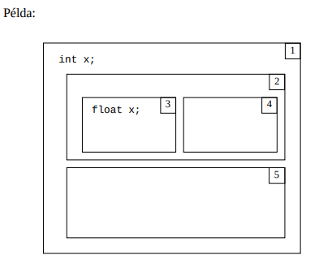

# 2M. Tétel: Lexikális egységek

## Lexikális egységek.

- A lexikális egységek a program szövegének azon elemei, melyeket a fordító a lexikális elemzés során felismer és tokenizál.
- PL: azonosítók (pl: saját objektumaink elnevezése), kulcsszavak (nyelv számára fenntartva), standard azonosítók, elhatároló jelek, megjegyzések, literálok (a literál az maga az érték, ami az értéket tárolja az a változó).

## Adattípusok.

- Az adattípus egy absztrakt programozási eszköz, amely mindig más, konkrét programozási eszköz komponenseként jeleniti meg.
- Az adattípusnak neve van, ami egy azonosító.
- A programozási nyelvek egy része ismeri, a másik nem e szerint típusos és nem típusos nyelvek.
- Egy adattípust három dolog határoz meg: - Tartomány: - Az adattípusok tartománya azokat az elemeket tartalmazza, amelyeket az adott típusú konkrét programozási eszköz felvehet értékként. Ezen tartomány elemei jelenhetnek meg a programban literálként. - Műveletek: - Az adattípushoz hozzátartoznak a műveletek, amelyeket a tartomány elemein végre tudunk hajtani. - Reprezentáció: - A reprezentáció az egyes típusok tartományába tartozó értékek tárban való megjelenését határozza meg, hogy hány bájtra és milyen bitkombinációban képződjenek le.
  Egyszerű adattípus: Pl: String
  Összetett adattípus: Pl: Tömb

## Nevesített konstans.

- Egy nevesített konstansnak három komponense van. (típus, név, érték)
  - Pl: final int myVariable = 2;
- Muszáj mindig deklarálni. Egy nevesített konstans a neve által van reprezentálva. A név mindig egy érték komponenst takar.
- Az érték komponenst nem lehet változtatni futási időben, a deklarálásnál eldőlt az értéke.
- Nevesített konstans szerepe, hogy engedjük a programozó számára, egy gyakran használt értéknek egy jól leíró nevet adni.
- Az előnye, hogy elegendő a deklarálásnál megváltoztatni az értékét, nem kell az összes előfordulásnál változtatni.

## Változó.

- A változó egy olyan azonosító, amely az információ ideiglenes tárolására szolgál.
- A program végehajtásakor az adatokat változókban tároljuk. A változókban tárolt adatok a program futása közben változhatnak, módosulhatnak.
- Típusai: string, integer, double etc.

## Kifejezések.

- Összetevői:
  - Operandusok (literál, nevesített konstans, változó vagy függvényhívás)
  - Operátorok (műveleti jelek, az értékkel végrehajtandó műveletet határozzák meg)
  - Kerek zárójelek (a műveletek végrehajtási sorrendjét befolyásolják)
- A legegyszerűbb kifejezés egy operandusból áll.
- Lehet egyoperandusú, kétoperandusú vagy három operandusú.
- Kétoperandusú esetén:
  - Prefix (\* 3 5)
  - Infix (3 \* 5)
  - Postfix (3 5 \*)
- Az egy operandusúak általában az operátorok előtt állnak.
- Az a folyamat, amikor a kifejezés értéke és típusa meghatározódik, a kifejezés kiértékelésének nevezzük. A kiértékelés során adott sorrendben elvégezzük a műveleteket, előáll az érték, és hozzárendelődik a típus.

### Imperatív programnyelv:

- Lépések sorozatával írjuk le, hogy mit csináljon a gép. (PL: Java)

### Deklaratív programnyelv:

- Leírjuk, hogy mit akarunk kapni. (PL: SQL)

## Utasítások.

- A programozásban az utasítást úgy lehet felfogni, mint egy imperatív programnyelv legkisebb elemét. A programot egy vagy több utasítás sorozata alkotja, ahol az utasítások rendelkeznek belső komponensekkel (kifejezésekkel).
- Fajtái:
  - Üres utasítás (pl: if, aminek a belseje üres)
  - Értékadó utasítás (értékadás változónak)
  - Beolvasó utasítás (billentyűzetről)
  - Kiíró utasítás (monitorra kiírt)
  - Ugró utasítás (struktúrált, nem struktúrált, pl: GOTO)
  - Megjegyzés (magyarázó szöveg)
  - Elágazások (feltételes utasítás pl: if (kétirányú), switch vagy if-else (többirányú))
  - Ciklusok (üres ciklus, végtelen ciklus, feltételes ciklus (while), végfeltételes ciklus (do-while), előírt lépésszámú ciklus (paraméterben megadott adatoknak megfelelően))
  - Vezérlésátadó (break, continue, return)

## Programegységek.

- Alprogram (függvény, metódus (eljárás))
- Blokk
- Csomag
- Taszk

### Alprogramok:

- Az alprogram mint absztrakciós eszköz egy bemeneti adatcsoportot képez le egy kimeneti adatcsoportra úgy, hogy egy specifikáció megadja az adatok leírását, de semmit nem tudunk magáról a tényleges leképezésről.
- Ismerjük a specifikációt, de nem ismerjük az implementációt.
- Az alprogram, mint programozási eszköz az újrafelhasználás eszköze.
- Akkor alkalmazható, ha a program különböző pontjain ugyanaz a programrész megismétlődik. Ez az ismétlődő programrész kiemelhető, egyszer kell megírni, és a program azon pontjain, ahol ez a programrész szerepelt volna, csak hivatkozni kell rá – az alprogram az adott helyeken meghívható, aktivizálható.
- Az alprogram attól lesz absztrakciós eszköz, hogy a kiemelt programrészt formális paraméterekkel látjuk el, vagyis általánosabban írjuk meg, mint ahogyan az adott helyeken szerepelt volna.

- Formálisan az alprogram a következőképpen épül fel:

  - Fej
  - Törzs
  - Vég

- 4 komponensből áll:
  - Név (azonosító)
  - Formális paraméter lista (kerek zárójel)
  - Törzs (Deklarációs és végrehajtó utasítások szerepelnek. deklarált eszközök az alprogramon kívül nem láthatóak)
  - Környezet (globális változók együttese)
- Eljárás:
  - Olyan alprogram, amely valamilyen tevékenységet hajt végre. A hívás helyén ezen tevékenység eredményét használhatjuk fel. Hatását a környezetének megváltoztatásával, illetve a törzsben elhelyezett utasítások végrehajtásával fejti ki.
- Függvény:
  - Olyan alprogram, melynek az a feladata, hogy egyetlen értéket határozzon meg. Függvény visszatérési értékének a típusa egy olyan információ, amely hozzátartozik a függvény specifikációjához.
- Formális paraméterlista:
  - A formális paraméterlista kerek zárójelek között áll.
  - Lehet üres, ekkor paraméter nélküli alprogramról beszélünk.

## Paraméterkiértékelés, paraméterátadás.

### Paraméterkiértékelés

- Paraméterkiértékelés alatt értjük azt a folyamatot, amikor egy alprogram hívásánál egymáshoz rendelődnek a formális- és aktuális paraméterek, és meghatározódnak azok az információk, amelyek a paraméterátadásnál a kommunikációt szolgáltatják.
- A paraméterkiértékelésnél mindig a formális paraméter lista az elsődleges, ezt az alprogram specifikációja tartalmazza, egy darab van belőle. Aktuális paraméter lista viszont annyi lehet, ahányszor meghívjuk az alprogramot.
- Tehát az egymáshoz rendelésnél mindig a formális paraméter lista a meghatározó, mindig az aktuális paramétereket rendeljük a formálisakhoz.
- A felsorolás sorrendjében rendelődnek a formális paraméterekhez az aktuális paraméterek.
- A formális paraméterek száma fix, ekkor a paraméterkiértékelés kétféle módon mehet végbe.
  - Az aktuális paraméterek számának egyeznie kell a formális paraméterek számával.
  - Az aktuális paraméterek száma kevesebb lehet, mint a formális paraméterek száma. Ez csak érték szerinti paraméterátadási mód esetén lehetséges. Azon formális paraméterekhez, amelyekhez nem tartozik aktuális paraméter, a formális paraméter listában alapértelmezett módon rendelődik érték.
- Formális és aktuális paraméter közötti kapcsolat:
  - Van olyan nyelv, ami azt vallja, hogy az aktuális paraméter típusának azonosnak kell lennie a formális paraméter típusával. A nyelvek másik része a típuskényszerítés alapján azt mondja, hogy az aktuális paraméter típusának konvertálhatónak kell lennie a formális paraméter típusára.
- Címkomponens:
  - A változó címkomponense a tárnak azt a részét határozza meg, ahol a változó értéke elhelyezkedik. A futási idő azon részét, amikor egy változó rendelkezik címkomponenssel, a változó élettartamának hívjuk.

### Paraméterátadás

- A paraméterátadás az alprogramok és más programegységek közötti kommunikáció egy formája. A paraméterátadásnál mindig van egy hívó, ez tetszőleges programegység, és egy hívott, amelyik mindig alprogram.
- Kérdés, hogy melyik irányban és milyen információ mozog.
- A nyelvek a következő paraméterátadási módokat ismerik:
  - Érték szerint
  - Cím szerint
  - Eredmény szerinti
  - Érték-eredmény szerinti
  - Név szerinti
  - Cím szerinti
- Érték szerinti paraméterátadás:
  - Esetén a formális paraméternek van címkomponensük a hívott alprogram területén. Az aktuális paraméternek rendelkeznie kell értékkomponenssel a hívó oldalon. Ez az érték meghatározódik a paraméterkiértékelés folyamán, majd átkerül a hívott alprogram területén lefoglalt címkomponensbe. A formális paraméter kap egy kezdőértéket, és az alprogram ezzel dolgozik a saját területén. Az információáramlás egyirányú, a hívótól a hívott felé irányul. A hívott alprogram semmit sem tud a hívóról. Mindig van értékmásolás.
- Cím szerinti paraméterátadás:
  - A formális paramétereknek nincs címkomponensük a hívott alprogram területén. Az aktuális paraméternek viszont rendelkeznie kell címkomponenssel a hívó területén. Paraméterkiértékeléskor meghatározódik az aktuális paraméter címe és átadódik a hívott alprogramnak, ez lesz a formális paraméter címkomponense. Tehát a meghívott alprogram a hívó területén dolgozik. Az információátadás kétirányú, az alprogram a hívó területéről átvehet értéket, és írhat is oda. Időben gyors, mert nincs értékmásolás.
- Eredmény szerinti paraméterátadás:
  - A formális paraméternek van címkomponense a hívott alprogram területén, az aktuális paraméternek lennie kell címkomponensének. A paraméterkiértékelésnél meghatározódik az aktuális paraméter címe, és átadódik a hívott alprogramnak, azonban az alprogram a saját területén dolgozik, és a futás közben nem használja ezt a címet. A működésének befejeztekor viszont átmásolja a formális paraméter értékét erre a címkomponensre. A kommunikáció egyirányú, a hívottól a hívó felé irányul. Van értékmásolás.
- Érték-eredmény paraméterátadás:
  - A formális paraméternek van címkomponense a hívott területén és az aktuális paraméternek rendelkeznie kell érték és címkomponenssel. A paraméterkiértékelésnél meghatározódik az aktuális paraméter értéke és címe és mindkettő átkerül a hívotthoz. Az alprogram a kapott értékkel, mint kezdőértékkel kezd el dolgozni a saját területén és a címet nem használja. Miután viszont befejeződik, a formális paraméter értéke átmásolódik az aktuális paraméter címére. A kommunikáció kétirányú, kétszer van értékmásolás.
- Név szerinti paraméterátadás:
  - Az aktuális paraméter egy, az adott szövegkörnyezetben értelmezhető tetszőleges szimbólumsorozat lehet. A paraméterkiértékelésnél rögzítődik az alprogram szövegkörnyezete, itt értelmezésre kerül az aktuális paraméter, majd a szimbólumsorozat a formális paraméter nevének minden előfordulását felülírja az alprogram szövegében, és ezután fut le az. Az információáramlás iránya az aktuális paraméter adott szövegkörnyezetbeli értelmezésétől függ.
- Szöveg szerinti paraméterátadás:
  - A szöveg szerinti paraméterátadás a név szerintinek egy változata, annyiban különbözik tőle, hogy a hívás után az alprogram elkezd működni, az aktuális paraméter értelmező szövegkörnyezetének rögzítése és a formális paraméter felülírása csak akkor következik be, amikor a formális paraméter neve először fordul elő az alprogram szövegében a végrehajtás folyamán.
- Az alprogramok formális paramétereit három csoportra oszthatjuk:
  - Input paraméterek: ezek segítségével az alprogram kap információt a hívótól (pl. érték szerinti paraméterátadás).
  - Output paraméterek: a hívott alprogram ad át információt a hívónak (pl. eredmény szerinti paraméterátadás).
  - Input-output paraméterek: az információ mindkét irányba mozog (pl. érték-eredmény szerinti paraméterátadás).

## Blokk.

- A blokk egy olyan programegység, amely csak másik programegység belsejében helyezkedhet el, külső szinten nem állhat.
- Formálisan a blokknak van kezdete, törzse, vége.
- A kezdet és a véget egy-egy speciális karaktersorozat vagy alapszó jelzi.
- A törzsben lehetnek deklarációs és végrehajtható utasítások. Ugyanúgy, mint az alprogramoknál, ezek az utasítások vagy tetszőlegesen keverhetők, vagy van külön deklarációs rész és végrehajtható rész.
- A blokknak nincs paramétere.
- Bárhol elhelyezhető, ahol végrehajtható utasítás állhat.
- Egyes nyelvekben lehet neve.
- Aktivizálni úgy lehet, hogy szekvenciálisan rákerül a vezérlés, vagy úgy, hogy GOTO-utasítással ráugrunk a kezdetére.

## Hatáskörkezelés, láthatóság.

### Hatáskör:

- A hatáskör a nevekhez kapcsolódó fogalom.
- Egy név hatásköre alatt értjük a program szövegének azon részét, ahol az adott név ugyanazt a programozási eszközt hivatkozza, tehát jelentése, felhasználási módja jellemzői azonosak. A hatáskör szinonimája a láthatóság.
- Egy programegységben deklarált nevet a programegység lokális nevének nevezzük. Azt a nevet, amelyet nem a programegységben deklaráltunk, de ott hivatkozunk rá, szabad névnek (globális?!) hívjuk.
- A név hatásköre az eljárásorientált programozási nyelvekben a programegységekhez, illetve a fordítási egységekhez kapcsolódik.
- Egy programegységben deklarált név a programegység lokális neve.
- Azt a tevékenységet, amikor egy név hatáskörét megállapítjuk, hatáskörkezelésnek hívjuk.
- Kétfélét ismerünk: statikus és dinamikus.
  - Statikus hatáskörkezelés:
    - Fordítási időben történik, a fordítóprogram végzi. Alapja a programszöveg, programegység szerkezete.
    - Ha a fordító egy programegységben talál egy szabad nevet, akkor kilép a tartalmazó programegységbe, és megnézi, hogy a név ott lokális-e. Ha igen a folyamatnak vége, ha nem keresi tovább, míg lokális névként meg nem találja vagy el nem jut a legkülső szintre.
    - Ha kiért a legkülső szintre, 2 eset lehetséges:
      - A név nem volt deklarálva, a programozó feladata, hogy minden nevet deklaráljon, ezért fordítási hiba.
      - Másik eset, hogy a nyelv ismeri az automatikus deklarációt, és ilyenkor hozzárendeli az automatikus deklaráció szabályainak megfelelő attribútumokat. Ilyenkor a név a legkülső szint lokális neveként értelmeződik.
    - A hatáskör befelé terjed, kifelé soha. Egy programegység a lokális neveit bezárja a külvilág elől. Azt a nevet, amely egy adott programegységben nem lokális név, de onnan látható, globális névnek hívjuk.
      
    - Dinamikus hatáskörkezelés:
      - Futási idejű tevékenység, a futtató rendszer végzi. Alapja a hívási lánc. Ha a futtató rendszer egy programegységben talál egy szabad nevet, akkor a hívási láncon keresztül kezd el visszalépkedni mindaddig, amíg meg nem találja lokális névként vagy a hívási lánc elejére nem ér. Ez utóbbi esetén vagy futási hiba keletkezik vagy automatikus deklaráció következik be.

## Absztrakt adattípus.

- Az absztrakt adattípus olyan adattípus, amely megvalósítja a bezárást vagy információ rejtést. Ez azt jelenti, hogy ezen adattípusnál nem ismerjük a reprezentációt és a műveletek implementációját. Az adattípus ezeket nem mutatja meg a külvilág számára. Az ilyen típusú programozási eszközök értékeihez csak szabályzott módon, a műveleteinek specifikációi által meghatározott interface-en keresztül férhetünk hozzá. Pl: tömb

## Kivételkezelés.

- A kivételkezelési eszközrendszer azt teszi lehetővé, hogy az operációs rendszertől átvegyük a megszakítások kezelését, felhozzuk azt a program szintjére. A kivételek olyan események, amelyek megszakítást okoznak. A kivételkezelés az a tevékenység, amelyet a program végez, ha egy kivétel következik be. A kivételeknek általában van neve és kódja.
- Pl: Null Pointer exception, FileNotFound exception, ArrayIndexOutOfBounds
