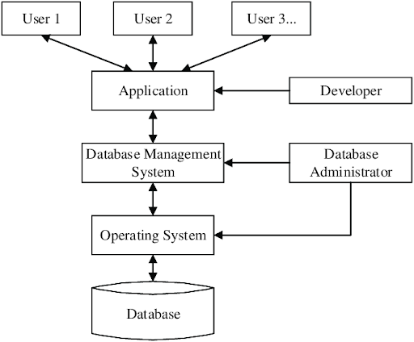

# 1M. Tétel: Adatbázisrendszerek

## Adatbázis, adatbázisrendszer, adatbázis-kezelő rendszer (DBMS) fogalma és jellemzői.

#### Adat

- Olyan ismert tény, mely számszerűsíthető és magától értetődő jelentése van.

### Adatbázis

- Az adatbázis azonos jellemzőjű (logikailag összefüggő, egymáshoz kapcsolódó), adatok összessége.

- Speciális célra tervezett és felépített adatok együttese.

### Adatbázisrendszer

- A számítógépek, szoftverek, adatok és felhasználók (adatbázis-adminisztrátor,
  szakértő, eseti) összessége.

#### Adatbázis felhasználók:

- Akik használják
- Akik karbantartják és üzemeltetik a DBMS-t.

#### Adatbázis adminisztrátor:

- Felelős az adatbázis ellenőrzött eléréséért, használatának koordinálásáért és monitorozásáért, szoftver és hardver eszközök telepítéséért és használatuk ellenőrzéséért, a műveletek hatékonyságának monitorozásáért.

#### Adatbázis tervezők:

- Felelősek a tartalom, szerkezet, a megszorítások definiálásáért, és az adatbázis felé intézett funkciókért és tranzakciókért.

#### Végfelhasználók:

- Az adatokat lekérdezésekre, adatok frissítésére használják.
- 2 fajta: eseti (alkalomszerű elérés), naív (nagyobb részük)

#### 3 DBMS séma:

- Belső séma (belső szinten a szerkezet és az elérési utak, jellemzően fizikai adatmodell)
- Koncepcionális (koncepcionális szinten a teljes adatbázis szerkezetének és megszorításainak leírása. Jellemzően implementációs sémát vagy koncepcionális sémát használ.)
- Külső séma (a külső felhasználói nézetek leírására, rendszerint ugyan az az adatmodell, mint a koncepcionális sémánál.)

#### Logikai és fizikai adatfüggetlenség:

- Logikai: Annak képessége, hogy a koncepcionális séma anélkül változzon meg, hogy a külső sémának és a hozzájuk rendelt alkalmazói programoknak meg kellene változni.
- Fizikai: Annak képessége, hogy a belső séma anélkül változzon meg, hogy a koncepcionális sémának meg kellene változnia.

### Adatbázis-kezelő rendszer (DBMS)

1. Olyan szoftvercsomag / rendszer, amely a számítógépes adatbázisok létrehozását és karbantartását támogatja.
2. Jellemzői:
   - Egy konkrét adatbázis definiálása adattípusai, szerkezete és megszorításai révén.
   - Az adatbázis kezelése
     - Keresés: lekérdezés.
     - Módosítás: beszúrás, törlés, tartalom frissítése.
     - Adatbázis elérése web alkalmazáson keresztül.
   - Adatok megjelenítése.
   - Feldolgozás és megosztás, közben adat érvényes és konzisztens.
   - Védelmi és biztonsági szolgáltatások.
   - Az adatbázis és a kapcsolódó programok karbantartása.
   - Kliens és szerver oldalon mindennek telepítve kell lennie
   - Lekérdezés és tranzakciós szolgáltatásokat nyújt

#### Az adatbázis megközelítés fő jellemzői:

- DBMS egy adatbázis leírását tárolja (adatszerkezetek, adattípusok)
- A leírás meta adatokból épül fel. (adatokra vonatkozó adat)
- Programok és adatok elszigetelése. (program-adat függetlenség). Lehetővé teszi az adatszerkezetek és a tárolás módjának megváltoztatását anélkül, hogy a DBMS-t elérő programot meg kellene változtatni.
- Adat absztrakció: egy adatmodellt használunk arra, hogy a tárolási részleteket elrejtsük és csak az adatbázis koncepcionális képét jelenítsük meg a felhasználónak.
  Adatok többféle nézetének támogatása. Minden felhasználó különböző képet láthat, ami őt érdekli.

## Egyed, tulajdonság és kapcsolat fogalma és tulajdonságai.

### Egyed

- A valós világnak az az eleme, amely a modellezés tárgyát képezi. (személy,fogalom, elképzelés)

### Tulajdonság

- Az egyednek a modellezés szempontjából lényeges jellemzője. (pl: neve)

#### Tulajdonságtípus:

- Az azonos szerepű tulajdonságok absztrakciója. (pl: hallgató neve, évfolyama)

#### Egyedtípus:

- Az azonos tulajdonságtípusokkal rendelkező egyedek absztrakciója. (pl: hallgató,tantárgy)

### Kapcsolat

- A két vagy több egyedtípus egyedei között fennálló viszony. (pl: xy felvette az adatbázis tárgyat)

#### Kapcsolattípus:

- Két vagy több egyedtípus egyedei között jól meghatározott viszony. (pl: a hallgató és a tantárgy között fennálló felvételi viszony)

#### Adatbázis séma:

-Az adatbázis leírása. Az adatbázis szerkezetének, az adattípusoknak és a megszorításoknak a leírását tartalmazza.

#### Kapcsolat foka:

- Meghatározza, hogy hány egyedtípus vesz részt a kapcsolatban.
- Lehet:
  - Bináris (másodfokú) pl: hallgató - tárgy
  - Ternáris (harmadfokú) pl: bank - számla - ügyfél

#### Kapcsolat számossága:

- Meghatározza, hogy hány kapcsolat-előfordulásban vehet részt egy egyedelőfordulás.
- Lehet:

  - 1:1 pl: házasság (az egyed minden egyes előfordulásához pontosan a másik egyed egy előfordulása tartozik)

  - 1:N pl: autó - személyek (egyik egyed minden előfordulásához, a másik egyed több előfordulása is tartozhat.)
  - M:N pl: hallgató - tárgyak (mindkét egyed előfordulásához a másik egyed több előfordulása tartozhat)

#### Kapcsolat szorossága:

- Meghatározza, hogy a kapcsolatban részt vevő egyedtípusok minden egyedének részt kell-e vennie legalább egy kapcsolat-előfordulásban.
- Lehet:
  - Kötelező pl: autó - autótulajdonos
  - Félig kötelező pl: autó - személy (minden autó egyednek részt kell vennie egy kapcsolat-előfordulásban)
  - Opcionális pl: könyv - könyvtártag

#### Tulajdonságtípusok osztályozása:

- Szerkezete szerint:
  - Egyszerű
  - Összetett
- Hány értéket vehet fel:
  - Egyértékű
  - Többértékű
- Minden esetben megjelenik e a háttértárolón:
  - Tárolt
  - Származtatott

#### Tulajdonság-előfordulás, mint NULL érték:

- Nem értelmezett, ismeretlen.

## Relációs, objektum-relációs és NoSQL adatbázisok jellemzése.

#### Relációs modell:

- Tedd Codd vezette be 1970-ben az IBM-nél.
- Előnyei:
  - egyszerűen értelmezhető a felhasználók és az alkalmazás készítők számára is, így lehet köztük ez a kommunikáció eszköze.
  - A logikai adatmodell reláció egy relációs adatbázis kezelő rendszerbe módosítások nélkül átvihetők.
  - Jellemzője, hogy az adatokat több, egymással összekapcsolt rendszerben ábrázolja.
  - Manapság a legelterjedtebb modell.
  - Alapját a matematikában is használatos reláció jelenti.
  - Egy új módszert alkalmaz a lekérdezések megvalósítására a relációkon értelmezett műveletek segítségével.

#### Reláció:

A reláció értékek egy táblázata, amely sorok egy halmazából áll.

#### Sor:

Minden egyes sor adatelemei a modellezett kisvilág egy egyed-előfordulásáról vagy egy kapcsolat-előfordulásáról tartalmaznak információkat.

#### Oszlop:

Minden egyes oszlop egy oszlop fejléccel rendelkezik, amely az illető oszlopban lévő adatok jelentéséről ad információt.

#### Kulcs:

Minden sor rendelkezik egy olyan adatelem értékkel, amely egyértelműen azonosítja a sort a táblázatban, ez a kulcs.

#### Atomi érték:

atomi egy olyan érték, amit nem tudunk további részekre bontani.

#### Reláció séma:

Jelentése alatt R(A1,A2,....,An) jelölést értjük, ahol az R a reláció neve, az A1,A2,An az attribútumok.

#### Attribútum:

Egy szerepkör neve.

#### Egyedintegritási megszorítás:

egyetlen egyed kulcsa sem lehet NULL érték.

#### Elsődleges kulcs:

Modellező feladata, hogy kiválasszon egyet a relációséma elsődleges kulcsául. Ez az érték lesz az, ami alapján azonosítjuk a relációkban szereplő rekordokat. Aláhúzással jelöljük.

### RDBMS (Relációs adatbázis modell):

- Az alapja az SQL, ezzel férünk hozzá.
- Az adatok tárolása az adatbázisban tábláknak nevezett objektekben történik.
- A tábla az egy gyűjteménye az azonos adatoknak és sorokból és oszlopokból áll.
- Minden tábla apró részekre van osztva, amiket mezőknek nevezünk.
- Egy mező egy oszlop a táblában és arra tervezték, hogy specifikus adatokat tároljon minden rekordról.
- A record pedig a sor.

### ORDBMS (Objektum relációs adatbázis modell):

- Minden olyat támogat, amit a relációs adatbázis is, de emellé támogatja az objektum-orientáltságot is.
- A classokat, objektumokat, öröklődést is.
- Bármelyik lekérdező nyelvvel használhatjuk az adatok módosítására.
- OQL a saját lekérdező nyelve (Object query language)
- Példa: PostgreSQL

### NOSQL (Not only sql):

- Az adatokat nem táblákban tárolják.
- A legtöbb NoSQL adatbázis szerver erősen optimalizált írás és olvasás műveletekre, míg ezen túl nem sok műveletet támogatnak.
- A jobb sebesség és a skálázhatóság érdekében olyan adatszerkezeteket használnak tárolásra, mint a kulcs-érték párok, gráfok, dokumentum-adatbázisok.
- Leginkább a real-time web alkalmazásokban és a big data-ban használatosak.

## A funkcionális függés fogalma.

- ha egy rendszerben szereplő egyik tulajdonságtípus bármely értékéhez egy másik tulajdonságtípusnak csakis egy értéke rendelhető hozzá. Azt fejezi ki, hogy például az autó rendszámából következik a tulajdonos neve és az autó típusa is.

#### Adatmodell:

- A logikai adatbázis szerkezeti leírását, a rajtuk végrehajtható műveleteket, és bizonyos egszorításokat foglalja magába.
- Szerkezete:
  - Építőelemekkel definiáljuk.
  - Megszorítások pedig korlátozásokat vezetnek be az érvényes adatokon.

#### Fajtái:

- Koncepcionális (magas szintű, olyan fogalmakkal dolgozik, amely közel áll ahhoz, hogyan gondolkodik egy felhasználó. Nem írja le a struktúráját a DB-nek.)
- Fizikai (alacsony szintű, leírja, hogyan tárolódik el az adat)
- Implementációs pl: relációs modell (DBMS is ezt használja)

## Koncepcionális adatbázis-tervezés, az ER modell és leképezése relációs modellre.

### A koncepcionális adatmodellek tervezés lépései

- Követelményrendszer felállítása és analízise
- Az adatbázis koncepcionális sémájának létrehozása: a koncepcionális séma a felhasználók adat követelményeinek egy tömör leírása
- Az adatbázis tényleges megvalósítása: ezt a lépést logikai tervezésnek vagy az adatmodell leképezésének nevezzük
- Fizikai tervezés: megadjuk az adatbázis állományainak belső tárolási szerkezetét, indexeit, elérési útjait és állományszervezési módjait

### ER modell

- Az adatokat, mint egyedeket, kapcsolatokat és attribútumokat írja le. Az ER modell által kezelt alapvető objektum az egyed, amely a valós világnak egy olyan darabja, amely a modellezés tárgyát képezi.
- Minden egyednek vannak attribútumai ezek az őt leíró tulajdonságok. Az egyedeket leíró attribútum értékek fogják alkotni az adatbázisban tárolt adatok nagy részét.

### Az ER séma leképezése relációs sémára

1. Erős egyedtípusok leképezése (rendelkezik saját kulcs attribútummal)
2. Gyenge egyedtípusok leképezése (nem rendelkezik saját kulcs attribútummal)
3. Bináris 1:1 számosságú kapcsolattípusok leképezése
4. Bináris 1: N számosságú kapcsolattípusok leképezése
5. Bináris M:N számosságú kapcsolattípusok leképezése
6. Többértékű attribútumok leképezése
7. Az n-ed fokú kapcsolattípusok leképezése

## Az SQL elemei: DDL, DML, DCL, egyszerű lekérdezések és táblák összekapcsolása.

#### SQL (Struktúrált lekérdező nyelv):

- Adatbázisokhoz való hozzáférést teszi lehetővé és rajtuk a módosításokat.

### DDL- Data Definition Language:

- Adatleíró nyelv (Data Definition Language)
- A DBA (db adminisztrátor) és az adatbázis tervezők használják azért, hogy az adatbázis koncepcionális sémáját megváltoztassák. Pl: ALTER,DROP,CREATE

### DML - Data Manipulation Language:

- Adatmanipulációs nyelv (Data Manipulation Language)
- Arra használjuk, hogy az adatbázisból való keresést illetve az adatbázis frissítését specifikáljuk. Pl: DELETE,INSERT,UPDATE

#### DQL:

- Data Query Language
- SELECT

### DCL - Data Control Language:

- Data Control Language
- Az adatbázis rendszer vezérlésével kapcsolatos parancsok, jogok, engedélyek
- GRANT: Egy felhasználónak, csoportnak elérés biztosítása egy objektumhoz
- REVOKE: fordítva

#### TCL:

- Transaction control language
- COMMIT (véglegesítés)
- ROLLBACK (vissza)
- SAVEPOINT (mentési pont)
- SET TRANSACTION (tranzakció karakterisztikája)
