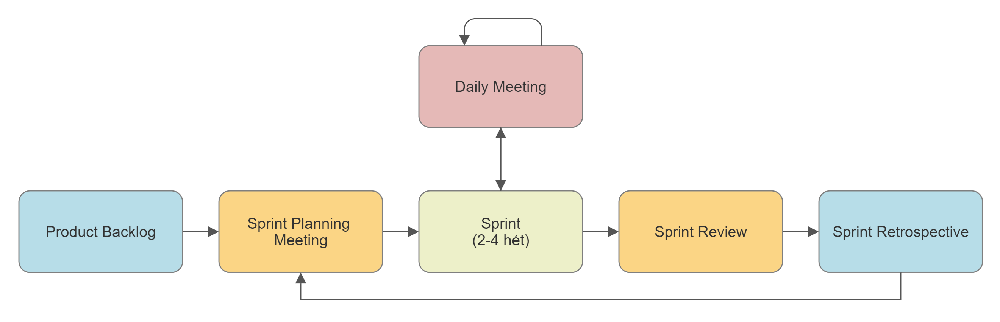

# 6. Tétel: Szoftverfejlesztési módszertanok

A módszertanok feladata, hogy meghatározzák, hogy a szoftver életciklus egyes lépései milyen sorrendben követik egymást, milyen dokumentumokat,
szoftver termékeket kell előállítani és hogyan. Egy nagy szabálykönyvre emlékeztetnek, ami pontosan leírja, hogyan kell szoftvert „főzni”.
Ha betartjuk a receptet, akkor egy átlagos minőségű szoftvert kapunk, de az átlagos minőség garantált.

A szoftverfejlesztés életciklusában megjelenő általános feladatok a következők:

1. Követelmények megfogalmazása - funkcionális specifikáció
2. Rendszertervezés (design) - rendszerterv
3. Kódolás, testreszabás és tesztelés
4. Bevezetés

A szoftverfolyamat modellje a szoftverfolyamat absztrakt reprezentációja. Minden egyes modell különböző speciális perspektívából reprezentál egy folyamatot,
de ily módon csak részleges információval szolgálhat magáról a folyamatról. Ezek az általános modellek nem a szoftverfolyamat pontos, végleges leírásai,
hanem valójában inkább hasznos absztrakciók, amelyet a szoftverfejlesztés különböző megközelítési módjainak megértéséhez használhatunk.
Az irodalomban számos szoftverfejlesztési modell alakult ki az évek során és található meg, melyekből a legismertebb folyamatmodelleket fogjuk a továbbiakban tárgyalni.

A modellek használata azonban korántsem kizárólagos. Sőt, talán ki is jelenthetjük, hogy kevés olyan vállalat van, aki csupán egy modellt használ folyamatainak leírásához.
A gyakorlatban inkább előszeretettel alkalmaznak több fejlesztési modellt egyszerre, főként nagy, komplex rendszerek fejlesztésekor.
Ebben az esetben legfőbb cél mindig az, hogy az adott fejlesztési környezet mellett a modellek a környezetre vetített előnyős tulajdonságaikat emeljék ki,
és adoptálják az adott környezetre.

## Hagyományos szoftverfejlesztési módszertanok

### Vízesés modell (Waterfall Model)

A szoftverfejlesztés történetének első publikált modellje, amely más tervezői modellekből származik.
Az elnevezése onnan fakad, hogy a fejlesztésben felmerülő tevékenységeket jól elválasztható lépésekben, lépcsősen ábrázolja, ami alapján vízesésmodellként vált ismertté.

A modell alapvető szakaszai alapvető fejlesztési tevékenységekre képezhetők le. Ezek:

1. Követelmények elemzése és meghozása
2. Rendszer és szoftvertervezés
3. Implementáció és egységteszt
4. Integráció és rendszerteszt
5. Működtetés és karbantartás

:::info Követelmények elemzése és meghozása
A rendszer szolgáltatásai, megszorításai és célja a rendszer felhasználóival történő konzultáció alapján alakul ki. Ezeket később részletesen kifejtik, és ezek szolgáltatják a rendszer specifikációt.

:::

:::info Rendszer és szoftvertervezés
A rendszer tervezési folyamatában választódnak szét a hardver- és szoftverkövetelmények. Itt kell kialakítani a rendszer átfogó architektúráját. A szoftver tervezése az alapvető szoftverrendszer-absztrakciók, illetve a közöttük levő kapcsolatok azonosítását és leírását is magában foglalja.

:::

:::info Implementáció és egységteszt
Ebben a szakaszban a szoftverterv programok, illetve programegységek halmazaként realizálódik. Az egységteszt azt ellenőrzi, hogy minden egység megfelel-e a specifikációjának.

:::

:::info Integráció és rendszerteszt
Megtörténik a különálló programegységek, illetve programok integrálása és teljes rendszerként való tesztelése, hogy a rendszer megfelel-e a követelményeknek. A tesztelés után a szoftverrendszer átadható az ügyfélnek.

:::

:::info Működtetés és karbantartás
Általában ez a szoftver életciklusának leghosszabb fázisa. Megtörtént a rendszertelepítés és megtörtént a rendszer gyakorlati használatbavétele. A karbantartásba beletartozik az olyan hibák javítása, amelyekre nem derült fény az életciklus korábbi szakaszaiban, a rendszeregységek implementációjának továbbfejlesztése, valamint a rendszer szolgáltatásainak továbbfejlesztése a felmerülő új követelményeknek megfelelően.

:::

A fázisok eredménye tulajdonképpen egy dokumentum. A modell fontos szabálya, hogy a következő fázis addig nem indulhat el, amíg az előző fázis be nem fejeződött.
A gyakorlatban persze ezek a szakaszok kissé átfedhetik egymást. Maga a szoftverfolyamat nem egyszerű lineáris modell, hanem a fejlesztési tevékenységek iterációjának sorozata.
Ez a vízesésmodellnél a visszacsatolásokban jelenik meg.

A dokumentumok előállításának költségéből adódóan az iterációk költségesek, és jelentős átdolgozást igényelnek. Ezért megszokott, hogy már kisszámú iteráció után
is befagyasztják az adott fejlesztési fázist, és a fejlesztést későbbi fázisokkal folytatják. A problémák feloldását későbbre halasztják, kihagyják vagy kikerülik azokat.
A követelmények ilyen idő előtti befagyasztása oda vezethet, hogy a rendszer nem azt fogja tenni, mint amit a felhasználó akart.

Az életciklus utolsó szakaszában a felhasználók használatba veszik a szoftvert. Ilyenkor derülnek ki az eredeti rendszerkövetelmények hibái és hiányosságai.
Program és tervezési hibák kerülnek elő, továbbá felmerülhet új funkciók szükségessége is. Ezekből adódóan a rendszert át kell alakítani, amely néhány vagy
akár az összes korábbi folyamatszakasz megismétlésével is járhat.

A vízesésmodell legfőbb problémáját a projekt szakaszainak különálló részekké történő nem flexibilis partícionálása okozza. Egy komplex, bonyolult probléma
megoldása nem végezhető el hatékonyan ezzel a megközelítéssel. A vízesésmodell csak akkor használható jól, ha már előre jól ismerjük a követelményeket,
melyeket részletes és pontos specifikáció követ.

### V-modell

A V-modell (angolul: V-Model vagy Vee Model) a nevét onnan kapta, hogy két szára van és így egy V betűhöz hasonlít. Az egyik szára megegyezik a vízesés modellel. Ez a fejlesztési szár. A másik szára a létrejövő termékek tesztjeit tartalmazza. Ez a tesztelési szár. Az egy szinten lévő fejlesztési és tesztelési lépések összetartoznak, azaz a tesztelési lépés a fejlesztési lépés során létrejött dokumentumokat használja, vagy a létrejött terméket teszteli.

A V-modell a vízesés modell kiegészítése teszteléssel. Ez azt jelenti, hogy először végre kell hajtani a fejlesztés lépéseit, ezután jönnek a tesztelés lépései. Ha valamelyik teszt hibát talál, akkor vissza kell menni a megfelelő fejlesztési lépésre.

A V-modell hasonlóan a vízesés modellhez nagyon merev, de alkalmazói kevésbé ragaszkodnak ehhez a merevséghez, mint a vízesés modell alkalmazói. Ennek megfelelően jobban elterjedt. Fő jellemzője a teszt központi szerepe.

Egy tipikus V-modell változatban először felmérjük az igényeket és elkészítjük a követelmény specifikációt. Ezt üzleti elemzők végzik, akik a megrendelő és a fejlesztők fejével is képesek gondolkozni. A követelmény specifikációban jól meghatározott átvételi kritériumokat fogalmaznak meg, amik lehetnek funkcionális és nemfunkcionális igények is. Ez lesz majd az alapja a felhasználói átvételi tesztnek (User Acceptance Test, UAT). Magát a követelmény specifikációt is tesztelik. A felhasználók tüzetesen átnézik az üzleti elemzők segítségével, hogy ténylegesen minden igényüket lefedi-e a dokumentum. Ez lényeges része a modellnek, mert a folyamatban visszafelé haladni nem lehet, és ha rossz a követelmény specifikáció, akkor nem az igényeknek megfelelő szoftver fog elkészülni. Ezzel szemben például a prototípus modellben lehet pongyola az igényfelmérés, mert az a prototípusok során úgyis pontosításra kerül.

Ezután következik a funkcionális specifikáció elkészítése, amely leírja, hogyan kell majd működnie a szoftvernek. Ez lesz a rendszerteszt alapja. Ha a funkcionális specifikáció azt írja, hogy a „Vásárol gomb megnyomására ki kell írni a kosárban lévő áruk értékét”, akkor a rendszertesztben lesz egy vagy több teszteset, amely ezt teszteli. Például, ha üres a kosár, akkor az árnak nullának kell lennie.

Ezután következik a rendszerterv, amely leírja, hogy az egyes funkciókat hogyan, milyen komponensekkel, osztályokkal, metódusokkal, adatbázissal fogjuk megvalósítani. Ez lesz a komponens teszt egyik alapja. A rendszerterv leírja tovább, hogy a komponensek hogyan működnek együtt. Ez lesz az integrációs teszt alapja.

Ezután a rendszertervnek megfelelően következik az implementáció. Minden metódushoz egy vagy több unit-tesztet kell készíteni. Ezek alapja nem csak az implementáció, hanem a rendszerterv is. A nagyobb egységeket, osztályokat, al- és főfunkciókat is komponens teszt alá kell vetni az implementáció és a rendszerterv alapján.

Ha ezen sikeresen túl vagyunk, akkor az integrációs teszt következik a rendszerterv alapján. Ha itt problémák merülnek fel, akkor visszamegyünk a V betű másik szárára a rendszertervhez. Megnézzük, hogy a hiba a rendszertervben vagy az implementációban van-e. Ha kell, megváltoztatjuk a rendszertervet, majd az implementációt is.

Az integrációs teszt után jön a rendszerteszt a funkcionális specifikáció alapján. Hasonlóan, hiba esetén a V betű másik szárára megyünk, azaz visszalépünk a funkcionális specifikáció elkészítésére. Majd jön az átvételi teszt a követelmény specifikáció alapján. Remélhetőleg itt már nem lesz hiba, mert kezdhetnénk az egészet elölről, ami egyenlő a sikertelen projekttel.

Ha a fejlesztés és tesztelés alatt nem változnak a követelmények, akkor ez egy nagyon jó, kiforrott, támogatott módszertan. Ha valószínű a követelmények változása, akkor inkább iteratív, vagy még inkább agilis módszert válasszunk.

### Spirális fejlesztési modell

A spirális fejlesztési modellt Boehm javasolta először már 1986-ban a „A Spiral Model of Software Development and Enhancement” címmel megjelent publikációjában, amely azóta széles körben elterjedt az irodalomban és a gyakorlatban is. A modell alapgondolata szintén eltér az eddigiektől, mert a szoftverfolyamatot nem tevékenységek és közöttük található esetleg visszalépések sorozataként tekinti, hanem inkább egy spirálként reprezentálja. A spirál minden egyes körben a szoftverfolyamat egy-egy fázisát reprezentálja. A spirálnak, mint a folyamatot reprezentáló vonalnak egy további sugallnivalója is van. Mégpedig az, hogy tetszőleges számú kör, mint iteráció tehető meg.

A legbelső kör a megvalósíthatósággal foglalkozik, a következő a rendszer követelményeinek meghatározása, a következő kör pedig a rendszer tervezésével foglalkozik, és így tovább.

A spirál minden egyes ciklusát négy fő szektorra oszthatjuk fel:

1. **Célok kijelölése**: az adott projektfázis által kitűzött célok meghatározása. Azonosítani kell a folyamat megszorításait, a terméket, fel kell vázolni a kapcsolódó menedzselési tervet. Fel kell ismerni a projekt kockázati tényezőit, és azoktól függően alternatív stratégiákat kell tervezni ha lehetséges.
2. **Kockázat becslése**: minden egyes felismert kockázati tényező esetén részletes elemzésre kerül sor. Lépéseket kell tenni a kockázat csökkentése érdekében.
3. **Fejlesztés és validálás**: a kockázat kiértékelése után egy fejlesztési modellt kell választani a problémának megfelelően. Pl. evolúciós, vízesés, stb modellek.
4. **Tervezés**: A folyamat azon fázisa, amikor dönteni kell arról, hogy folytatódjon-e egy következő ciklussal, vagy sem. Ha a folytatás mellett döntünk, akkor fel kell vázolni a projekt következő fázisát.

Egy spirálciklus mindig a célok meghatározásával kezdődik. Ekkor fel kell sorolni a megvalósítás lehetőségeit, és meg kell vizsgálni azok megszorításait is. Minden egyes célhoz meg kell határozni egy lehetséges alternatívát, amely azt eredményezi, hogy azonosításra kerülnek a projekt kockázati forrásai is. A következő lépés ezeknek a kockázatoknak a kiértékelése, majd végül pedig a tervezési fázis következik, ahol eldönthetjük, hogy szükség van-e egy további ciklusra vagy sem.

Miben más a spirális fejlesztési modell az egyéb szoftverfolyamat-modelltől? Itt a modell explicite számol a kockázati tényezőkkel, amelyek problémákat okozhatnak a projektben. Ilyen például a határidő- és költségtúllépések. A modell egy tipikus alkalmazási területe napjainkban a játékfejlesztés iparága, mégpedig azért, mert a mai vezető számítógépes játékok nagyon komplex, sok embert igénylő szoftverfejlesztési folyamat, ahol gyakran kell határidőcsúszásokkal is számolni.

### Prototípus alapú fejlesztés

A prototípus modell válasz a vízesés modell sikertelenségére. A fejlesztő cégek rájöttek, hogy tarthatatlan a vízesés modell megközelítése, hogy a rendszerrel a felhasználó csak a projekt végén találkozik. Gyakran csak ekkor derült ki, hogy az életciklus elején félreértették egymást a felek és nem a valós követelményeknek megfelelő rendszer született. Ezt elkerülendő a prototípus modell azt mondja, hogy a végső átadás előtt több prototípust is szállítsunk le, hogy mihamarabb kiderüljenek a félreértések, illetve a megrendelő lássa, mit várhat a rendszertől.

A prototípus alapú megközelítése a fejlesztésnek azon alapszik, hogy a megrendelő üzleti folyamatai, követelményei nem ismerhetők meg teljesen. Már csak azért sem, mert ezek az idővel változnak (lásd az agilis módszertanokat). A követelményeket érdemes finomítani prototípusok segítségével. Ha a felhasználó használatba vesz egy prototípust, akkor képes megfogalmazni, hogy az miért nem felel meg az elvárásainak és hogyan kellene megváltoztatni. Ebben a megközelítésben a leszállított rendszer is egy prototípus.

Ez a megközelítés annyira sikeres volt, hogy a modern módszertanok majd mindegyike prototípus alapú. Az iteratív módszerek általában minden mérföldkőhöz kötnek egy prototípust. Az agilis módszertanok akár minden nap új (lásd napi fordítás) prototípust állítanak elő.

A kezdeti prototípus fejlesztése általában a következő lépésekből áll:

- **1. lépés**: Az alap követelmények meghatározása: Olyan alap követelmények meghatározása, mint a bemeneti és kimeneti adatok. Általában a teljesítményre vagy a biztonságra vonatkozó követelményekkel nem foglalkozunk.
- **2. lépés**: Kezdeti prototípus kifejlesztése: Csak a felhasználói felületeket fejlesztjük le egy erre alkalmas CASE eszközzel. A mögötte lévő funkciókat nem, kivéve az új ablakok nyitását.
- **3. lépés**: Bemutatás: Ez egyfajta felhasználói átvételi teszt. A végfelhasználók megvizsgálják a prototípust, és jelzik, hogy mit gondolnak másként, illetve mit tennének még hozzá.
- **4. lépés**: A követelmények pontosítása: A visszajelzéseket felhasználva pontosítjuk a követelmény specifikációt. Ha még mindig nem elég pontos a specifikáció, akkor a prototípust továbbfejlesztjük és ugrunk a 3. lépésre. Ha elég pontos képet kaptunk arról, hogy mit is akar a megrendelő, akkor az egyes módszertanok mást és mást írnak elő.

A prototípus készítést akkor a legcélszerűbb használni, ha a rendszer és a felhasználó között sok lesz a párbeszéd. A modell on-line rendszerek elemzésében és tervezésében nagyon hatékony, különösen a tranzakció feldolgozásnál. Olyan rendszereknél, ahol kevés interakció zajlik a rendszer és a felhasználó között, ott kevésbé éri meg a prototípus modell használata, ilyenek például a számítás igényes feladatok. Különösen jól használható a felhasználói felület kialakításánál.

A prototípus modell nagyban épít a tesztelésre. Minden prototípust felhasználói átvételi tesztnek vetnek alá, ami során könnyen kiderül, hogy milyen funkcionális és nemfunkcionális követelményt nem tart be a prototípus. A korai szakaszban sok unit-tesztet alkalmazunk. Amikor befejezünk egy újabb prototípust, akkor regressziós teszttel vizsgáljuk meg, hogy ami az előző prototípusban működött, az továbbiakban is működik-e. Ha az új prototípusban van új komponens is, akkor a régi és az új komponensek között, illetve az új – új komponensek között integrációs tesztet kell végrehajtani. A modell későbbi szakaszában, miután már a követelmény és a funkcionális specifikáció letisztult, egy vízesés modellre hasonlít. Azaz az implementáció után jön a tesztelés. Ekkor elvégezzük újból komponens és integrációs teszteket is. Rendszertesztet általában csak a végső prototípus átadás előtt végzünk.

### Iteratív és inkrementális módszertanok

Az iteratív módszertan előírja, hogy a fejlesztést, kezdve az igényfelméréstől az üzemeltetésig, kisebb iterációk sorozatára bontsuk. Eltérően a vízesés modelltől, amelyben például a tervezés teljesen megelőzni az implementációt, itt minden iterációban van tervezés és implementációi is. Lehet, hogy valamelyik iterációban az egyik sokkal hangsúlyosabb, mint a másik, de ez természetes.

A folyamatos finomítás lehetővé teszi, hogy mélyen megértsük a feladatot és felderítsük az ellentmondásokat. Minden iteráció kiegészíti a már kifejlesztett prototípust. A kiegészítést inkrementumnak is nevezzük. Azok a módszertanok, amik a folyamatra teszik a hangsúlyt, azaz az iterációra, azokat iteratív módszertanoknak nevezzük. Azokat, amelyek az iteráció termékére, az inkrementumra teszik a hangsúlyt, azokat inkrementális módszertanoknak hívjuk. A mai módszertanok nagy része, kezdve a prototípus modelltől egészen az agilis modellekig, ebbe a családba tartoznak.

A kiegészítés hozzáadásával növekvő részrendszer jön létre, amelyet tesztelni kell. Az új kódot unit-teszttel teszteljük. Regressziós teszttel kell ellenőrizni, hogy a régi kód továbbra is működik-e az új kód hozzáadása és a változások után. Az új és a régi kód együttműködését integrációs teszttel teszteljük. Ha egy mérföldkőhöz vagy prototípus bemutatáshoz érkezünk, akkor van felhasználói átvételi teszt is. Egyébként csak egy belső átvételi teszt van az iteráció végén.

Ezt a megközelítést több módszertan is alkalmazza, például a prototípus modell, a gyors alkalmazásfejlesztés (RAD), a Rational Unified Process (RUP) és az agilis fejlesztési modellek. Itt ezeknek a módszertanoknak a közös részét, az iterációt ismertetjük. Egy iteráció a következő feladatokból áll:

1. Üzleti folyamatok elemzése
2. Követelményelemzés
3. Elemzés és tervezés
4. Implementáció
5. Tesztelés
6. Értékelés

Az iteratív modell fő ereje abban rejlik, hogy az életciklus lépései nem egymás után jönnek, mint a strukturált módszertanok esetén, hanem időben átfedik egymást. Minden iterációban van elemzés, tervezés, implementáció és tesztelés. Ezért, ha találunk egy félreértést, akkor nem kell visszalépni, hanem néhány iteráció segítségével oldjuk fel a félreértést. Ez az jelenti, hogy kevésbé tervezhető a fejlesztés ideje, de jól alkalmazkodik az igények változásához.

Mivel a fejlesztés lépéseit mindig ismételgetjük, ezért azt mondjuk, hogy ezek időben átfedik egymást, hiszen minden szakaszban minden lépést végre kell hajtani. A kezdeti iterációkban több az elemzés, a végéhez közeledve egyre több a tesztelés. Már a legelső szakaszban is van tesztelés, de ekkor még csak a teszttervet készítjük. Már a legelső szakaszban is van implementáció, de ekkor még csak az architektúra osztályait hozzuk létre. És így tovább.

A feladatot több iterációra bontjuk. Ezeket általában több kisebb csapat implementálja egymással versengve. Aki gyorsabb, az választhat iterációt a meglévők közül. A választás nem teljesen szabad, a legnagyobb prioritású feladatok közül kell választani. A prioritás meghatározása különböző lehet, általában a leggyorsabban megvalósítható és legnagyobb üzleti értékű, azaz a legnagyobb üzleti megtérüléssel (angolul: return of investment) bíró feladat a legnagyobb prioritású.

:::info Üzleti folyamatok elemzése
Első lépésben meg kell ismerni a megrendelő üzleti folyamatait. Az üzleti folyamatok modellezése során fel kell állítani egy projekt fogalomtárat. A lemodellezett üzleti folyamatokat egyeztetni kell a megrendelővel, hogy ellenőrizzük jól értjük-e az üzleti logikát. Ezt üzleti elemzők végzik, akik a megrendelők és a fejlesztők fejével is képesek gondolkozni.
:::

:::info Követelményelemzés
A követelmény elemzés során meghatározzuk a rendszer funkcionális és nemfunkcionális követelményeit, majd ezekből funkciókat, képernyőterveket készítünk. Ez a lépés az egész fejlesztés elején nagyon hangsúlyos, hiszen a kezdeti iterációk célja a követelmények felállítása. Későbbiekben csak a funkcionális terv finomítása a feladata. Fontos, hogy a követelményeket egyeztessük a megrendelőkkel. Ha a finomítás során ellentmondást fedezünk fel, akkor érdemes tisztázni a kérdést a megrendelővel.
:::

:::info Elemzés és tervezés
Az elemzés és tervezés során a követelmény elemzés termékeiből megpróbáljuk elemezni a rendszert és megtervezni azt. A nemfunkcionális követelményekből lesz az architekturális terv. Az architekturális terv alapján tervezzük az alrendszereket és a köztük levő kapcsolatokat. Ez a kezdeti iterációk feladata. A funkcionális követelmények alapján tervezzük meg az osztályokat, metódusokat és az adattáblákat. Ezek a későbbi iterációk feladatai.
:::

:::info Implementáció
Az implementációs szakaszra ritkán adnak megszorítást az iteratív módszertanok. Általában a bevett technikák alkalmazását ajánlják, illetve szerepköröket írnak elő. Pl.: a fejlesztők fejlesztik a rendszert, a fejlesztők szoros kapcsolatban vannak a tervezőkkel, továbbá van egy kód ellenőr, aki ellenőrzi, hogy a fejlesztők által írt programok megfelelnek-e a tervezők által kitalált tervezési és programozási irányelveknek. Ebben a szakaszban a programozók unit-teszttel biztosítják a kód minőségét.
:::

:::info Tesztelés
A tesztelési szakaszban különböző tesztelési eseteket találunk ki, ezeket unit-tesztként valósítjuk meg. Itt vizsgáljuk meg, hogy az elkészült kód képes-e együttműködni a program többi részével, azaz integrációs tesztet hajtunk végre. Regressziós tesztek segítségével ellenőrizzük, hogy ami eddig kész volt, az nem romlott el. Ehhez lefuttatjuk az összes unit-tesztet. Rendszerteszt csak a késői tesztelési fázisokban van.
:::

:::info Értékelés
A fejlesztés minden ciklusában el kell dönteni, hogy az elkészült verziót elfogadjuk-e, vagy sem. Ha nem, akkor újra indul ez az iteráció. Ha igen, vége ennek az iterációnak. Az így elkészült kódot feltöltjük a verziókövető rendszerbe, hogy a többi csapat is hozzáférjen. Az értékelés magában foglal egy átvételi tesztet is. Ha a megrendelő nem áll rendelkezésre, akkor általában a csoportok munkáját összefogó vezető programozó / tervező helyettesíti. Amennyiben a folyamat során elértünk egy mérföldkőhöz, akkor általában át kell adnunk egy köztes prototípust is. Ekkor mindig rendelkezésre áll a megrendelő, hogy elvégezzük a felhasználói átvételi tesztet.
:::

:::info Támogató tevékenységek, napi fordítás
Az iterációktól függetlenül úgynevezett támogató folyamatok is zajlanak a szoftver cégen belül. Ilyen például a rendszergazdák vagy a menedzsment tevékenysége. Az iterációk szemszögéből a legfontosabb az úgynevezett a napi fordítás (daily build). Ez azt jelenti, hogy minden nap végén a verziókövető rendszerben lévő forráskódot lefordítjuk. Minden csapat igyekszik a meglévő kódhoz igazítani a sajátját, hogy lehetséges legyen a fordítás. Aki elrontja a napi fordítást, és ezzel nehezíti az összes csapat következő napi munkáját, az büntetésre számíthat. Ez a cég hagyományaitól függ, általában egy hétig ő csinálja a napi fordítás és emiatt sokszor sokáig bent kell maradnia.
:::

Végül vagy elérjük azt a pontot, ahol azt mondjuk, hogy ez így nem elkészíthető, vagy azt mondjuk, hogy minden felmerült igényt kielégít a szoftverünk és szállíthatjuk a megrendelőnek.

### Gyors alkalmazásfejlesztés - RAD

A gyors alkalmazásfejlesztés vagy ismertebb nevén RAD (Rapid Application Development) egy olyan elgondolás, amelynek lényege a szoftver gyorsabb és jobb minőségű elkészítése. Ezt a következők által érhetjük el:

1. Korai prototípus készítés és ismétlődő felhasználói átvételi tesztek.
2. A csapat - megrendelő és a csapaton belüli kommunikációban kevésbé formális.
3. Szigorú ütemterv, így az újítások mindig csak a termék következő verziójában jelennek meg.
4. Követelmények összegyűjtése fókusz csoportok és munkaértekezletek használatával.
5. Komponensek újrahasznosítása.

Ezekhez a folyamatokhoz több szoftvergyártó is készített segédeszközöket, melyek részben vagy egészben lefedik a fejlesztés fázisait, mint például:

1. követelmény összegyűjtő eszközök,
2. tervezést segítő eszközök,
3. prototípus készítő eszközök,

csapatok kommunikációját segítő eszközök.

A RAD elsősorban az objektumorientált programozással kapcsolódik össze, már csak a komponensek újrahasznosítása okán is. Összehasonlítva a hagyományos fejlesztési metódusokkal (pl.: vízesés modell), ahol az egyes fejlesztési fázisok jól elkülönülnek egymástól, a RAD sokkal rugalmasabban. Gyakori probléma, hogy a tervezésbe hiba csúszik, és az csak a megvalósítási vagy a tesztelési fázisban jön elő, ráadásul az elemzés és a tesztelési fázis között hat-hét hónap is eltelhet. Vagy ha menetközbe megváltoznak az üzleti körülmények, és már a megvalósítási fázisban járunk, vagy csak rájöttek a megrendelők, hogy valamit mégis másképpen szeretnének, akkor szintén gondban vagyunk. A RAD válasza ezekre a problémákra a gyorsaság. Ha gyorsan hozzuk létre a rendszert, akkor ezen rövid idő alatt nem változnak a követelmények, az elemzés és tesztelés között nem hat-hét hónap, hanem csak hat-hét hét telik el.

A gyorsaság eléréséhez sok meglévő komponenst kell felhasználni, amit a csapatnak jól kell ismernie. A komponensek lehetnek saját fejlesztésűek vagy megvásároltak. Komponenst vásárolni nagy kockázat, mert ha hiba van benne, azt nem tudjuk javítani, ha nem kapjuk meg a forrást, de még úgy is nagyon nehéz. Ezért a komponens gyártók nagyon alaposan tesztelik terméküket.

A RAD az elemzést, a tervezést, a megvalósítást, és a tesztelést rövid, ismétlődő ciklusok sorozatába tömöríti, és ennek sok előnye van a hagyományos modellekkel szemben. A fejlesztés során általában kis csoportokat hoznak létre fejlesztőkből, végfelhasználókból, ez az úgynevezett fókusz csoport. Ezek a csapatok az ismétlődő, rövid ciklusokkal vegyítve hatékonyabbá teszik a kommunikációt, optimalizálják a fejlesztési sebességet, egységesítik az elképzeléseket és célokat, valamint leegyszerűsítik a folyamat felügyeletét.

Öt fejlesztési lépés a RAD-ban:

1. **Üzleti modellezés**: Az üzleti funkciók közötti információ áramlást olyan kérdések feltevésével tudjuk felderíteni, mint hogy milyen információk keletkeznek, ezeket ki állítja elő, az üzleti folyamatot milyen információk irányítják, vagy hogy ki irányítja.
2. **Adat modellezés**: Az üzleti modellezéssel összegyűjtöttük a szükséges adatokat, melyekből adat objektumokat hozunk létre. Beazonosítjuk az attribútumokat és a kapcsolatokat az adatok között.
3. **Folyamat modellezés**: Az előzőleg létrehozott adatmodellhez szükséges műveletek (bővítés, törlés, módosítás) meghatározása, úgy hogy létrehozzuk a kellő információáramlást az üzleti funkciók számára.
4. **Alkalmazás előállítása**: A szoftver előállításának megkönnyítése automatikus eszközökkel.
5. **Tesztelés**: Az új programkomponensek tesztelése, a már korábban tesztelt komponenseket már nem szükséges újra vizsgálni. Ez gyorsítja a folyamatot.

Hátránya, hogy magasan képzett fejlesztőkre van szükség, emellett fontos a fejlesztők és a végfelhasználók elkötelezettsége a sikeres szoftver iránt. Ha a projekt nehezen bontható fel modulokra, akkor nem a legjobb választás a RAD. Nagyobb rendszerek fejlesztése ezzel a módszertannal kockázatos.

## Agilis szoftverfejlesztési módszertanok

### Az agilis szoftverfejlesztés alapjai

Az agilis szoftverfejlesztés valójában iteratív szoftverfejlesztési módszerek egy csoportjára utal, amelyet 2001-ben az Agile Manifesto nevű kiadványban öntöttek formába. Az agilis fejlesztési módszerek (nevezik adaptívnak is) egyik fontos jellemzője, hogy a résztvevők, amennyire lehetséges megpróbálnak alkalmazkodni a projekthez. Ezért fontos például, hogy a fejlesztők folyamatosan tanuljanak.

Az agilis szoftverfejlesztés szerint értékesebbek:

1. az egyének és interaktivitás szemben a folyamatokkal és az eszközökkel,
2. a működő szoftver szemben a terjedelmes dokumentációval,
3. az együttműködés a megrendelővel szemben a szerződéses tárgyalásokkal,
4. az alkalmazkodás a változásokhoz szemben a terv követésével.

Az agilis szoftverfejlesztés alapelvei:

1. A legfontosabb a megrendelő kielégítése használható szoftver gyors és folyamatos átadásával.
2. Még a követelmények kései változtatása sem okoz problémát.
3. A működő szoftver / prototípus átadása rendszeresen, a lehető legrövidebb időn belül.
4. Napi együttműködés a megrendelő és a fejlesztők között.
5. A projektek motivált egyének köré épülnek, akik megkapják a szükséges eszközöket és támogatást a legjobb munkavégzéshez.
6. A leghatékonyabb kommunikáció a szemtől-szembeni megbeszélés.
7. Az előrehaladás alapja a működő szoftver.
8. Az agilis folyamatok általi fenntartható fejlesztés állandó ütemben.
9. Folyamatos figyelem a technikai kitűnőségnek.
10. Egyszerűség, a minél nagyobb hatékonyságért.
11. Önszervező csapatok készítik a legjobb terveket.
12. Rendszeres időközönként a csapatok reagálnak a változásokra, hogy még hatékonyabbak legyenek.

Az agilis szoftverfejlesztésnek nagyon sok fajtája van. Egy példa erre a Scrum.

Ennek néhány jellemzői:

1. Kevesebb dokumentáció.
2. Növekvő rugalmasság, csökkenő kockázat.
3. Könnyebb kommunikáció, javuló együttműködés.
4. A megrendelő bevonása a fejlesztésbe.

:::info Kevesebb dokumentáció
Az agilis metódusok alapvető különbsége a hagyományosakhoz képest, hogy a projektet apró részekre bontják, és mindig egy kisebb darabot tesznek hozzá a termékhez, ezeket egytől négy hétig terjedő ciklusokban (más néven keretekben vagy idődobozokban) készítik el, és ezek a ciklusok ismétlődnek. Ezáltal nincs olyan jellegű részletes hosszú távú tervezés, mint például a vízeséses modellnél, csak az a minimális, amire az adott ciklusban szükség van. Ez abból az elvből indul ki, hogy nem lehet előre tökéletesen, minden részletre kiterjedően megtervezni egy szoftvert, mert vagy a tervben lesz hiba, vagy a megrendelő változtat valamit.
:::

:::info Növekvő rugalmasság, csökkenő kockázat
Az agilis módszerek a változásokhoz adaptálható technikákat helyezik előnybe a jól tervezhető technikákkal szemben. Ennek megfelelően iterációkat használnak. Egy iteráció olyan, mint egy hagyományos életciklus: tartalmazza a tervezést, a követelmények elemzését, a kódolást, és a tesztelést. Egy iteráció maximum egy hónap terjedelmű, így nő a rugalmasság, valamint csökken a kockázat, hiszen az iteráció végén átvételi teszt van, ami után megrendelő megváltoztathatja eddigi követelményeit. Minden iteráció végén futóképes változatot kell kiadniuk a csapatoknak a kezükből.
:::

:::info Könnyebb kommunikáció, javuló együttműködés
Jellemző, hogy a fejlesztő csoportok önszervezőek, és általában nem egy feladatra specializálódottak a tagok, hanem többféle szakterületről kerülnek egy csapatba, így például programozok és tesztelők. Ezek a csapatok ideális esetben egy helyen, egy irodában dolgoznak, a csapatok mérete ideális esetben 5-9 fő. Mindez leegyszerűsíti a tagok közötti kommunikációt és segíti a csapaton belüli együttműködést. Az agilis módszerek előnyben részesítik a szemtől szembe folytatott kommunikációt az írásban folytatott eszmecserével szemben.
:::

:::info A megrendelő bevonása a fejlesztésbe
Vagy személyesen a megrendelő vagy egy kijelölt személy, aki elkötelezi magát a termék elkészítése mellett, folyamatosan a fejlesztők rendelkezésére áll, hogy a menet közben felmerülő kérdéseket minél hamarabb meg tudja válaszolni. Ez a személy a ciklus végén is részt vesz az elkészült prototípus kiértékelésében. Fontos feladata az elkészítendő funkciók fontossági sorrendjének felállítása azok üzleti értéke alapján. Az üzleti értékből és a fejlesztő csapat által becsült fejlesztési időből számolható a befektetés megtérülése (Return of Investment, ROI). A befektetés megtérülése az üzleti érték és a fejlesztési idő hányadosa.
:::

Az agilis módszertanok nagyon jól működnek, amíg a feladatot egy közepes méretű (5-9 fős) csapat képes megoldani. Nagyobb csoportok esetén nehéz a csapat szellem kialakítása. Ha több csoport dolgozik ugyanazon a célon, akkor köztük a kommunikáció nehézkes. Ha megrendelő nem hajlandó egy elkötelezett munkatársát a fejlesztő csapat rendelkezésére bocsátani, akkor az kiváltható egy üzleti elemzővel, aki átlátja a megrendelő üzleti folyamatait, de ez kockázatos.

### Az agilis kiáltvány

> _Mi a következő elveket követjük:_
>
> _Legfontosabbnak azt tartjuk, hogy az ügyfél elégedettségét a működő szoftver mielőbbi és folyamatos szállításával vívjuk ki._
>
> _Elfogadjuk, hogy a követelmények változhatnak akár a fejlesztés vége felé is. Az agilis eljárások a változásból versenyelőnyt kovácsolnak az ügyfél számára._
>
> _Szállíts működő szoftvert gyakran, azaz néhány hetenként vagy havonként, lehetőség szerint a gyakoribb szállítást választva._
>
> _Az üzleti szakértők és a szoftverfejlesztők dolgozzanak együtt minden nap, a projekt teljes időtartamában._
>
> _Építsd a projektet sikerorientált egyénekre. Biztosítsd számukra a szükséges környezetet és támogatást, és bízz meg bennük, hogy elvégzik a munkát._
>
> _A leghatásosabb és leghatékonyabb módszer az információ átadásának a fejlesztési csapaton belül, a személyes beszélgetés._
>
> _A működő szoftver az elsődleges mércéje az előrehaladásnak._
>
> _Az agilis eljárások a fenntartható fejlesztést pártolják. Fontos, hogy a szponzorok, a fejlesztők és a felhasználók folytonosan képesek legyenek tartani egy állandó ütemet._
>
> _A műszaki kiválóság és a jó terv folyamatos szem előtt tartása fokozza az agilitást._
>
> _Elengedhetetlen az egyszerűség, azaz az elvégezetlen munkamennyiség maximalizálásának művészete._
>
> _A legjobb architektúrák, követelmények és rendszertervek az önszerveződő csapatoktól származnak._
>
> _A csapat rendszeresen mérlegeli, hogy miképpen lehet emelni a hatékonyságot, és ehhez hangolja és igazítja az működését._

### Scrum

A Scrum egy agilis szoftverfejlesztési metódus. Jellegzetessége, hogy fogalmait az amerikai futballból, más néven rugby, meríti. Ilyen fogalom, maga a Scrum is, amely dulakodást jelent. A módszertan jelentős szerepet tulajdonít a csoporton belüli összetartásnak. A csoporton belül sok a találkozó, a kommunikáció, lehetőség van a gondok megbeszélésre is. Az ajánlás szerint jó, ha a csapat egy helyen dolgozik és szóban kommunikál.

A Scrum által előírt fejlesztési folyamat röviden így foglalható össze: A Product Owner létrehoz egy Product Backlog-ot, amelyre a teendőket felhasználói sztoriként veszi fel. A sztorikat prioritással kell ellátni és megmondani, mi az üzleti értékük. Ez a Product Owner feladata. A Sprint Planning Meetingen a csapat tagjai megbeszélik, hogy mely sztorik megvalósítását vállalják el, lehetőleg a legnagyobb prioritásúakat. Ehhez a sztorikat kisebb feladatokra bontják, hogy megbecsülhessék mennyi ideig tart megvalósítani azokat. Ezután jön a sprint, ami 2-4 hétig tart. A sprint időtartamát az elején fixálja a csapat, ettől eltérni nem lehet. Ha nem sikerül befejezni az adott időtartam alatt, akkor sikertelen a sprint, ami büntetést, általában prémium megvonást, von maga után. A sprinten belül a csapat és a Scrum Master naponta megbeszélik a történteket a Daily Meetingen. Itt mindenki elmondja, hogy mit csinált, mi lesz a következő feladata, és milyen akadályokba (impediment) ütközött. A sprint végén következik a Sprint Review, ahol a csapat bemutatja a sprint alatt elkészült sztorikat. Ezeket vagy elfogadják, vagy nem. Majd a Sprint Retrospective találkozó következik, ahol a Sprint során felmerült problémákat tárgyalja át a csapat. A megoldásra konkrét javaslatokat kell tenni. Ezek után újra a Sprint Planning Meeting következik. A fejlesztett termék az előtt piacra kerülhet, hogy minden sztorit megvalósítottak volna.

A csapatban minden szerepkör képviselője megtalálható, így van benne fejlesztő és tesztelő is. Téves azt gondolni, hogy a sprint elején a tesztelő is programot ír, hiszen, amíg nincs program, nincs mit tesztelni. Ezzel szemben a tesztelő a sprint elején a tesztelő a teszttervet készít, majd kidolgozza a teszteseteket, végül, amikor már vannak kész osztályok, unit-teszteket ír, a változásokat regressziós teszttel ellenőrzi.

A Scrum, mint minden agilis módszertan, arra épít, hogy a fejlesztés közben a megrendelő igényei változhatnak. A változásokhoz úgy alkalmazkodik, a Product Backlog folyamatosan változhat. Az erre épülő dokumentumok folyamatosan finomodnak, tehát könnyen változtathatók. A csapatok gyorsan megvalósítják a szükséges változásokat.

A Scrum tökélyre viszi az egy csapaton belüli hatékonyságot. Ha több csapat is dolgozik egy fejlesztésen, akkor köztük lehetnek kommunikációs zavarok, ami a módszertan egyik hátránya.

A Scrum két nagyon fontos fogalma a sprint és az akadály.

:::info Sprint (vagy futam)
Egy előre megbeszélt hosszúságú fejlesztési időszak, általában 2-4 hétig tart, kezdődik a Sprint Planning-gel, majd a Retrospective-vel zárul. Ez a Scrum úgynevezett iterációs ciklusa, addig kell ismételni, amíg a Product Backlog-ról el nem tűnnek a megoldásra váró felhasználói sztorik. Alapelv, hogy minden sprint végére egy potenciálisan leszállítható szoftvert kell előállítani a csapatnak, azaz egy prototípust. A sprint tekinthető két mérföldkő közti munkának.
:::

:::info Akadály (Impediment)
Olyan gátló tényező, amely a munkát hátráltatja. Csak és kizárólag munkahelyi probléma tekinthető akadálynak. A csapattagok magánéleti problémái nem azok. Akadály például, hogy lejárt az egyik szoftver licence, vagy szükség lenne egy plusz gépre a gyorsabb haladáshoz, vagy több memóriára az egyik gépbe, vagy akár az is lehet, hogy 2 tag megsértődött egymásra. Ilyenkor kell a Scrum Masternek elhárítani az akadályokat, hogy a munka minél gördülékenyebb legyen.
:::

A módszertan szerepköröket, megbeszéléseket és elkészítendő termékeket ír elő.

#### Szerepkörök

A módszertan kétféle szerepkört különböztet meg, ezek a disznók és a csirkék. A megkülönböztetés alapja egy vicc:

A disznó és a csirke mennek az utcán. Egyszer csak a csirke megszólal: „Te, nyissunk egy éttermet!” Mire a disznó: „Jó ötlet, mi legyen a neve?” A csirke gondolkozik, majd rávágja: „Nevezzük Sonkástojásnak!” A disznó erre: „Nem tetszik valahogy, mert én biztosan mindent beleadnék, te meg éppen csak hogy részt vennél benne.”

A disznók azok, akik elkötelezettek a szoftver projekt sikerében. Ők azok, akik a „vérüket” adják a projekt sikeréért, azaz felelősséget vállalnak érte. A csirkék is érdekeltek a projekt sikerében, ők a haszonélvezői a sikernek, de ha esetleg mégse sikeres a projekt, akkor az nem az ő felelősségük.

Disznók:

1. Scrum mester (Scrum Master)
2. Terméktulajdonos (Product Owner)
3. Csapat (Team)

Csirkék:

1. Üzleti szereplők (Stakeholders)
2. Menedzsment (Managers)

:::info Scrum mester (Scrum Master)
A Scrum mester felügyeli és megkönnyíti a folyamat fenntartását, segíti a csapatot, ha problémába ütközik, illetve felügyeli, hogy mindenki betartja-e a Scrum alapvető szabályait. Ilyen például, hogy a Sprint időtartama nem térhet el az előre megbeszélttől, még akkor sem, ha az elvállalt munka nem lesz kész. Akkor is nemet kell mondania, ha a Product Owner a sprint közben azt találja ki, hogy az egyik sztorit, amit nem vállaltak be az adott időszakra, el kellene készíteni, mert mondjuk megváltoztak az üzleti körülmények. Lényegében ő a projekt menedzser.
:::

:::info Termék tulajdonos (Product Owner)
A megrendelő szerepét tölti be, ő a felelős azért, hogy a csapat mindig azt a részét fejlessze a terméknek, amely éppen a legfontosabb, vagyis a felhasználói sztorik fontossági sorrendbe állítása a feladata a Product Backlog-ban. A Product Owner és a Scrum Master nem lehet ugyanaz a személy.
:::

:::info Csapat (Team)
Ők a felelősek azért, hogy az aktuális sprintre bevállalt feladatokat elvégezzék, ideális esetben 5-9 fő alkot egy csapatot. A csapatban helyet kapnak a fejlesztők, tesztelők, elemzők. Így nem a váltófutásra jellemző stafétaváltás (mint a vízesés modellnél), hanem a futballra emlékeztető passzolgatás, azaz igazi csapatjáték jellemzi a csapatot.
:::

:::info Üzleti szereplők

A megrendelő által jön létre a projekt, ő az, aki majd a hasznát látja a termék elkészítésének, a Sprint Review során kap szerepet a folyamatban.
:::

:::tip Példa
Megrendelők, forgalmazók (Stakeholders, i.e., customers, vendors)
:::

:::info Menedzsment (Managers)
A menedzsment feladata a megfelelő környezet felállítása a csapatok számára. Általában a megfelelő környezeten túl a lehető legjobb környezet felállítására törekszenek.
:::

#### Megbeszélések

:::info Sprint Planning Meeting (futamtervező megbeszélés)
Ezen a találkozón kell megbeszélni, hogy ki mennyi munkát tud elvállalni, majd ennek tudatában dönti el a csapat, hogy mely sztorikat vállalja be a következő sprintre. Emellett a másik lényeges dolog, hogy a csapat a Product Owner-rel megbeszéli, majd teljes mértékben megérti, hogy a vevő mit szeretne az adott sztoritól, így elkerülhetőek az esetleges félreértésekből adódó problémák. Ha volt Backlog Grooming, akkor nem tart olyan sokáig a Planning, ugyanis a csapat ismeri a Backlog-ot, azon nem szükséges finomítani, hacsak a megrendelőtől nem érkezik ilyen igény. A harmadik dolog, amit meg kell vizsgálni, hogy a csapat hogyan teljesített az előző sprintben, vagyis túlvállalta-e magát vagy sem. Ha túl sok sztorit vállaltak el, akkor le kell vonni a következtetést, és a következő sprintre kevesebbet vállalni. Ez a probléma leginkább az új, kevéssé összeszokott csapatokra jellemző, ahol még nem tudni, hogy mennyi munkát bír elvégezni a csapat. Ellenkező esetben, ha alulvállalta magát egy csapat, akkor értelemszerűen többet vállaljon, illetve, ha ideális volt az előző sprint, akkor hasonló mennyiség a javasolt.
:::

:::info Backlog Grooming/Backlog Refinement
A Product Backlog finomítása a Teammel együtt, előfordulhat például, hogy egy taszk túl nagy, így story lesz belőle, és utána taszkokra bontva lesz feldolgozva. Ha elmarad, akkor a Sprint Planning hosszúra nyúlhat, valamint abban is nagy segítség, hogy a csapat tökéletesen megértse, hogy mit szeretne a megrendelő.
:::

:::info Daily Meeting/Daily Scrum
A sprint ideje alatt minden nap kell tartani egy rövid megbeszélést, ami maximum 15 perc, és egy előre megbeszélt időpontban, a csapattagok és a Scrum Master jelenlétében történik (mások is ott lehetnek, de nem szólhatnak bele). Érdekesség, hogy nem szabad leülni, mindenki áll, ezzel is jelezve, hogy ez egy rövid találkozó. Három kérdésre kell válaszolnia a csapat tagjainak, ezek a következőek:

1. Mit csináltál a tegnapi megbeszélés óta?
2. Mit fogsz csinálni a következő megbeszélésig?
3. Milyen akadályokba ütköztél az adott feladat megoldása során?
   :::

:::info Sprint Review Meeting (Futam áttekintés)
Minden sprint végén összeülnek a szereplők, és megnézik, hogy melyek azok a sztorik, amelyeket sikerült elkészíteni, illetve az megfelel-e a követelményeknek. Ekkor a sztori állapotát készre állítják. Fontos, hogy egy sztori csak akkor kerülhet ebbe az állapotba, ha minden taszkja elkészült, és a Review-on elfogadták. Ezen a megrendelő is jelen van.
:::

:::info Sprint Retrospective (Visszatekintés)
Ez az egyik legfontosabb meeting. A Scrum egyik legfontosabb funkciója, hogy felszínre hozza azokat a problémákat, amelyek hátráltatják a fejlesztőket a feladatmegoldásban, így ha ezeket az akadályokat megoldjuk, a csapat jobban tud majd alkalmazkodni a következő sprint alatt a feladathoz. Problémák a Daily Meetingen is előkerülnek, de ott inkább a személyeket érintő kérdések vannak napirenden, míg itt a csapatmunka továbbfejlesztése az elsődleges.
:::

#### Termékek

:::info Product Backlog (termék teendő lista)
Ez az a dokumentum, ahol a Product Owner elhelyezi azokat az elemeket, más néven sztorikat, amelyeket el kell készíteni. Ez egyfajta kívánságlista. A Product Owner minden sztorihoz prioritást, fontossági sorrendet rendel, így tudja szabályozni, hogy melyeket kell elsősorban elkészíteni, így a Sprint Planning során a csapattagok láthatják, hogy ami a Backlog-ban legfelül van, azt szeretné a vevő leghamarabb készen látni, annak van a legnagyobb üzleti értéke. Emellett a csapatok súlyozzák az elemeket aszerint, hogy melynek az elkészítéséhez kell a kevesebb munka, így azonos prioritás mellett a kevesebb munkát igénylő elemnek nagyobb a befektetés megtérülése (Return of Investment, ROI). Az üzleti érték meghatározása a Product Owner, a munka megbecslése a csapat feladata. A kettő hányadosa a ROI.
:::

:::info Sprint Backlog (futam teendő lista)
Ebben a dokumentumban az aktuális sprintre bevállalt munkák, storyk vannak felsorolva, ezeket kell adott időn belül a csapatnak megvalósítania. A sztorik tovább vannak bontva taszkokra, és ezeket a taszkokat vállalják el a tagok a Daily Meeting során. Ez a feldarabolása a feladatoknak a feladat minél jobb megértését segíti.
:::

:::info Burn down chart\*\* (Napi Eredmény Kimutatás)
Ez egy diagram, amely segít megmutatni, hogy az ideális munkatempóhoz képest hogyan halad a csapat az aktuális sprinten belül. Könnyen leolvasható róla, hogy a csapat éppen elakadt-e egy ponton, akár arra is lehet következtetni, hogy ilyen iramban kész lesz-e minden a sprint végére. Vagy éppen ellenkezőleg, sikerült felgyorsítani az iramot, és időben, vagy akár kicsit hamarabb is kész lehet a bevállalt munka.
:::

## További információk

- https://gyires.inf.unideb.hu/KMITT/c12/ch02s03.html
- https://gyires.inf.unideb.hu/KMITT/c02/ch02.html
- https://users.iit.uni-miskolc.hu/~tompa/Szoftverteszt/2_Modellek.pdf
- https://cloud.smartdraw.com/editor.aspx
