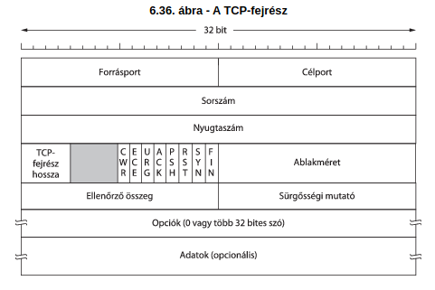
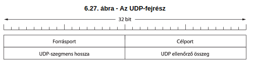

# 8M. Tétel: Hálózatok

## Számítógép-hálózatok osztályozási szempontjai.

- Számítógép-hálózat:
  - Számítógépek és egyéb eszközök kommunikációs csatornával történő összekapcsolása, mely lehetővé teszi a felhasználók egymás közötti kommunikációját, valamint információk és erőforrások megosztását.
- Csomópont:
  - Önálló kommunikációra képes, saját hálózati címmel rendelkező eszköz.
- Lefedett fizikai terület mérete szerint:
  - BAN
    - Body area net
    - Hálózat az emberi testen
  - PAN
    - Personal area network
    - Személyes hálózat
  - SOHO
    - Small office / home office
    - Otthoni, kiscéges
  - LAN
    - Local area network
    - Helyi hálózat
    - Egymással adatkommunikációs kapcsolatban lévő számítógépek együttese.
    - Kiterjedésük kicsi néhány négyzetkilométer
    - Állandó hozzáférés a hálózati szolgáltatásokhoz
    - LAN kiépítését az intézmény végzi.
    - Átviteli sebessége viszonylag nagy lehet a rövid távolságok miatt.
    - Adatátvitel biztonsága a rövid távolságok és a technológia miatt magas
    - Típusai:
      - Összeköttetéssel működő
        - Pl: koaxiális, optikai
      - Összeköttetés nélküli
        - Pl: rádióhullámok
    - Összetevői:
      - Számítógépek
      - Hálózati média
        - Kábelek, hullámok
      - Hálózati eszközök
        - hub, bridge, switch, router
  - MAN
    - Metropolitan area network
    - Városi / területi hálózat
    - Két vagy több LAN-t kapcsolnak össze
    - Technológiájuk leggyakrabban a LAN-okéval azonos
  - WAN
    - Wide area network
    - Nagyterületi hálózat
    - Felhasználók együttműködhetnek a valós idejű alkalmazásokban
    - Távoli erőforrások használata
    - Pl: Email, WWW, fájlátvitel
  - GAN
    - Global area network
    - Globális hálózat
- Adatátviteli ráta szerint:
  - Klasszikus hálózatok: kbps, mbps
  - Nagysebességű hálózatok: 100 Mbps.. Tbps
- Tulajdonjog szerint:
  - Magán hálózat
    - Private network
  - Nyilvános hálózat
    - Public network
- Mobilitás szerint:
  - Rögzített
    - Fixed network
  - Mobil
    - Mobile network

## Hálózati rétegmodellek.

- Protokoll:
  - Szabályok és konvenciók összességének egy formális leírása, mellyel meghatározzák a hálózati entitások kommunikációját.
- ISO/OSI
  - A nemzeti szabványügyi hivatal (ISO) által elfogadott hét rétegű modellje.
  - Rétegek (fentről lefelé): - Alkalmazási réteg - Megjelenítési réteg - Viszony réteg - Szállítási réteg - Hálózati réteg - Adatkapcsolati réteg - Fizikai réteg
  - Fizikai réteg:
    - Feladata a jeltovábbítás.
  - Adatkapcsolati réteg:
    - Megbízható adatátvitelt biztosít egy fizikai összeköttetésen keresztül.
    - Feladata a fizikai címzés, hálózati topológia közeghozzáférés, fizikai átvitel hibajelzése és a keretek sorrendhelyes kézbesítése.
  - Hálózati réteg:
    - Összeköttetést és útvonalválasztást biztosít két hálózati csomópont között.
    - Ide tartozik a hálózati címzés és az útvonalválasztás (routing).
  - Szállítási réteg:
    - Megbízható hálózati összeköttetést létesít két csomópont között.
    - Feladatkörébe tartozik az átviteli hibák felismerése és az áramlásszabályozás, virtuális áramkörök kezelése.
  - Viszony réteg:
    - Ez a réteg építi ki, kezeli és fejezi be az applikációk közötti dialógusokat.
  - Megjelenítési réteg:
    - Feladata a különböző csomópontokon használt különböző adatstruktúrákból eredő információ-értelmezési problémák feloldása.
  - Applikációs (alkalmazási) réteg:
    - Az alkalmazások működéséhez nélkülözhetetlen szolgáltatásokat biztosítja.
      - Pl: fájlátvitel

- TCP/IP:
  - Hétköznapi életben a leginkább elterjedt protokollrendszerre épülő hálózat (internet).
  - Modellszemlélete eltér az OSI modelltől.
  - Részei:
    - Gép a hálózathoz réteg
    - Hálózati réteg
    - Szállítási réteg
    - Alkalmazási réteg

## IP technológia címzési rendszere, és vezérlése.

- Az IP a TCP/IP referenciamodell általános adatszállításra szolgáló hálózati réteg protokollja.
- Összeköttetés mentes (datagram) szolgáltatást nyújt a szállítási réteg felé.
- Datagram:
  - Önálló adatcsomag, amely az azonosításhoz és a kézbesítéshez szükséges összes elemet tartalmazza.
- IP csomag: fejrész (Header) + rakrész (Payload)
  - Header:
    - A datagram kézbesítéséhez szükséges információk
      - címek , vezérlő, ellenőrző mezők
    - 4 bájtos szavakból áll
  - Payload:
    - Szállítási réteg adatelemét foglalja magába
    - Max méret: 64kB
- IP csomag darabolás és összerakás:
  - Adatkapcsolati réteg technológiával továbbítódik
  - Enkapszuláció előtt a túl nagy IP csomagot darabolni és a darabokat sorszámozni kell.
  - Fogadó csomópontnál a dekapszuláció után pontosan össze kell rakni részekből a nagy IP csomagot.
  - Darabolást végző csomópont:
  - forrás vagy köztes (útválasztó).
  - Darabolás engedélyezés hatáskör:
  - Forrás csomópont, csomagonként.
- IP címzési rendszer:
  - A hálózati rétegben logikai azonosításként működik.
  - A logikai cím egy hálózati interfészt egyértelműen azonosít.
  - Az egyetlen interfésze csomópontnál ez ,,host cím” megnevezéssel használatos.
  - IP címmel azonosított interfészek:
    - A végfelhasználói (host) csomópontnál,
    - Az L3 típusú köztes (router) csomópontnál.
  - Az azonosítók nyilvántartását nemzetközi szervezetek látják el:
    - Pl: IANA
  - Az IP cím kódoltan azonosítja az üzenetszórási tartományt és a host címet is.
  - IP címek használata:
    - Szervezet vagy internet szolgáltató
      - IP tartományo(k) vagy hálózati azonosító(k)
    - Előfizető gép
      - IP host azonosító
  - IP cím:
    - Hierarchikus logikai azonosító.
    - A hálózaton minden csomópontnak rendelkeznie kell legalább egy IP-címmel.
    - Ez egy 4 bájtost azonosító.
    - Pl: 192.168.0.250
  - IP címek hossza:
    - Bájtok 4k típusú többszöröse:
      - IPv4: k = 1
      - IPv6: k = 2
  - IP címek formátuma:
    - IPv4: decimálisan reprezentált bájtok, ponttal elválasztva
    - IPv6: hexadecimálisan reprezentált
  - IP címkezelés:
    - Használt kódolási módszer a maszkolás
    - Célja a hálózati cím meghatározása
    - Maszk:
      - Hossza megegyezik az IP cím méretével.
      - Bitpoziciónkénti ÉS művelet
      - Formája:
        - 1111…1100…0= ,,N(1)” ,,H(0)”
          - N:
            - Hálózat (halmaz) azonosító rész
          - H:
            - Host (interfész) azonosító rész
      - Szabályok:
        - ,,0” bit után csak ,,0” bit lehet,
        - ,,1” bit után bármi lehet.
      - Jelölések:
        - Bináris:
          - 1111111111111111111100000000
        - Decimális:
          - 255.255.255.0
        - Prefix:
          - /24 (N: 24 db bit, H: 32-24 = 8 bit)
          - A netmaszk elején elhelyezkedő 1-ek száma.
      - Speciális host címek:
        - IP üzenetszórás (broadcast):
          - Csupa bináris 1
        - IP hálózat azonosító:
          - Csupa bináris 0
      - Kiosztható címek száma:
        - Broadcast - N - 1

## Forgalomirányítás elve és az útválasztási kategóriák jellemzése.

- Forgalomirányítás (routing):
  - Csomagok (IP datagrammok) továbbítási irányának meghatározásával kapcsolatos döntések meghozatala.
  - Ez megvalósul host (saját csomagok) és router (saját és mástól való csomagok) szinten is.
- Forgalomirányítási táblázat (routing table):
  - A forgalomirányításhoz szükséges információkat tartalmazó táblázat.
- Megfontolások:
  - Útválasztás szükséges úgy a végpontokon, mint a köztes csomópontokon.
  - Host csak saját csomagjai számára végez útválasztást.
  - Útválasztó (router) idegen és saját csomagjai számára is végez útválasztást.
  - Útválasztás szükséges eszköze a routing tábla, amibe bejegyzések kerülnek.
  - Dinamikus routing üzenet hitelessége a hálózatbiztonsági szempont.
- Forgalomirányítási osztályok:
  - Minimális routing:
    - Teljesen izolált, router nélküli megoldás.
  - Statikus routing:
    - A forgalomirányítási táblázat manuális feltöltése a rendszergazda által.
    - Pl: default router beállítása
  - Dinamikus routing:
    - A forgalomirányítási táblázat(ok) bejegyzéseit valamilyen routing protokoll végzi.
    - Belső forgalomirányítás:
      - Egy autonóm rendszeren belül a legelőnyösebb útvonal meghatározása speciális algoritmusokkal: távolságvektor vagy link-állapot alapon.
    - Külső forgalomirányítás:
      - Autonóm rendszerek közötti útvonal meghatározása útvonalvektor (üzemeltetési politika) alapján.
- Távolságvektor alapú forgalomirányítás:
  - A routerek minden elérhető célra (gép vagy hálózat) nyilvántartják, hogy a legjobb úton milyen irányban milyen távolsággal érhető el az adott cél.
  - A szomszédos forgalomirányítók ezen információkat meghatározott időközönként kicserélik egymással.
  - Az új információk birtokában a routerek ellenőrzik, hogy szükséges-e változás valamelyik eddig ismert legjobb úttal kapcsolatban (található-e jobb útvonal az eddiginél)
- Link-állapot alapú forgalomirányítás:
  - Szomszédok felfedezése
  - Szomszédok felé vezető kapcsolat (link) költségének mérése.
  - Csomagkészítés a mérési eredményekről.
  - A készített csomag küldése a hálózati forgalomirányítási egység össze útválasztójának.
  - Minden router ismeri a teljes hálózati topológiát, s ki tudja számítani (pl: Dijkstra algoritmussal) a többi routerhez vezető optimális utat.

## TCP és UDP mechanizmusok.

- TCP:

  - Transmission control protocol
  - Összeköttetés alapú szállítási réteg protokoll
  - Megbízható, nyugtázott kapcsolat
  - Olyan rendszerekhez lett tervezve, ahol fontos az, hogy minden adat az adott sorrendben érkezzen meg
    - Pl: képek küldése, adatfájlok
  - Minden elküldött adatbájtot sorszámoz
  - TCP szegmens: Fejrész + rakrész
  - A küldő és a vevő TCP-entitásokat az adatokat szegmensekben viszik át egymás között.
  - Egy 20 byte-os fejrészből, és 0 vagy több adatbyte-ból áll
    - A forrásport és a célport azonosítják az összeköttetés helyi végpontjait.
      - 16 - 16 bit.
    - A sorszám és a nyugtaszám, ahol a nyugtaszám a következő várt bájt sorszámát tartalmazza.
      - 32 - 32 bit
    - TCP fejrész hossza, mely 4 bites
    - Ellenőrző összeg
    - Opciók
    - Egy csúszóablakos protokoll-változatot használnak dinamikus ablakmérettel.
    - A küldő minden szegmens feladásakor egy időzítőt is elindít.
    - Ha a szegment megérkezik a célhoz, a vevő TCP-entitás visszaküld egy olyan szegments, amely tartalmazza a maradék ablak méretét, és amennyiben a következőnek várt szegmens sorszámával visszaigazolja az adást.
    - Ha a küldő oldalon az időzítő nyugta vétele előtt lejár, akkor a küldőentitás újra elküldi a szegments.

- UDP:

  - User datagram protocol
  - Összeköttetés nélküli protokoll
  - Megbízhatatlan, nyugtázás nélküli kapcsolat
  - Időérzékeny alkalmazásokhoz használják
    - Pl: játékok, streamek, DNS kiszolgálók
  - UDP szegmens: Fejrész + rakrész
    - Egy 8 byte-os fejrészből és további felhasználó adatokból áll
    - Legalább 8 byte hosszúnak lennie kell, ami csak a fejrészt tartalmazza
  - Fejrész:

    - Forrás portszám (16 bit), Cél portszám (16 bit)
    - UDP szegmens hossza (16 bit), Fejrész ellenőrző összeg (16 bit)
    - Rakrész:
      - Tetszőleges tartalom

