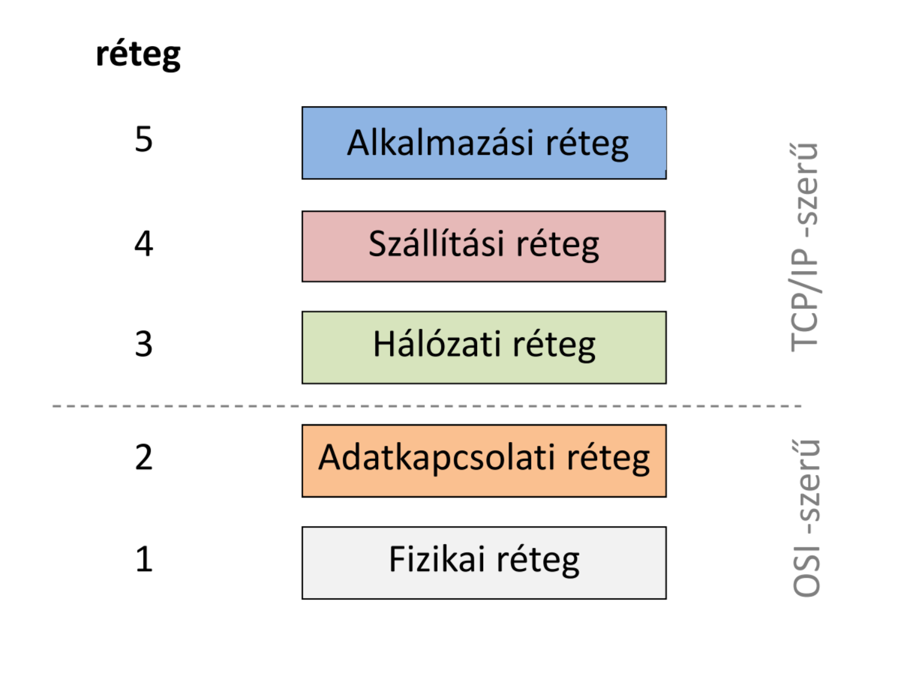
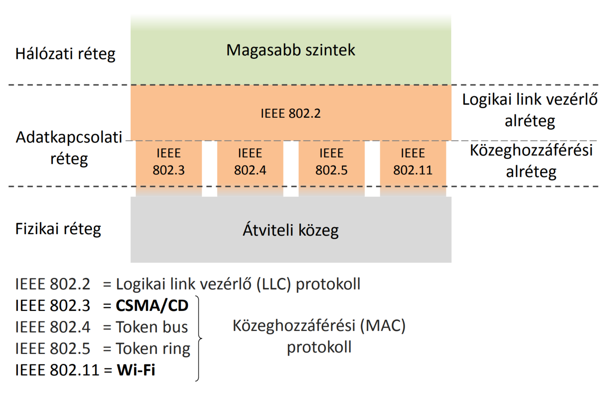
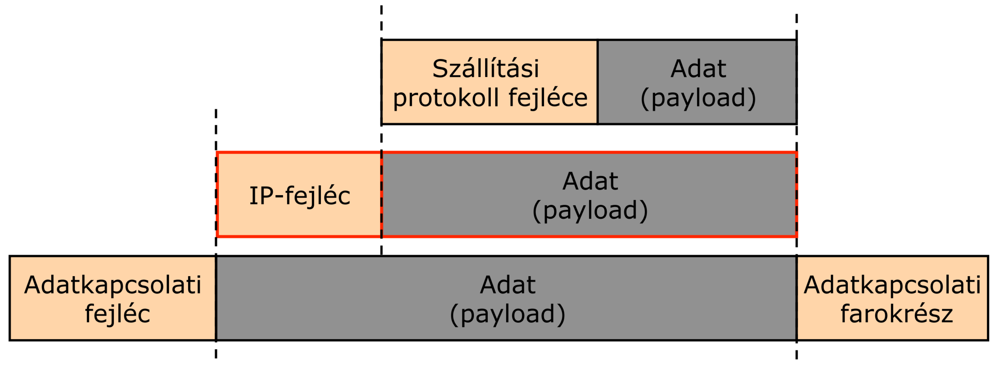
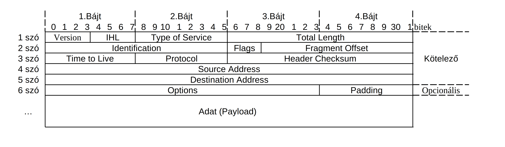
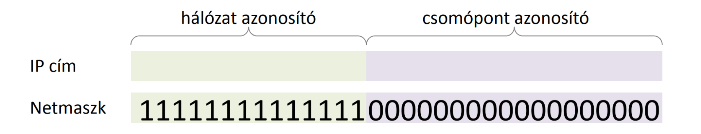
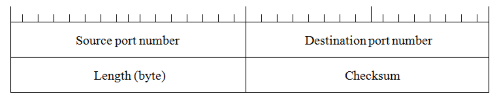
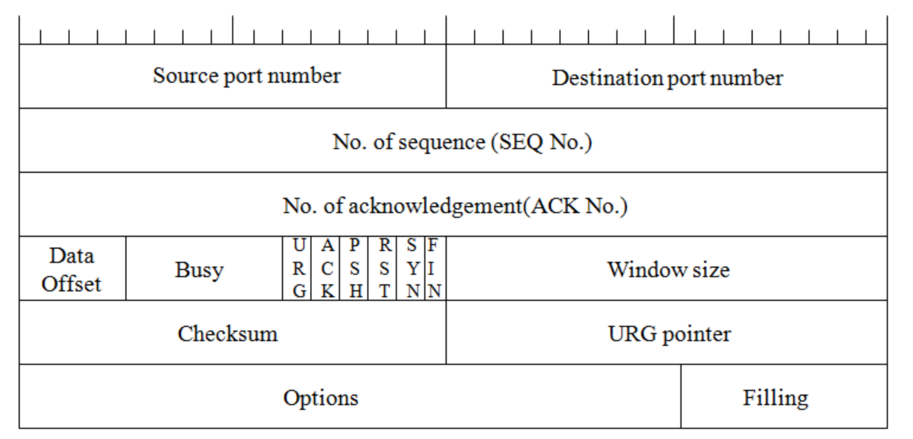

# 8. Tétel: Hálózatok

**Számítógép-hálózat:** Két vagy több számítógép összekapcsolása hardveres és szoftveres eszközökkel információ átvitel céljából.

Célok:
- Erőforrás-megosztás
- Megbízhatóság növelése
- Sebességnövelés
- Emberi kommunikáció
- stb.

A számítógép-hálózat tipikusan számítógépekből és perifériás elemekből (pl. hálózati nyomtató), hálózati kapcsolóelemekből, a fizikai összeköttetést megvalósító eszközökből (kábelekből) és a különböző hálózati alkalmazásokat megvalósító programokból (szoftverekből) épül fel.

**Csomópont (node):** Saját hálózati címmel rendelkező eszköz, amely független kommunikációra képes (számítógép, nyomtató, router).
A kommunikáció során a csomópont viselkedhet adóként (forrás) vagy vevőként (nyelő).

Hálózati eszközök kategóriái:
- Végfelhasználói csomópont: számítógép, nyomtató, szkenner vagy egyéb készülék, amely közvetlenül a felhasználónak nyújt valamiféle szolgáltatást.
- Hálózati kapcsoló/összekötő eszköz: lehetővé teszi végfelhasználói eszközök kommunikációját azáltal, hogy összeköti őket.

## Számítógép-hálózatok osztályozási szempontjai. 

:::info Méret szerint
- Multiszámítógép vagy személyi hálózat (PAN - Personal area network)
- Helyi hálózat (LAN - Local area network)
- Városi hálózat (MAN - Metropolitan area network)
- Világhálózat (WAN - Wide area network)
:::
:::info Kapcsolástechnika alapján
- Áramkör kapcsolt
- Csomag kapcsolt
- Üzenet kapcsolt
:::
:::info Átviteli sebesség szerint
- Klasszikus hálózatok: kbps, mbps
- Nagysebességű hálózatok: 100 Mbps.. Tbps
:::
:::note Átviteli sebesség (hálózati sebesség, sávszélesség, bit ráta):
Időegység alatt átvitt információ mennyisége.
Mértékegység: `bit/sec`, `b/s`, `bps`.

Nagyobb egységek:
- `1 kbps` = `1000 bps`
- `1 Mbps` = `1000 Kbps`
- `1 Gbps` = `1000 Mbps`
:::

:::info Tulajdonjog szerint
- Magán hálózat (Private network)
- Nyilvános hálózat (Public network)
:::
:::info Mobilitás szerint
- Rögzített (Fixed network)
- Mobil (Mobile network)
:::

## Hálózati rétegmodellek. 
:::note Miért használunk rétegelt hálózati architektúrát?
- Egy óriási protokoll leírása komplex és nehéz.
- Hierarchikus protokoll rendszer könnyebben implementálható.
- A változáskövetés könnyebb.
- A rétegek együtt tudnak működni különböző gyártók esetén is.
:::

A nemzetközi szabványügyi hivatal (ISO) által elfogadott hét rétegű (ún. nyílt rendszerek összekapcsolási, OSI) modellje.

| Sorszám |	Réteg neve | PDU neve |
|--|--|--|
|7. | Applikációs réteg (Application layer) |	APDU |
|6. | Megjelenítési réteg (Presentation layer) | PPDU |
|5. | Viszony réteg (Session layer) | SPDU |
|4. | Szállítási réteg (Transport layer) | Szegmens, TPDU |
|3. | Hálózati réteg (Network layer) | Csomag |
|2. | Adatkapcsolati réteg (Datalink layer) | Keret, cella |
|1. | Fizikai réteg (Physical layer) | Bit |

### OSI modell rétegei
:::info Fizikai réteg (L1)
Átviteli közegek tulajdonságaival, a jelátvitel megvalósításával foglalkozik.
- Kábelek, csatlakozók, moduláció, jelkódolás, stb.
:::
:::info Adatkapcsolati réteg (L2)
Megbízható jelátvitel két közvetlenül összekötött eszköz között. Két alréteg: LLC, MAC.
- Fizikai címzés, közeghozzáférés, logikai topológia, stb.
:::
:::info Hálózati réteg (L3)
Összeköttetés két hálózati csomópont között (nem csak a közvetlenül összekötött esetben).
- Routing, forgalom szabályzás, hálózati címzés, stb.
:::
:::info Szállítási réteg (L4)
Megbízható összeköttetés két csomóponton lévő szoftver között. Protokollok lehetnek kapcsolatmentesek vagy kapcsolat-orientáltak.
- Hiba detektálás/javítás, sorrend garancia, stb.
:::
:::info Viszony réteg (L5)
Végfelhasználók közötti logikai kapcsolat felépítése, bontása.
:::
:::info Megjelenítési réteg (L6)
Az információ azonos módon értelmezése a kapcsolat mindkét oldalán (a csomópontok különböző adatstruktúrákat, adatábrázolást használhatnak).
:::
:::info Alkalmazási réteg (L7)
Interfész az alkalmazások és a felhasználók között.
- DNS, http, ftp, bittorrent, stb.
:::

#### TCP/IP - OSI modell leképezése
A hétköznapi életben leginkább elterjedt hálózati technológia a TCP/IP protokollrendszerre épülő hálózat (internet). A TCP/IP architektúra (korántsem egységes) modellszemlélete eltér az OSI modell szemléletmódjától:

#### Hybrid Referencia Modell
A. S. Tanenbaum (több kiadásban is megjelent) Számítógép-hálózatok c. művében javasolta, hogy a hálózati kommunikáció tanulmányozására egy ún. "hibrid modellt" használjunk: A hibrid modell alsó két rétegében (az OSI modellt követve) a fizikai és adatkapcsolati réteg jelenik meg, a felsőbb rétegeket pedig (a TCP/IP modellt követve) a hálózati, szállítási (transzport), és az applikációs rétegek képviselik.

#### Hálózati kapcsolóelemek
:::note Jelismétlő (repeater):
Erősíti, regenerálja és ismétli az egyik oldalon bejövő jelet a másik oldali átviteli közeg irányába.

Ütközés szempontjából nem különíti el az összekötött hálózatokat. A több port-os jelismétlőt HUB-nak hívjuk.
:::
:::note Híd (bridge):
Adatkapcsolati rétegben valósít meg szelektív összeköttetést. („Csak azt a csomagot engedi át amelyik valóban a túloldalra tart.”)

Az összekötött hálózatok külön ütközési tartományt képeznek.

Az üzenetszórási kereteket továbbítja az összekötött hálózatokba.
:::
:::note Kapcsoló (switch):
Több port-os eszköz, amely minden port párja között híd funkcionalitást valósít meg.
:::
:::note Útvonal választó (router):

Hálózati rétegben valósít meg szelektív összeköttetést, útvonalválasztást, forgalom szabályozást.

Az összekötött hálózatok külön ütközési és üzenetszórási tartományt képeznek.

Ez egy csomópont saját hálózati címmel.

Néha átjárónak (gateway) is hívják hálózati rétegben (pl. default gateway).
:::

Alhálózatok - a kapcsoló eszközök működése alapján - különböző OSI rétegekben kapcsolódhatnak.

| OSI réteg | Kapcsoló eszköz |
|--|--|
|Szállítási réteg (és felette)|átjáró|
|Hálózati réteg|router|
|Adatkapcsolati réteg|híd, kapcsoló|
|Fizikai réteg|jelismétlő, hub|

### Fizikai réteg (L1)
A hybrid modell első rétege (L1). Jelátvitel megvalósítása, különböző átviteli közegek tulajdonságai.

Témakörök:
- Kábelek és csatlakozók
- Topológia
- Moduláció és jelkódolás
- stb.

:::note Fizikai átviteli közegek és jelek
**Vezetékes:**
- Koaxiális kábel (elektromos jel) - Vékony, vastag
- Csavart érpár (elektromos jel) - UTP, FTP, STP
- Optikai szál (fény) - Egy módusú, több módusú

**Vezeték nélküli:**
- Levegő (elektromágneses hullám) - Rádióhullám, mikrohullám, infravörös
:::

### Adatkapcsolat réteg (L2)
A hybrid modell második rétege (L2) Megbízható átvitel két közvetlen összekötött csomópont között. Két alréteg: LLC, MAC.

**Témakörök:**
- Fizikai címzés (azonosítás)
- Közeghozzáférés
- Logikai topológia
- stb.

### Hálózati réteg (L3)

A hybrid modell 3. rétege (L3). Összeköttetés bármelyik (nem csak közvetlenül összekötött) két csomópont között.

**Témakörök:**
- Hálózati címzés
- Forgalomirányítás (routing)
- Alhálózatra bontás
- stb.

### Szállítási réteg (L4)

A hybrid modell 4. rétege (L4). Megbízható összeköttetés két tetszőleges csomóponton lévő 2 tetszőleges szoftver között. A protokollok lehetnek kapcsolat alapúak vagy kapcsolat mentesek.

**Témakörök:**
- Hiba detektálás és javítás
- Sorrend garancia
- Program azonosítás csomópontokon
- stb.

:::note Szállítási réteg protokollok
**UDP (User Datagram Protocol):**
- Kapcsolat mentes
- Nem megbízható

**TCP (Transmisson Control Protocol):**
- Kapcsolat alapú
- Megbízható
:::

### Alkalmazási réteg (L5)

A hybrid modell 5. rétege (L5). Interfész a felhasználók és a hálózat között. Biztosítja a megfelelő kommunikációt a felhasználók között. Az ember számára értelmezhető formában jeleníti meg az átvitt adatokat.

**Témakörök:**
- Tartomány nevek (DNS)
- World Wide Web (www, HTTP, HTTPS, HTML)
- E-mail (SMPT, POP3, IMAP)
- Fájl átvitel (FTP, BitTorrent)
- Stb.

## IP technológia címzési rendszere, és vezérlése. 
### Az IP hálózati protokoll

IP (Internet Protocol) (RFC 791)
- A TCP/IP referencia modell hálózati réteg protokollja.
- Széles körben használt, az Internet alapja.
- Főbb jellemzői: 
    - Az IP fejrész szerkezete. 
    - IP címek, címosztályok. 
    - Fragmentálás támogatása. 
    - Datagram jellegű szolgáltatás a szállítási réteg felé.

A csomópont interfészének hálózati rétegbeli 32 bit (4 byte) hosszúságú azonosítója.

### Az IP csomag szerkezete
Az IP-csomag két része:
- IP-fejléc / fejrész (IP header)
- Adat (payload) 

Az IP-csomag alsóbb rétegbeli protokoll adatrészébe ágyazódik be. 
Az IP-csomag adatrészébe magasabb rétegbeli protokollüzenet (PDU) kerül 

### IP fejrész szerkezete

32-bites szavakból áll.

Hossza: minimum 5, maximum 15 szó.

Az **első** szó általános információkat tartalmaz: Verziószám; IP fejrész hossza (szavakban); szolgáltatás típusa (TOS); adatmező hossza (bájtokban mérve).

Az IP fejrész **második** szava a csomag darabolásával kapcsolatos információkat tartalmazza. Darabolásra akkor van szükség, ha a csomag (túl nagy mérete miatt) nem ágyazható be az adatkapcsolati réteg keret adatmezőjébe. 

A **harmadik** szó adatai - általános információk:
- 8 bit: TTL a csomag „hátralevő életidejének” jelzése. Az útválasztónak kötelező legalább 1-et levonni a rajtuk áthaladó csomag TTL értékéből. Ha a TTL mező értéke nullára csökken, akkor a csomag "halottnak" tekintendő, s el kell dobni.
- 8 bit: Felsőbb (transzport) rétegbeli protokoll kódja – RFC 1700.
- 16 bit: A fejrész ellenőrző összege.

A **negyedik** és **ötödik** szó adatai - címzések:
- 32 bit: A „forrás” IP címe.
- 32 bit: A „cél” IP címe.

A **hatodik** szótól - 32 bites opcionális információk, pl.:
- Record route - A továbbítás útvonalának naplózása.
- Timestamp - A késleltetési idők naplózása.

### IP címek

Az IP cím a csomópont interfészének hálózati rétegbeli azonosítója. A bájt értékeket ponttal elválasztva (ún.
**pontozott decimális megjelenítési formában**) szoktuk felírni: pl. 157.45.190.57. 

Az azonosítók kezelését nemzetközi szervezet (**IANA**, **InterNIC**) látja el, a végfelhasználók internet szolgáltatóktól kaphatnak IP címet.

Az intézmények nem egyedi címeket, hanem címtartományokat (hálózat azonosítókat) kapnak.

Az IP címek első része a hálózatot többi az adott hálózaton belüli csomópontot azonosítja.

Az IP cím **eleje** a hálózat (vagy intézmény) azonosítója, a **vége** pedig a csomópont azonosítója a hálózaton belül.

Az IP forgalomirányítás a hálózati azonosítókra épül (nem kell minden csomópont címét letárolnunk a forgalomirányítási táblában).

### IP cím osztályok

### Hálózati maszk

:::info Hálózati maszk (netmaszk)
Egy olyan 32 bites maszk, mely 1-es bit értékeket tartalmaz a hálózat és alhálózat azonosításában résztvevő bithelyeken, és 0-ás bit értékeket tartalmaz a csomópont azonosítására szolgáló bithelyeken.

A hálózati maszk segítségével az eredetileg az osztályba sorolás által (statikusan) meghatározott hálózat-gép határ módosítható.
:::

:::info Prefix hossz
A hálózati maszkban szereplő 1-es értékek darabszáma (a hálózat azonosító bithelyek darabszáma).
:::

Az egyes osztályokhoz tartozó alapértelmezett hálózati maszkok:
- **A osztály:** Hálózati maszk: 255.0.0.0 Prefix hossz: 8
- **B osztály:** Hálózati maszk: 255.255.0.0 Prefix hossz: 16
- **C osztály:** Hálózati maszk: 255.255.255.0 Prefix hossz: 24

### Első bájt szabály

| Osztály | Első bit(ek) | Első byte | Netmaszk | Prefix |
|---|---|---|---|---|
|A|0 . . . . . . . |0-127|255.0.0.0|8|
|B|10 . . . . . .|128-191|255.255.0.0|16|
|C|110 . . . . .|192-223|255.255.255.0|24|

### Speciális IP címek

A speciális IP címek nem általános csomópont azonosítási funkciót látnak el, hanem valamilyen (definíció alapján meghatározott) speciális funkciót látnak el.

**Nem definiált IP cím (aktuális gép):** 32 db "0" bitérték. A csomópont saját magára való hivatkozásként használhatja, ha nincs ennél alkalmasabb címe (pl. DHCP címkéréskor feladó IP címként szerepelhet).

**Loopback IP cím (egy gépen belüli kommunikáció):** A 127.0.0.0/8 címtartomány "loopback" célra használt. A loopback interfész egy speciális (valódi hardverhez nem kötődő) interfész, melynek célja, hogy egy csomóponton belül is lehessen szabályos IP kommunikációt folytatni. A csomag ebben az esetben nem hagyhatja el a csomópontot (nem jelenhet meg a tényleges hálózati vonalon/csatornán).

**Hálózat azonosító IP cím:** A hálózat azonosító IP cím csomópont azonosító bitpozícióiban mindenütt "0" érték szerepel (a hálózat azonosító bithelyeken pedig a hivatkozott hálózat azonosítója). Ezt a címet (tipikusan) nem rendeljük hozzá csomóponti interfészhez, hanem az egész hálózati egység hivatkozására használjuk. (Leggyakrabban a forgalomirányítási táblázatokban találkozunk ilyen címmel).

**Aktuális hálózaton belüli üzenetszórás IP címe:** 32 db "1" bitérték. Az aktuális üzenetszórási tartomány valamennyi csomópontja számára szóló üzenet célcímeként használható.

**Irányított üzenetszórás IP címe (directed broadcast):** Az irányított üzenetszórás esetén egy megadott azonosítójú hálózat valamennyi csomópontja számára küldünk csomagot. Az irányított üzenetszórási IP cím hálózat azonosító részében az elérni kívánt csomópontok közös hálózat azonosítója szerepel, a csomópont azonosító részben pedig mindenütt "1" bitérték.

## Forgalomirányítás elve és az útválasztási kategóriák jellemzése. 
### IP forgalomirányítási alapok
:::info Forgalomirányítás (útválasztás, útvonal választás; routing)
Csomagok (IP datagramok) továbbítási irányának meghatározásával kapcsolatos döntések meghozatala.
:::
:::info Forgalomirányítási táblázat (routing table)
A forgalomirányításhoz szükséges információkat tartalmazó táblázat. 

Tipikus (legfontosabb) mezők:
- Célhálózat
- Netmask
- Kimenő int.
- Következő csomópont (next hop)
- Metrika
:::

#### Hálózati protokollok forgalomirányítási felosztása

:::info Forgalomirányított protokoll (routed protocol)
Olyan hálózati réteghez kötődő általános adatszállító protokoll, amelyet a forgalomirányító (router) irányítani képes (pl. IP, IPX).
:::
:::info Forgalomirányítási protokoll (routing protocol)
A forgalomirányítási táblázat(ok) felépítéséhez szükséges információk továbbítását (routerek közötti cseréjét) leíró protokoll (pl. RIP, OSPF, BGP).
:::
:::info Egyéb protokoll
Az előzőekhez nem sorolható hálózati protokoll (pl. ICMP).
:::

:::info Forgalomirányított protokoll (routed protocol)
Olyan hálózati réteghez kötődő általános adatszállító protokoll, amelyet a forgalomirányító (router) irányítani képes (pl. IP, IPX).
:::
:::info Forgalomirányítási protokoll (routing protocol)
A forgalomirányítási táblázat(ok) felépítéséhez szükséges információk továbbítását (routerek közötti cseréjét) leíró protokoll (pl. RIP, OSPF, BGP).
:::
:::info Autonóm rendszer (AS)
Hálózatok forgalomirányítási adminisztrációs egysége, amelyben egy közös forgalomirányítási stratégia (routing protocol) érvényesül.
:::
:::info Metrika
Egy adott forgalomirányítás eredményeként előálló útvonal minőségének mérési módja, alapvetően két (egymásba transzformálható) kategóriában vizsgálható:
- Távolságalapú (költségalapú) metrika.
- Jóság alapú metrika.
:::

####  Forgalomirányítók (alapvető) működése
1. A router az input interfészen érkező csomagot fogadja.
2. A router a csomag célcímét illeszti a routing táblázat soraira. Ha a célcím több sorra illeszkedik, akkor a leghosszabb prefixű sort tekintjük illeszkedőnek.
3. Ha nem létezik illeszkedő sor, akkor a cél elérhetetlen, a csomag nem továbbítható. A csomagot a router eldobja és ICMP hibajelzést küld a feladónak.
4. Ha létezik illeszkedő sor, akkor a csomagot az ebben szereplő kimeneti interfészen továbbítjuk (adatkapcsolati rétegbeli beágyazással) a következő hopként megadott szomszédhoz, ill. a célállomáshoz, ha már nincs több hop.

####  Az útválasztás alapvető működése
1. Az útválasztó a bemeneti interfészen érkező csomagot fogadja.
2. A routing tábla sorait prefix hossz szerint csökkenő sorrendbe rendezzük. N=1.
Ezzel biztosítjuk, hogy több illeszkedő sor esetén a leghosszabb prefixűt fogjuk eredményként kapni.
3. Ha nem létezik a táblázatban az N. sor, akkor a cél elérhetetlen, a csomag nem továbbítható.
A csomagot a router eldobja és esetlegesen ICMP hibajelzést küld a feladónak. A folyamat befejeződik.
4. A csomag célcíme és az N. sor hálózati maszkja között bitenkénti AND műveletet hajtunk végre.
5. Ha a bitenkénti AND művelet eredménye megegyezik az N. sor célhálózat értékével, akkor a cím az N.
sorra illeszkedik; ebben az esetben az N. sorban szereplő kimenő interfészen küldjük tovább a csomagot, s
a folyamat befejeződik.
6. N=N+1, és folytassuk a 3. pontnál.

#### Forgalomirányítási konfigurációk osztályozása

:::info Minimális routing 
Teljesen izolált (router nélküli) hálózati konfiguráció. Forgalomirányítási döntés nem csak a forgalomirányítókon történik, hanem minden csomóponton a csomag küldése előtt.
:::
:::info Statikus routing
A forgalomirányítási táblázatot a rendszeradminisztrátor tartja karban. Tipikus példa a végfelhasználói csomópontokon az alapértelmezett útválasztó (default router, vagy más néven default gateway) beállítása.
:::

:::info Dinamikus routing
A forgalomirányítási táblázat(ok) valamilyen routing protocol segítségével kerülnek karbantartásra.

**Belső forgalomirányítási protokollok (IGP, például RIP, OSPF).** Egy autonóm rendszeren belül működik,
legfőbb alapelv a „legjobb útvonal” meghatározása ún. távolságvektor alapú vagy kapcsolat-állapot (linkállapot) alapú módszerrel

**Külső forgalomirányítási protokollok (EGP, például EGP, BGP).** Nem feltétlenül a legjobb útvonal
meghatározása a cél (politika alapú forgalomirányítás - BGP)
:::

### Távolságvektor alapú forgalomirányítás (Distance Vector Routing)

Működési alapelv:
- A routerek minden elérhető célra (gép vagy hálózat) nyilvántartják, hogy a legjobb úton milyen irányban milyen távolsággal érhető el az adott cél (távolságvektor).
- A szomszédos forgalomirányítók ezen információkat meghatározott időközönként kicserélik egymással.
- Az új információk birtokában a routerek ellenőrzik, hogy szükséges-e változás valamelyik eddig ismert legjobb úttal kapcsolatban. (Található-e az eddig ismertnél jobb útvonal?)

### Kapcsolat-állapot (linkállapot) alapú forgalomirányítás (Link State Routing)

A kapcsolat-állapot alapú útválasztás működési vázlata:
1. Szomszédok felfedezése.
2. A szomszédok felé vezető kapcsolat (link) költségének mérése.
3. Csomagkészítés a mérési eredményekről.
4. A készített csomag küldése a hálózati forgalomirányítási egység összes útválasztójának.
5. Minden router ismeri a teljes hálózati topológiát, s ki tudja számítani (pl. Dijkstra algoritmussal) a többi routerhez vezető optimális utat (feszítőfa, spanning tree számítás).

## TCP és UDP mechanizmusok.

### UDP (User Datagram Protocol)

Az UDP protokoll (RFC 768) egyszerű, nem megbízható (nem nyugtázott), összeköttetés mentes szállítási réteg protokoll.

Az UDP fejrész szerkezete:
- 16 bit feladó portszám
- 16 bit célportszám
- 16 bit hossz (bájtokban)
- 16 bit ellenőrző összeg

Az UDP nagyon egyszerű protokoll. A fejrész legfontosabb két mezője a két portszám, melyek a
kommunikációs adatfolyam azonosítását végzik. Nincs benne kötelező visszajelzési mechanizmus, s az
áramlásszabályozást gyakorlatilag az applikációk végzik.

### TCP (Transmission Control Protocol)
Az TCP protokoll (RFC 793) megbízható (nyugtázott), összeköttetés alapú szállítási réteg protokoll. Az
adatkommunikáció megkezdése előtt kapcsolat (TCP összeköttetés) épül ki a felek között. A kommunikáció
során pedig folyamatos áramlásszabályozást lát el.

A TCP fejrész legfontosabb mezői:
- 16 bit feladó portszám
- 16 bit célportszám (A két portszám együttesen azonosítja a kommunikációs viszonyt)
- 32 bit szegmens sorszám (bájt sorszám modulo 232 )
- 32 bit nyugta sorszám (a következőként várt bájt sorszáma)
- 4 bit (Data offset) TCP fejrész hossza (szavakban)
- Legfontosabb jelzőbitek:
    - SYN: Kapcsolat kiépítés (szinkronizáció)
    - FIN: Kapcsolat bontás (finish)
    - ACK: Érvényes a nyugta sorszám mező értéke
- 16 bit Ablakméret - (A következőként várt szegmens maximális mérete)

A szegmens hossza nincs benne a fejrészben, ez a TCP/IP interfészen adódik át az IP felé. A TCP minden bájtot
sorszámoz, s a nyugtában jelzi vissza a társa felé a soron következőként várt bájt sorszámát.

A TCP áramlásszabályozást is végez: az ablakméret mezőben jelzi vissza a társának, hogy az maximum milyen
hosszú szegmenst küldhet legközelebb.

#### Portszámok
A széleskörben használt szolgáltatások szerver oldali portszámait rögzítik (RFC 1700). A kliens oldali
portszámokat tipikusan nem rögzítik.

**Néhány példa szerver oldali portszámra:**

| Szolgáltatás | Portszám |
|--|--|
| HTTP |80|
| SMTP |25|
| SSH |22|
| DNS |53|

#### TCP háromutas kézfogás
A TCP az applikációk közötti adatátvitel megkezdése előtt egy TCP összeköttetést (TCP kapcsolatot) épít ki, ezt
a kapcsolatkiépítést hívjuk TCP háromutas kézfogásnak (3 way handshake).

**A háromutas kézfogás működési vázlata:**
1. A kapcsolat kiépítést a kliens kezdeményezi. A TCP fejrészben a portszámok megfelelően beállításra
kerülnek; a kezdősorszám egy (bizonyos feltételeknek eleget tevő) véletlen-szám lesz (pl. SEQ_No=450).
A jelzőbiteknél SYN=1, ACK=0.
2. A szerver megkapja a kliens üzenetét. A TCP fejrészből (jelzőbitekből) látja, hogy új kapcsolat kiépítése
indult. A szerver jóváhagyó válasz-üzenetet küld: A válasz TCP fejrészben a kapott üzenet portszámait
felcseréli; beállítja a saját (véletlen) kezdősorszámát (pl. SEQ_No=870), a nyugta sorszámot a kapott SEQ
érték rákövetkezőjére (ACK_No=451) állítja. A jelzőbiteknél SYN=1, ACK=1.
3. A kliens megkapja a szerver válaszát, s erre egy jóváhagyást küld a szerver felé. A TCP fejrészben a kapott
üzenet portszámait felcseréli; beállítja a saját szegmes-sorszámát (SEQ_No=451); a nyugta sorszámot
pedig a kapott SEQ érték rákövetkezőjére (ACK_No=871) állítja. A jelzőbiteknél SYN=0, ACK=1.
4. A szerver megkapja a kliens válaszát, s ezzel a kapcsolat kiépült. Ezután megindul az applikációs rétegben
használt protokollnak megfelelő adatátviteli kommunikáció.

:::note Megjegyzés 
A háromutas kézfogás üzenetei tipikusan nem szállítanak adatot; ha mégis, akkor azokat pufferelni
kell, s a feldolgozásuk csak a kapcsolat kiépülése (4. pont) után kezdődhet el.
:::

## További információk

- https://gyires.inf.unideb.hu/KMITT/b05/
- https://arato.inf.unideb.hu/toth.erzsebet/halozat/Szamitogep-halozatok_oktatasi_segedlet.pdf
- https://irh.inf.unideb.hu/~vargai/download/network_hu/Network_lab_hu.pdf
- https://vik.wiki/images/d/d9/Kh1_dia_2017_4.pdf