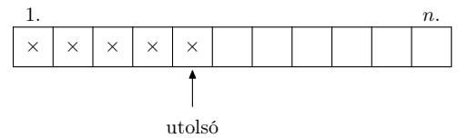
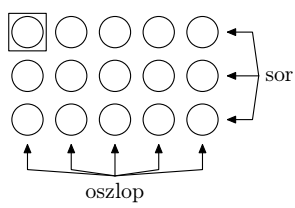
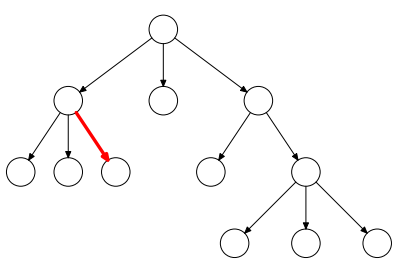
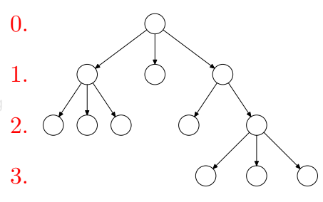
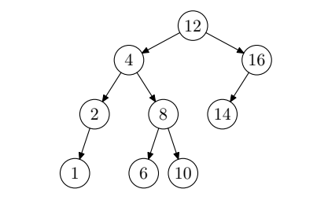
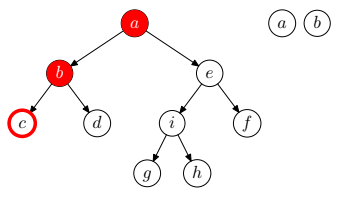
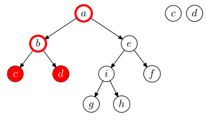
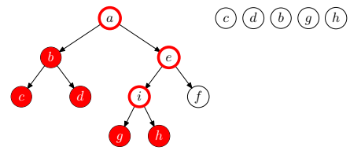

# 1. Tétel: Valószínűségi eloszlások; Adatszerkezetek

## Diszkrét és folytonos valószínűségi eloszlás fogalma. 

:::info Diszkrét eloszlás
- Diszkrétnek nevezzük azokat a valószínűségi változókat, ami **megszámlálhatóan sok értéket** vesznek fel.
- Véges sok vagy végtelen, de fel tudjuk sorolni az értékeket.
- Ekkor az eloszlásfüggvény lépcsőzetes lesz.
- Minden számnál annyit ugrik, mint az adott szám valószínűsége.
- Binomiális, Poisson
:::
:::info Folytonos eloszlás
- Folytonosnak nevezzük azokat a valószínűségi változókat, melyek folytonos mennyiségeket mérnek.
- Pl: idő
- Ha az `X` valószínűségi változó folytonos, akkor `A` és `B` között **bármilyen valós értéket felvehet**.
- Egyenletes, Exponenciális, Normális
:::

## Nevezetes eloszlások: binomiális, Poisson, egyenletes, exponenciális, normális.
- A diszkrét eloszlású valószínűségi változó csak diszkrét, definiált értékeket vehet fel.
- A folytonos eloszlású valószínűségi változó végtelen sok értéket vehet fel.

Diszkrét:
- Binomiális
- Geometriai
- Poisson

Abszolult folytonos:
- Exponenciális
- Egyenletes
- Normális

### Binomiális eloszlás
- A binomiális eloszlás egy diszkrét eloszlás.
- Esetén az `X` **korlátos**, tehát van maximum értéke.
- Az `X` valószínűségi változó
    - Eseményekhez rendel hozzá számokat
    - Pl: 2 balesetes nap van egy héten, X = 2
- A `k` maga a mennyiség, amit `n`-ből választottunk
    - Pl: 2
- Az `n` a minta száma
    - Pl: egy héten mennyi van, n = 7
- A `p` a valószínűség
    - Pl: 30 nap alatt átlag 12 van, 12/30 = 0,4

---

Dobjunk fel egy érmét $n$-szer egymás után. A fejek vagy
írások számának eloszlása ún. binomiális eloszlás. Az $X$
v.v. binomiális eloszlást követ, ha 
$$
P(X = k) = \binom{n}{k}p^{k}(1-p)^{n-k}, \space\space\space\space\space k = 0,1,...,n,
$$
ahol $n \in \mathbb{N}$ és $p \in [0, 1]$ paraméterek. Jelölés: $Bi(n, p)$.

$X$ várható értéke és szórásnégyzete:
$$
E(X) = np, \space\space\space\space\space D(X)^{2} = np(1-p)
$$

#### Mikor használunk binomiális eloszlást?
$n$ darab véletlen kísérletet végzek, mindegyik a többitől
függetlenül $p$ valószínűséggel sikeres.

Legyen $X = a$ sikeres kísérletek száma. Ekkor $X$ eloszlása
binomiális eloszlású $n, p$ paraméterekkel.

Például: feldobok 10 érmét, hány lesz ebből fej, egy betegség ellni
gyógyszerkísérletnél hányan gyógyulnak meg, egy processzor
magján hány jó mag van.

### Poisson eloszlás

- A poisson eloszlás egy diszkrét eloszlás.
- Esetén az X nem korlátos, tehát nincs maximum értéke.
- Az X valószínűségi változó
    - Pl: 2 balesetek száma van egy héten, X = 2
- A λ az eloszlás várható értéke
    - Pl: hány baleset van egy héten, ha 30 naponta 12 baleset van.
        - 12/30 = 0,4
        - Tehát egy héten:
            - 0,4 * 7 = 2,8

---

Ritka események, pl. sajtóhibák száma egy lapon, meghibásodások száma egy gépnél, mazsolák egy kalácsban, eloszlásának jellemzésére szolgál. Az X v. v.
Poisson eloszlást követ, ha
$$
P(X = k) = \frac{\lambda^{k}}{k!}e^{-\lambda}, \space\space\space\space\space k = 0,1,2,...,
$$
hol $\lambda > 0$ paraméter. Jelölés: $Po(\lambda)$.

$X$ várható értéke és szórásnégyzete:
$$
E(X)=\lambda, \space\space\space\space\space D^{2}(X)=\lambda
$$

#### Mikor használunk Poisson eloszlást?
Amikor binomiálist használnák, de $n$ nagy $n\to \infty$, $p$ kicsi $n\to 0$ , de a várható érték állandó $np = \lambda$

Például: Budapesten a heti tűzesetek száma (sok helyen lehet tűz,
de a valószínűsége kicsi). Egy méter szövetanyagban a hibák
átlagos száma (sok helyen lehet hiba, de a valószínűség kicsi). Egy
webszerveren a percenkénti lekérdezések száma (sok lekérdezés van
de kicsi a valószínűsége, hogy pont ezt a szervert kérdezik).

### Egyenletes eloszlás
- Minden érték ugyanakkora valószínűséget vesz fel.
    - Pl: `A` az intervallum kezdete, ez a legkisebb érték, amit `x` felvehet. `B` pedig az intervallum vége, a legnagyobb érték, amit `x` felvehet.

---

Az egyik legtermészetesebb eloszlás az (egy halmazon
adott) egyenletes eloszlás. Pl.: gyakran mondjuk, hogy
dobjunk le egy pontot egyenletesen egy intervallumra.
Ez azt jelenti, hogy egy részintervallumba esés valószínűsége arányos a részintervallum hosszával.

Az $X$ egyenletes eloszlást követ az $[a, b]$ intervallumon,
ha sűrűségfüggvénye:
$$
f(x)= \left\{\begin{matrix}
\frac{1}{b-a} & ha\space a<x<b \\
0 & egyébként \\ 
\end{matrix}\right.
$$

Jelölés: $Uni(a, b)$.

$X$ várható értéke és szórásnégyzete:
$$
E(X) = \frac{a+b}{2}, \space\space\space\space\space D^{2}(X) = \frac{( b -a )^{2}}{12}
$$

#### Mikor használunk Egyenletes eloszlást?
Ha egy véletlen érték biztosan $a$ és $b$ érték közé esik, de semmilyen
más információ nem tudott róla, akkor $[a, b]$-n egyenletes eloszlást
kell használni. Jelölés: $Uni(a, b)$.

Például: Világutazó barátom részegen felhív és mikor fut be a hívás
egyneletes $[0, 24]$-en. Egy $1$ méter hosszú kötélnek van piros és kék
vége. Tökéletesen összeragasztom a két végét, hogy egy kört
kapjak, majd megpörgetem ezt a kört egy olló nyitott szárai között,
majd elcsattintom az ollót. Újra szétszedem a kötelet az
összeragasztásnál, akkor a piros végű darab hossza egyenletes
eloszású $[0, 1]$-en.

Eloszlásfüggvénye:
$$
F(x)=\left\{\begin{matrix}
0 & x \leq  a \\
\frac{x-a}{b-a} & a<x\leq b \\
1 & b<x \\
\end{matrix}\right.
$$

$X$ várható értéke és szórásnégyzete:
$$
E(X) = \frac{a+b}{2}, \space\space\space\space\space D^{2}(X) = \frac{( b -a )^{2}}{12}
$$

### Exponenciális eloszlás

- Az exponenciális eloszlás élettartamok, várakozási idők, általában egy esemény bekövetkezéséig eltelő véletlen időtartamok hosszának jellemzésekor szokott előkerülni.
- Ezzel összefügg, hogy értéke csak pozitív lehet.
- Legfontosabb tulajdonsága az örökifjúság.
- Exponenciális eloszlásnak nincs ,,memóriája”, a további várakozási esélyeket nem befolyásolja az, hogy már valamennyi időt vártunk.

---
#### Mikor használunk exponenciális eloszlást?
Olyan időintervallum hosszára, amikor várok valaminek a
bekövetkeztére sokszor használunk exponenciális eloszlást.

Például: Egy telefonközpontban két hívás közt eltelt idő. Egy
egyszerű alkatrész élettartama. Nukleáris bomlás

Az exponenciális eloszlás eloszlásfüggvénye:
$$
F(x) = \left\{\begin{matrix}
0 & ha\space x\leq 0 \\
1-e^{-\lambda x} & ha\space 0<x \\
\end{matrix}\right.
$$

$X$ várható értéke és szórása:
$$
E(X) = \frac{1}{\lambda}, \space\space\space\space\space D(X) = \frac{1}{\lambda}
$$

### Normális eloszlás

- A normális eloszlásnak van sűrűségfüggvénye (alakja haranggörbe), viszont eloszlásfüggvénye nincs.
- Ezért, bevezetünk egy speciális normális eloszlást, melynek a várható értéke `0`, a szórása pedig `1`.
- Ezt standard normális eloszlásnak nevezzük.
- Standard normális eloszlás sűrűségfüggvénye a **Gauss-görbe**.
- Jele:
    - Φ (fi)

---

A természetben egyik leggyakrabban eloforduló eloszlás, 
az alakja kapcsán gyakran harang-görbe eloszlásról beszélnek. Ennek elméleti alapja a központi határeloszlás
tétel, melyet szokás úgy interpretálni, hogy sok független, azonos eloszlású kis hatás összesítése (megfelelő
normálás után) normális eloszlást eredményez.

Az $X$ normális eloszlást követ, ha sűrűségfüggvénye:
$$
f(x) = \frac{1}{\sqrt{2\pi }\sigma }e^{-\frac{(x-m)^{2}}{2\sigma ^{2}}}, \space\space\space\space\space x\in\mathbb{R}
$$
ahol $m \in\mathbb{R}$ és $\sigma > 0$ paraméterek. Jelölés: $N (m, \sigma^{2})$.

$X$ várható értéke és szórásnégyzete (azaz a paraméterek jelentése):
$$
E(X) = m,\space\space\space\space\space D^{2}(X)=\sigma^{2}
$$

Az $N(0, 1)$ eloszlást standard normális eloszlásnak
nevezik.

-----------

## Adatszerkezetekkel kapcsolatos alapfogalmak

A valós világ **rendszereinek** alkotóelemei az **egyedek**, melyek **tulajdonságokkal**, és **viselkedésmóddal** rendelkeznek.

**tulajdonság** statikus jellemző

**viselkedésmód** dinamikus jellemző, az egyedek egymáshoz való kapcsolatát jellemzi

**Modellalkotás**: lényeges jellemzők kiemelése, lényegtelenek figyelmen kívül hagyása

A **modellezés** lényege: absztrakció
- Azon tulajdonságok, melyek lehetőleg minél több egyednél megtalálhatóak: az egyedek karakterisztikus tulajdonságai
- Viselkedésmód elemek

A modell nem egyedi dolgokkal, hanem ezen dolgok absztrakt osztályaival foglalkozik.

Informatikában:
- tulajdonság: adat
- viselkedésmód: program

Az adatelemek lehetnek **egyszerűek** (atomiak) és **összetettek**.

Minden adatelem rendelkezik valamilyen **értékkel**

### Absztrakció (logikai és fizikai szint)

Logikai szint:
- Az adatelemek között jól meghatározott kapcsolatrendszervan. Az adatelemek és a közöttük lévő kapcsolatok definiáljáka **logikai (absztrakt) adatszerkezetet**. Független hardvertől,szoftvertől.
- absztrakt adatszerkezetek, melyek függetlenek a platformtól, a számítőgéptől

Fizikai szint:
- **Fizikai adatszerkezet (társzerkezet)**: adatszerkezet az operatívtárban vagy periférián (háttértáron).
- hardver + szoftveraz adatok tárolására szolgáló hely
    - memória (tár)
    - háttértároló (állományok)

### Absztrakt adatszerkezetek (homogén-heterogén, statikus-dinamikus, struktúra, műveletek)
Lehetséges csoportosítási szempontok:

Milyen az adatszerkezet elemeinek a típusa?
- homogén
- heterogén

Változhat-e az adatszerkezet elemeinek száma?
- statikus
- dinamikus

Milyen kapcsolatban állnak egymással az adatelemek az adatszerkezetben?
- Egy homogén adatszerkezet lehet
    - struktúra nélküli
    - asszociatív
    - szekvenciális
    - hierarchikus
    - hálós
- A heterogén adatszerkezeteket nem csoportosítjuk ilyenszempont alapján.

Absztrakt adatszerkezetekkel végezhető **műveletek**:
- Létrehozás
- Módosítás
    - bővítés
    - törlés (fizikai, logikai)
    - csere
- Rendezés
- Keresés
- Elérés
- Bejárás
- Feldolgozás

#### Ábrázolási (tárolási) módok

**Ábrázolás** alatt az adatszerkezet memóriában való megjelenési formáját értjük. Ez **minden adatszerkezet** esetén lehet
- folytonos (vektorszerű)
- szétszórt (láncolt)

Az adatelemek számára tárhelyeket foglalunk a memóriában. Egy **tárhely** mindig egy bájtcsoportot jelent, amely egy adatelem értékét tárolja, illetve szerkezetleíró információkat is hordozhat.

#### Folytonos (vektorszerű) tárolás
Egy tárhelyen egy adatelem értékét tároljuk. A tárhelyek amemóriában folytonos, **összefüggő** tárterületet alkotnak, atárhelyek **mérete** azonos.

Előnye: 
- közvetlen elérés, a kezdőcím és az egy adatelemheztartozó tárhely méretének ismeretében
- a csere m űvelete könnyen megvalósítható
- hatékony rendező algoritmusok (pl. gyorsrendezés)
- hatékony kereső algoritmusok (pl. bináris keresés)

Hátránya:
- nem segíti a bővítés és a fizikai törlés m ű veleténekvégrehajtását

#### Szétszórt (láncolt) tárolás

Egy tárhelyen egy adatelem értékét (**adatrész**) és legalább egy
mutató értékét (mutatórész) tároljuk. A mutatók értékei
memóriacímek lehetnek, amelyek megmondják az adatelem
rákövetkezőinek tárbeli helyét. A tárhelyek mérete nem
szükségképpen azonos, elhelyezkedésük a memóriában
tetszőleges.

A szétszórt ábrázolási mód alapvető fajtái:
- egyirányban láncolt lista
- cirkuláris lista
- kétirányban láncolt lista
- multilista

## Elemi adatszerkezetek: lista, verem, sor. 

### Lista
Dinamikus, homogén, szekvenciális adatszerkezet.

:::info Jelölések 
- **Üres lista**: `q = []`
- **Nem üres lista**: `q = [x1,x2…,xn]`
- **Lista feje**: `x1`
- **Lista vége**: `xn`
- **Lista farka**: `[x2,...,xn]`
- **Lista hossza**: `n`
:::

:::info Alapműveletek
- **Hozzáférés, elérés**: közvetlen `q[i] = n`
- **Részlista képzés**
- **Konkatenáció, egyesítés**
:::

:::info Listával végezhető műveletek
- **Bővítés**
    - Bárhol bővíthető
    - Bővítéskor részlistákat képzünk, és konkatenáljuk
- **Törlés**
    - Megvalósítható fizikai törlés
    - Részlistákat képzünk, és a törlendő elemet kihagyjuk
- **Csere**
    - Bármelyik elem cserélhető
    - Részlistaképzés
- **Rendezés**
    - Értelmezhető
- **Keresés**
    - értelmezhető
- **Elérés**
    - Soros vagy közvetlen
- **Bejárás**
    - értelmezhető
- **Feldolgozás**
    - Alapműveletek segítségével
:::

:::info Szélső elemekkel végezhető műveletek
- **Access head**
    - Első elem elérése
- **Push**
    - Bővítés az első elem előtt
- **Pop**
    - Első elem törlése
- **Access end**
    - Utolsó elem elérése
- **Inject**
    - Bővítés az utolsó elem után
- **Eject**
    - Az utolsó elem törlése
:::

:::info Ábrázolása
**Folytonos reprezentáció:**
- Vektorral
- Lista elemei egy tömbben vannak eltárolva egymás után.
- Könnyen bejárható.
- Egy új elem a lista végére kerül.
- Ha a közepére szúrunk be, az mozgatással jár, ahogy a törlés szintén.

**Szétszórt reprezentáció:**
- Láncolt listával
- Beszúrás:
    - Lista elejére, végére, aktuális elem után, elé
- Törlés:
    - Lista eleje, vége, aktuális elem
:::

### Verem
Speciális lista adatszerkezet.
Csak a verem tetejére lehet betenni, illetve onnan kivenni.
Az utoljára betett elem a verem tetejére kerül.
Az elsőnek betett elem a verem aljára.

:::info Végezhető műveletek:
- **Létrehozás**
    - Üres verem létrehozása
- **Bővítés**
    - Új elem bevitele az utoljára betett elem fölé (PUSH)
- **Csere**
    - nincs
- **Törlés**
    - Fizikai, verem tetején (POP)
- **Rendezés, keresés, bejárás**
    - Nem értelmezett
- **Elérés**
    - Felső elemet közvetlenül, többit sehogyan
- **Feldolgozás**
    - Last in first out (LIFO adatszerkezet)
    - utolsóként értelmező adatelem feldolgozása először.
:::

:::info Ábrázolás:
**Folytonos reprezentáció:**
- A veremmutató mindig a verem tetején lévő elemet indexeli.
- Ha a veremmutató értéke 0, a verem üres.
- Ha a veremmutató értéke n, a verem tele van.

**Szétszort reprezentáció:**
- Egyirányban láncolt listával
    - A fej mutató mindig a verem tetején lévő elemre mutat.
    - Ha a fejnek NIL az értéke, a verem üres.

:::

### Sor

Specialis lista adatszerkezet

:::info Alapműveletei
- **Első elemhez történő hozzáférés**
    - Access head
- **Bővítés az utolsó elem mögé**
    - Put (INJECT)
- **Első elem törlése**
    - Get (POP)
:::

:::info Sorral végezhető műveletek
- **Létrehozás**
    - Üres sor
- **Bővítés**
    - Utolsó elem mögé
- **Csere**
    - nincs
- **Törlés**
    - Fizikai, az első elemet
- **Rendezés, keresés, bejárás**
    - Nem értelmezett
- **Elérés**
    - Az első elemet közvetlenül, a többit sehogyan sem
- **Feldolgozás**
    - First in First out (FIFO) adatszerkezet.
    - Az elsőként érkező elemet dolgozzuk fel először
:::

:::info Ábrázolás:=
**Folytonos reprezentáció:**
- Sor első helye rögzített, mindig az 1. Indexű tárhely a vektorban.
- A v mutató a sor utolsó elemét indexeli.
- Üres a sor, ha `v = 0`.
- Tele van a sor, ha `v = n`.
- Új elemet a `v + 1` pozícióba helyezünk.
- Törléskor csúsztatjuk az elemeket.

**Szétszórt reprezentáció:**
- Egyirányban láncolt listával, két segédmutatóval (első, utolsó)
- Elérni és feldolgozni az első mutató által hivatkozott elemet tudjuk.
- Bővíteni pedig az utolsó mutató által hivatkozott elem mögé tudunk.
- A sor üres, ha mindkét segédmutató értéke `NIL`.
:::

## Halmaz, multihalmaz, mátrix. 
### Halmaz

Struktúra nélküli, homogén és dinamikus adatszerkezetek.
Minden eleme különböző.
Adatszerkezetben lévő **elemek között nincs kapcsolat** (ezért struktúra nélküli.)

:::info Alapműveletei
- Eleme
- Uniója
- Metszet
- Különbség
:::

:::info Hagyományos műveletek
- **Adatfeldolgozás**
    - a halmaz alapműveleteinek segítségével
- **Csere** 
    - Nincs
- **Rendezés, keresés, elérés, bejárás**
    - nem értelmezettek
- **Törlés**
    - csak fizikai, különbségképzéssel
- **Bővítés**
    - unió képzéssel
- **Reprezentáció**
    - Karakterisztikus függvény segítségével
    - Elemeit sorba rendezzük, és mindegyikhez hozzárendelünk egy-egy bit méretű tárterületet.
    - Az adott értékű adatelemhez tartozó bit fogja jelezni, hogy az adatelem benne van-e a halmazban (1) vagy nem (0).
:::

### Multihalmaz
Struktúra nélküli, homogén, dinamikus adatszerkezet.
Elemek között nincs kapcsolat.
Több azonos elem is előfordulhat.

:::info Alapműveletei
Alapműveletei halmazéval megegyezőek
:::

:::info Hagyományos műveletek
Hagyományos műveletek hasonlóak a halmazokéhoz
:::

:::info Reprezentációja
- Karakterisztikus függvénnyel történik
- Elemeit sorba rendezzük, mindegyikhez hozzárendelünk egy tárterületet.
- Általában 1 byte-ot.
- A tárhelyen az adott értékű elemek előfordulásainak számát tároljuk.
:::

### Mátrix
Kétdimenziós tömb

:::info Végezhető műveletek
- **Létrehozás**
    - Rögzítjük a dimenziót és az indextartományokat.
    - Ezzel egyidőben meghatározzuk a tömb elemszámát is
    - A szerkezet kialakításával párhuzamosan elemeket is elhelyezhetünk a tömbben.
- **Bővítés**
    - Nincs, ugyanis a tömb statikus
- **Csere**
    - Bármely létező elem értékét felülírhatjuk egy új értékkel
    - Elhelyezhetünk elemet oda, ahová létrehozáskor nem tettünk
- **Törlés**
    - Csak logikai
- **Rendezés**
    - Egydimenziós tömböknél
- **Keresés**
    - Reprezentációfüggő művelet
- **Bejárás**
    - Reprezentációfüggő művelet
- **Feldolgozás**
    - Alapja a közvetlen elérés
- **Leképezés**:
    - Történhet sorfolytonosan vagy oszlopfolytonosan
:::

:::note Négyzetes (kvadratikus) mátrixok.
- Az olyan négyzetes mátrixot, amelynek **főátlója alatt csupa 0** elem található, **felsőháromszög-mátrixnak** nevezzük.
- Az olyan négyzetes mátrixot, amelynek **főátlója fölött lévő elemek mindegyikének értéke 0**, akkor **alsóháromszög-mátrixról** beszélünk.
:::

## Fák ábrázolása, keresések, bejárások, törlés, beszúrás.
:::info Hierarchikus adatszerkezet
Minden adatelemének - egyet kivéve - pontosan egy megelőzője, és tetszőleges számú (akár 0) rákövetkezője lehet.

Pl: fa
:::
### Fák ábrázolása

Homogén, dinamikus, hierarchikus adatszerkezet.

Részei:
:::note Csúcs, csomópont

:::
:::note Gyökérelem

:::
:::note Levélelem

:::
:::note Közbenső elem

:::
:::note Él

:::
:::note Út

:::
:::note Részfa

:::
:::note Szint

:::
:::note Magasság

:::

:::info Bináris fa
Olyan fa, melyben minden adatelemnek legfeljebb két rákövetkezője van.
:::
:::info Szigorú értelemben vett bináris fa
Olyan bináris fa, ahol minden adatelemnek 0 vagy 2 rákövetkezője van.
:::
:::info Bináris keresőfa
Olyan rendezett bináris fa, melyben az adatelemek mindegyike rendelkezik egy kulccsal, és minden adatelemre igaz, hogy az adatelem bal oldali részfájában lévő elemek kulcsai kisebbek, a jobb oldali részfájában lévő elemek kulcsai pedig nagyobbak az elem kulcsánál.

:::
:::info Műveletek
- **Létrehozás**
    - Üres fa
- **Bővítés**
    - Egy elemmel vagy részfával
- **Törlés**
    - Részfát vagy elemet
- **Bejárás**
    - Olyan algoritmus, melynek segítségével a bináris fa elemeit leképezzük egy sorra
    - Preorder, inorder, postorder módon.
:::
:::info Reprezentációja
- **Folytonos**
    - Vektor segítségével
- **Szétszórt**
    - Láncolt lista segítségével
:::

### Bejárások
:::info Preorder bejárás
- Ha a bejárandó fa üres, az algoritmus véget ér.
- Dolgozzuk fel a gyökérelemet.
- Járjuk be a gyökérelem bal oldali részfáját preorder módon.
- Járjuk be a gyökérelem jobb oldali részfáját preorder módon.
:::

:::info Inorder bejárás
- Ha a bejárandó fa üres, az algoritmus véget ér.
- Járjuk be a gyökérelem bal oldali részfáját inorder módon.
- Dolgozzuk fel a gyökérelemet
- Járjuk be a gyökérelem jobb oldali részfáját inorder módon.

:::

:::info Postorder bejárás
- Ha a bejárandó fa üres, az algoritmus véget ér.
- Járjuk be a gyökérelem bal oldali részfáját postorder módon.
- Járjuk be a gyökérelem jobb oldali részfáját postorder módon.
- Dolgozzuk fel a gyökérelemet.
:::

### Keresések
:::info Keresés bináris fában
Bináris keresőfában az elemek rendezettek, bal oldalon a kisebbek, jobb oldalon a nagyobbak, így a keresés elég egyszerű, vizsgáljuk a gyökért, majd ha nagyobb a keresett elem jobbra, ha kisebb balra indulunk el, rekurzívan.
:::

### Törlés
:::info Törlés bináris fából
- Ha üres a fa, akkor nem tudunk törölni, és ezzel az algoritmus sikertelenül véget ér.
- Összehasonlítjuk a gyökérelem értékét a törlendő elemmel.
- Ha a törlendő elem kisebb a gyökérelemnél, akkor a gyökérelem bal oldali részfájából töröljük a törlendő elemet. 
- Ha a törlendő elem nagyobb a gyökérelemnél, akkor a gyökérelem jobb oldali részfájából töröljük a törlendő elemet.
- Ha a két elem egyenlő, akkor megnézzük, hogy a gyökérelemnek hány rákövetkezője van.
- Ha a gyökérelemnek egy rákövetkezője sincs (azaz levélelem), akkor egyszerűen törölhető. 
- Ha a gyökérelemnek egy rákövetkezője van, akkor felülírjuk a gyökérelemet azzal a rákövetkező elemmel (azaz egy szinttel feljebb csúsztatjuk a gyökérelem nem üres részfáját).
- Ha a gyökérelemnek két rákövetkezője van, akkor a gyökérelem értékét felülírjuk a gyökérelem bal oldali részfája legjobboldalibb elemének az értékével, majd a gyökérelem bal oldali részfájából töröljük ezt a legjobboldalibb elemet.
- Ezzel az algoritmus sikeresen véget ér.
:::

### Beszúrás
:::info Bináris keresőfa bővítése:
- Ha üres a fa, akkor a beszúrandó elem lesz a fa egyetlen eleme (levéleleme)
- Összehasonlítjuk a gyökérelem értékét a beszúrandó elemmel.
    - Ha a két elem egyenlő, akkor a beszúrandó elemet nem helyezhetjük el a fában, és ezzel az algoritmus sikertelenül véget ér.
    - Ha a beszúrandó elem kisebb a gyökérelemnél, akkor a gyökérelem bal oldali részfáját bővítjük a beszúrandó elemmel.
    - Egyébként a gyökérelem jobb oldali részfáját bővítjük a beszúrandó elemmel.
:::

## További információk

- https://www.sze.hu/~szalayk/GKNB_MSTM011/jegyzet/Matek3_valszam.pdf
- https://www.math.u-szeged.hu/~barczy/KompStatElo4_BM_IM.pdf
- https://math.bme.hu/~lfarkas/2019-2020-2/vegyval/5e.pdf
- https://math.bme.hu/~lfarkas/2019-2020-2/vegyval/6e.pdf

- https://www.codecogs.com/eqnedit.php

- https://tamop412.elte.hu/tananyagok/algoritmusok/lecke3_lap1.html
- https://gyires.inf.unideb.hu/KMITT/c11/ch01s04.html
- https://gyires.inf.unideb.hu/KMITT/b21/index.html
- https://tamop412.elte.hu/tananyagok/algoritmusok/lecke3_lap1.html
- https://docplayer.hu/180504758-3-eloadas-alapfogalmak-reprezentacio-es-implementacio-algoritmusok-a-halmaz-es-a-multihalmaz-tombok.html
- https://adoc.pub/adatszerkezetek-1-eladas.html