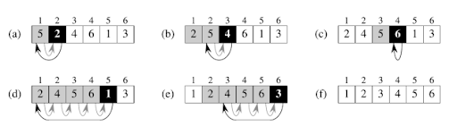

# 2. Tétel: Valószínűség kiszámítása; Rendező algoritmusok

## Valószínűség fogalma és kiszámításának kombinatorikus módszerei (permutációk, variációk, kombinációk).

### Valószínűség fogalma

Minél többször végzünk el egy kísérletet, egy esemény relatív gyakorisága annál jobban megközelít egy számot.
Ez a szám az esemény valószínűsége.

Az esemény valószínűségét $P(A)$-val jelöljük.

### Permutációk

:::info Permutáció
Egy adott $n$ elemű halmaz elemeinek egy ismétlés nélküli permutációjának nevezzük az $n$ **különböző elem egy sorba rendezését**.

Jelölése:

$$
P_{n}
$$

Egy $n$ elemű halmaz összes ismétlés nélküli permutációinak száma $n$ faktoriális, azaz:

$$
P_{n} = n \cdot (n-1) \cdot (n-2) \cdot \ldots \cdot 2 \cdot 1 = n!
$$

:::
:::info Ismétléses permutáció
Ha az $n$ elem között van $k_{1}, k_{2},\ldots, k_{m}$ **egymással megegyező elem**, akkor az elemek egy **sorba rendezését** ismétléses permutációnak nevezzük.

Jelölése:

$$
P_{n}^{(k_{1}, k_{2}, \ldots, k_{m})}
$$

Tehát a különbség a következő: **ismétlés nélküli permutáció** esetén csupa **különböző elemet** rendezünk sorba,
míg **ismétléses permutáció** esetén _vannak megegyező elemek_.

Ha egy $n$ elemű halmazban az $n$ elem között $k_{1}, k_{2}, \ldots, k_{m}$ egymással megegyező elem van, és $k_{1} + k_{2} + \ldots + k_{m} = n$, akkor ezeket az elemeket

$$
P_{n}^{(k_{1}, k_{2}, \ldots, k_{m})} = \frac{n!}{k_{1}! \cdot k_{2}! \cdot \ldots \cdot k_{m}!}
$$

különböző módon lehet sorba rendezni. Ez a halmaz összes ismétléses permutációjának száma.

Pl: hány 5 jegyű szám írható fel 2, 2 ,2 ,7, 7 - ből?

:::

### Variációk

:::info Variáció
Legyen $n$ egymástól különböző elemünk. Ha ezekből $k (k \leq n)$ elemet **kiválasztunk** minden lehetséges módon úgy,
hogy a **kiválasztott elemek sorrendjére tekintettel vagyunk**, akkor az $n$ elem $k$-ad osztályú ismétlés nélküli variációját kapjuk.

Jelölése:

$$
V_{n}^{k}
$$

Ezek száma:

$$
V_{n}^{k} = \frac{n!}{(n-k)!}= n \cdot (n-1) \cdot (n-2) \cdot \ldots \cdot (n-k+1).
$$

Pl: hányféleképpen ülhet le 5 ember közül 3 egymás mellé egy padra?

$5 * 4 * 3 = 60$ (ugyan az, csak másképp)
:::

:::info Ismétléses variáció
Legyen $n$ egymástól különböző elemünk. Ha ezekből $k$ elemet **kiválasztunk** minden lehetséges módon úgy,
hogy a **kiválasztott elemek sorrendjére tekintettel vagyunk** és **ugyanazt az elemet többször is kiválaszthatjuk**,
akkor az $n$ elem $k$-ad osztályú ismétléses variációját kapjuk.
Jelölése:

$$
V_{n}^{k,i}
$$

Ezek száma:

$$
V_{n}^{k,i} = n^{k}
$$

:::

### Kombinációk

:::info Kombináció

Legyen $n$ egymástól különböző elemünk. Ha ezekből $k (k \leq n)$ elemet **kiválasztunk** minden lehetséges módon úgy,
hogy a **kiválasztott elemek sorrendjére nem vagyunk tekintettel**, akkor az $n$ elem $k$-ad osztályú ismétlés nélküli kombinációját kapjuk.
Jelölése:

$$
C_{n}^{k}
$$

Az n elem k-ad osztályú összes ismétlés nélküli kombinációjának száma n alatt a k:

$$
C_{n}^{k} = \frac{n \cdot (n-1) \cdot (n-2) \cdot \ldots \cdot (n-k+1)}{k \cdot (k-1) \cdot \ldots \cdot 2 \cdot 1} = \frac{n!}{k! \cdot (n-k)!} = \binom{n}{k}.
$$

:::
:::info Ismétléses kombináció

Legyen $n$ egymástól különböző elemünk. Ha ezekből $k$ elemet **kiválasztunk** minden lehetséges módon úgy,
hogy a **kiválasztott elemek sorrendjére nem vagyunk tekintettel** és **ugyanazt az elemet többször is kiválaszthatjuk**,
akkor az $n$ elem $k$-ad osztályú ismétléses kombinációját kapjuk.

Jelölése:

$$
C_{n}^{k,i}
$$

Az $n$ elem $k$-ad osztályú összes ismétléses kombinációjának száma $n+k-1$ alatt a $k$:

$$
C_{n}^{k,i} = \frac{(n+k-1)!}{k! \cdot [(n+k-1)-k]! } = \frac{(n+k-1)!}{k! \cdot (n-1)! } = \binom{n+k-1}{k}
$$

:::

## Feltételes valószínűség, függetlenség, Bayes-formula.

### Feltételes valószínűség

:::info Feltételes valószínűség
Azt mondja meg, hogy mekkora az $A$ esemény valószínűsége, ha tudjuk, hogy a $B$ esemény biztosan bekövetkezik.

Jelölése:

$$
P(A|B) = \frac{P(A\cap B)}{P(B)}, \space ha \space P(B)>0
$$

$$
(A \space feltéve \space B) = \frac{P(A \space metszet \space B)}{P(B)}
$$

:::

### Függetlenség

:::info Függetlenség
Hétköznapi értelemben két eseményt akkor nevezünk függetlennek, ha nincsenek egymásra befolyással,
azaz az egyik bekövetkezése esetén a másik esemény bekövetkezésének az esélye sem nem nagyobb, sem nem kisebb.
:::

### Bayes-formula

Akkor használjuk, ha egy korábban bekövetkezett esemény valószínűségét akarjuk kiszámolni egy később bekövetkezett tükrében.

Ha A és B ismert valószínűség, és ezek egyikse sem 0, valamint a P(B|A) feltételes valószínűség, akkor:

$$
P(A|B) = \frac{P(B|A)P(A)}{P(B)}
$$

---

## Algoritmusok lépésszáma: beszúrásos rendezés, összefésüléses rendezés, keresések lineáris és logaritmikus lépésszámmal.

:::info Algoritmus
Olyan eljárás (elemi lépések sorozata), melynek során a következő teljesülnek:

- Minden lépés elvégzése után egyértelműen definiált helyzet
- Véges sok lépés után véget ér
- Feladatosztály tagjaira érvényes
- Jól meghatározott objektumon, jól meghatározott műveletet végez
  :::

### Beszúrásos rendezés

- Tömb elemeinek sorba rendezése.
- Az algoritmus a k-adik lépése előtt az első k-1 elem már rendezett
- A lépés során a k-adik elemet beszúrjuk az első k-1 elem közé az őt nagyság szerint megillető helyre, és a nála nagyobbakat eggyel eltoljuk.
- Nagy tömbök esetén nem hatékony, mivel lépésszáma a legrosszabb és átlagos esetben is négyzetes.
- Kis tömbökre azonban a leggyorsabb algoritmus.
- Legjobb eset, ha a tömb rendezve van alapból.
- **Futási ideje** legrosszabb esetben n \* (n - 1) / 2

:::info Beszúrásos rendezés
A rendezés során sorrendbeli hibát keresünk egy tömbben. Ennek során használhatunk lineáris, illetve bináris keresést.
A kialakult sorrendtől eltérő helyen levő elemet kiemeljük, majd megkeressük a sorrendnek megfelelő helyét.
Amikor a helyét megtaláltuk, akkor a közbeeső elemeket eltoljuk, majd az imént kiemelt elemet a felszabaduló helyre beszúrjuk.
Ez a rendezés túl sok mozgatást igényel.
:::

### Összefésüléses rendezés

- Tömb elemeinek sorba rendezésére.
- Oszd meg és uralkodj elven alapszik.
- A tömböt két részre vágjuk.
- A két résztömböt az uralkodás pontból kifolyólag ismét ketté osztjuk, és ezt addig folytatjuk (rekurzió), míg az egy elemű tömbök szintjét el nem érjük.
- A kapott részeket összefésüli egy nagy, rendezett listává.
- **Futási ideje** a gyorsrendezésével közel azonos, és a kimeneti sorozat hosszával arányos.

:::info Összefésüléses rendezés
Az eddig ismertetett rendező algoritmusoktól eltérő, rekurzív elven működik. A c[1..n] tömb rendezése rekurzívan visszavezethető
a c[1..n/2] és a c[n/2+1..n] tömbszakaszok külön-külön történő rendezésére, és az ezt követő összefésülésükre.
Az általános rendez eljárást egy c[i..j] tömbszakasz rendezésére kell megírnunk. A feladat akkor triviális,
ha a rendezendő tömbszakasz egyelemű (i = j).
:::

### Lineáris keresés

- Segítségével találhatunk meg egy tetszőleges elemet egy nem rendezett tömbben.
- Összehasonlítjuk az elemeket.
- A keresés véget ér, ha megtaláltuk az elemet, vagy elértünk a tömb végére.
- **Futási idő** a tömb méretével lineárisan nő.

:::info Lineáris keresés
A legegyszerűbb keresési algoritmus, amely rendezetlen tömbön dolgozik. A tömb első elemétől kezdve összehasonlítjuk a tömbelemeket a keresendő elemmel.
A keresési ciklus akkor ér véget, ha valamelyik tömbelem megegyezik a keresettel, vagy, ha a tömb végére érünk. Az utóbbi esetben a keresett elem nincs a
tömbben. Az algoritmus onnan kapta nevét, hogy a keresések száma, és így a futási idő, lineáris függvénye a tömb elemszámának.
:::

### Logaritmikus (bináris) keresés

- Segítségével egy elem rendezett tömbben való keresésére valósítható meg.
- A keresés során minden egyes iterációban felezni lehet a résztvevő elemek számát.
- Összehasonlítja a keresett elemet a tömb középső elemével, ha tőle kisebb a keresett elem balra megy és folytatja ezt az összehasonlítást, ha nagyobb, akkor jobbra keres.
- Így egy `n` elemű tömbben O(log n) lépésben megtalálható a keresett elem, vagy megállítható a jelenlétének hiánya. (**futási idő**)

:::info Logaritmikus (bináris) keresés
A logaritmikus vagy bináris keresési algoritmus rendezett tömbön működik, így az előző módszernél lényegesen gyorsabb keresést tesz lehetővé.
A keresendő elemet először a tömb középső eleméhez hasonlítjuk. Ha a két elem egyezik, megtaláltuk a tömbelemet, ha nem,
a keresést abban a tömbfélben folytatjuk, amelyet a középső és a keresett elem viszonya kijelöl. Ha a tömb növekvő sorrendbe rendezett
és a keresendő elem nagyobb, mint a középső elem, akkor a második tömbrészben, egyébként pedig az elsőben folytatjuk a keresést.
A keresést akkor fejezzük be, ha megtaláltuk a keresett tömbelemet, vagy a tömbrész elfogyott. Az összehasonlítások száma,
s így a futási idő, az elemszám kettesalapú logaritmusával arányos, ami nagy elemszámok esetén lényegesen kisebb lehet, mint a lineáris keresés esetén.
:::

## Gyorsrendezés, az összehasonlítások minimális száma.

### Gyorsrendezés

- Tömb elemeinek sorba rendezésére.
- Oszd meg és uralkodj elven alapszik.
- Tömböt két részre osztja, majd ezeket rekurzívan rendezi, gyorsrendezéssel.
- A felbontáshoz kiválaszt egy _"főelemet"_.
- A _"főelemnél"_ kisebb elemeket előre, a nagyobbakat mögé mozgatja.
- Középső elemet érdemes főelemnek választani.
- Futási ideje n \* log n.

:::info Gyorsrendezés (quick-sort)
Ez az algoritmus is rekurzív elven működik. Szétválogatjuk az aktuális tömbszakasz (a[i..j]) elemeit a szakasz első eleme (az a[i] kulcselem) szerint,
majd folytatjuk a rendezést a szakasz kulcselem előtti, illetve mögötti elemei rendezésével.
:::

## Rendezés lineáris lépésszámmal: radix rendezés, vödör rendezés.

### Radix rendezés

- Számjegyes rendezés
- Azonos hosszúságú stringek rendezésére használható, ahol k a szó hossza, d az egy karakteren előforduló lehetséges jegyek, n pedig a bemenő adatok száma.
- Futási idő k \* (n + d)

### Vödör / Edény rendezés

- Alapelve, hogy feltételezzük, hogy a rendezni kívánt tömb elemeit egy olyan algoritmus generálja, ami egyenletesen osztja el az elemeket egy adott intervallumon.
- Rendezés során ezt az adott intervallumot felosztjuk egyenlő részintervallumokra, amelyekbe elhelyezzük az azokba beleillő elemeket.
- Az egyes edényekben a rendezés párhuzamosan zajlik.
- Az itt használt rendezési algoritmus szabadon választható.
- Pl: beszúró rendezés
- Ha a rendezés lezajlott, akkor az elemeket szekvenciálisan (egymás után) vissza kell írnunk a tömbbe.

## További információk

- https://matek4u.hu/kombinatorika-valoszinusegszamitas/
- https://valstat.ktk.pte.hu/feltval.html
- https://gyires.inf.unideb.hu/KMITT/b02/ch09s02.html
