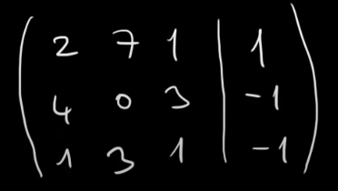
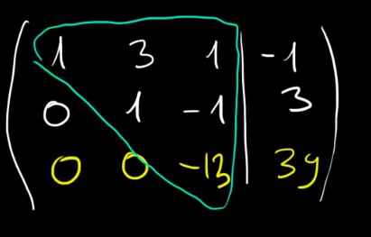
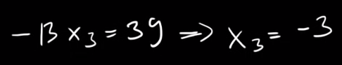
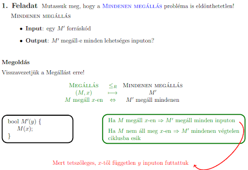

# 7. Tétel: Lineáris egyenletrendszerek; Automaták II

## Lineáris egyenletrendszer fogalma és megoldása Gauss eliminációval.

### Lineáris egyenletrendszer fogalma:

Olyan többismeretlenes egyenletrendszer, ahol minden ismeretlen első hatványon szerepel.

### Megoldása Gauss-eliminációval:

- Az egyenletrendszert felírjuk egy mátrix alakként, ő lesz az együtthatómátrix.
- Az együtthatómátrix mellé felírom az egyenlőségjel jobb oldalán található értékeket.

- Ahol mindegyik sor egy egyenlet.
- A cél, egy felső háromszögmátrix kialakítása.
- A sorok felcserélhetőek, a cél, hogy a főátló alatt minden szám 0 legyen.
- A sorok kivonhatóak egymásból vagy éppen összeadhatóak és egy sor szorozható annak érdekében, hogy elérjük a várt eredményt.
  - (főátló alatt minden 0 legyen)
- Így, ha kijött a várt eredmény, az x3 értéke kiszámolható.

- Ebből a többi x értéke is kiszámolható.

---

## Determinisztikus Turing-gépek, lineárisan korlátozott automaták, eldönthetetlen problémák, tár és idő korlátok.

### Determinisztikus Turing-gép:

- Először a legegyszerűbb változatát definiáljuk a Turing-gépnek, az egyszalagos Turing-gépet.
  - Ekkor a gépnek egyetlen szalagja van, egy író-olvasó fejjel, mely mindkét irányba tud mozogni a szalagon.
- A gép **kezdetben a q0 állapotban van**, a szalag elején a bemeneti szó található a szalag többi része szimbólumokkal van feltöltve és a fej a szalag első (bal szélső) mezőjén áll.
  - **Ez a gép kezdő helyzete**.
- A gép minden lépésben beolvassa a szalagon az aktuális karaktert, majd ennek, és az eddigi állapotnak a hatására változik az állapota, módosíthatja az író-olvasó fej alatt látott karaktert, majd lép a szalagon egyet jobbra vagy balra, esetleg helyben marad.
- Az **átmeneti függvény** azt írja le, hogy egy lépés során mit tesz a gép megadhatja, hogy ha a gép q állapotban van, a betűt olvas a szalagról akkor **q' állapotba kerül**, az olvasott **a-t felülírja b-vel**, majd a szalagot olvasó és **író fej D irányba lép**.
- A Turing-gép egy számítás során a **kezdőhelyzetből indulva az átmeneti függvénynek megfelelő lépések sorozatát hajtja végre.**
- Ha a szalag elején balra lépne, akkor a gép hibával megáll.
- Egyébként a működés akkor ér véget, ha nem tud lépni, elakad, mert az adott belső állapotra nincs értelmezve a függvény.
- A gép **akkor fogadja el a bemeneti szót**, ha ez az elakadás F-beli állapotban történik.
- **Használat közben előfordulhat, hogy a Turing-gép:**
  - Leáll elfogadó állapotban
  - Leáll hibával
  - Leáll nem elfogadó állapotban
  - A gép sosem áll le a bemenet hatására.
- **Turing-gép egy rendezett hetes:**
  - $Q$ **belső állapotok véges halmaza**
  - $q0$ **kezdőállapot**
  - $V$ **szalagábécé**
  - $T$ **inputábécé (T eleme V-nek)**
  - $#$ **szóköz betű**
  - $F$ **végállapotok halmaza**
  - $d$ **gép mozgásfüggvénye (bal, jobb)**

### Lineárisan korlátozott automata:

- Környezetfüggő nyelveket fogadja el.
- Az automata egy véges vezérlővel rendelkezik és egy szalaggal, amelyen kezdetben az input szó áll.
- Az automata a működése során **két lényeges eltérést mutat** az eddig tárgyalt automatákhoz képest:
  - Az egyik, hogy a szalagon a **fej előre és hátra is mozoghat**
  - A másik, még lényegesebb, hogy **nem csak olvashatja a szalagot, de annak tartalmát át is írhatja**, ennek megfelelően nem olvasó, hanem író-olvasó fejről beszélünk.
- **7 részből áll:**
  - $Q$ **belső állapotok véges halmaza**
  - $q0$ **kezdőállapot**
  - $V$ **szalagábécé**
  - $T$ **inputábécé (T eleme V-nek)**
  - $#$ **speciális jel**
  - $F$ **végállapotok halmaza**
  - $d$ **gép mozgásfüggvénye (bal, jobb, helyben)**
- Akkor mondjuk, hogy az automata elfogadja az input szót, ha végállapotba jut.
- $#$ (speciális jelek) nem írhatóak felül.
- Az automata csak az eredeti input által elfoglalt területet használhatja számolásra.

### Eldönthetetlen problémák:

- Egy probléma eldönthetetlen, ha nincs egyáltalán őt eldöntő algoritmus.

### Tár és idő korlátok:

- Néhány feladat megoldhatósága messze lehet a gyakorlati megoldhatóságtól.
- Egy **Turing-gép időigénye az a time függvény**, mely a gép lépésszámának maximumát adja meg n hosszúságú bemenet esetén.
- Tegyük fel, hogy a gépnek el kell olvasnia minden bemenetet:
  - Ekkor a **space tárigény függvény úgy definiáljuk**, mint a gép szalagjain azon különböző mezők maximális számát az n hosszúságú bemenetek esetén, melyekre a gép ír.

## Nemdeterminisztikus Turing-gépek, nevezetes nyelvosztályok, P, NP.

### Nemdeterminisztikus Turing-gép:

- A fő különbség a determinisztikus változathoz képest tehát az, hogy **most egy állapot és egy olvasott karakter hatására többféle műveletet is végezhet** a Turing-gép.
- Ellentétben a véges automatával és a veremautomatával, a nemdeterminisztikus **Turing-gép esetén nem kell külön átmenetekkel bajlódnunk**.
- Ha meg akarjuk engedni, hogy a gép **léphessen úgy, hogy a fej alatt álló karaktert nem olvassa el**, akkor ezt megtehetjük egy olyan szabálycsoport létrehozásával, melyben a fej bármit is olvas, ugyanazt írja vissza és a fej helyben marad.
- **Egy adott bemeneti szó esetén a gép lehetséges számításait egy úgynevezett számítási fával is leírhatjuk.**
- A fa gyökere a kezdőállapot, csúcsai a gép állapotai, elágazása pedig az adott állapotban lehetséges lépések.
- Akkor fogadja el az állapotát, ha a fában van elfogadó levél, és a belső állapota elfogadó.

### Nevezetes nyelvosztályok:

- A determinisztikus Turing-gép akkor fogad el egy inputot, ha azzal indítva leáll.
- A nemdeterminisztikus Turing-gép ugyanannál az inputnál más és más lépést sorozatokat hajthat végre, egyes esetekben megáll, máskor pedig nem.
- **PSPACE**:
  - Determinisztikus Turing-géppel polinomiális időben kiszámolható problémák osztálya.
- **NPSPACE**:
  - Nemdeterminisztikus Turing-géppel polinomiális időben kiszámolható problémák osztálya.
- **A PSPACE és NPSPACE problémaosztály egybeesik.**

## További információk
