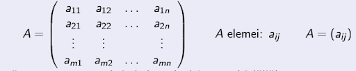
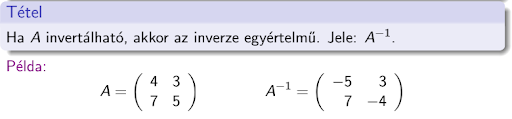
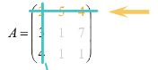
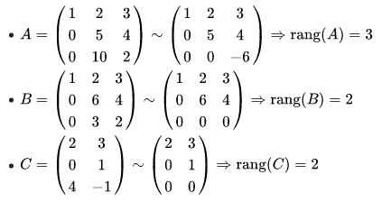
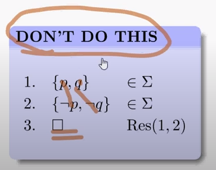

# 5. Tétel: Mátrixok; Logikai problémák

## Mátrix fogalma, műveletek, determináns, rang.

### Mátrix:

- Egy m sorral és n oszloppal rendelkező számtáblázatot m x n-es mátrixnak nevezünk.
- Az összes m x n-es mátrix halmazát Mmxn-nel jelöljük.
- Ha n = m, akkor a mátrix négyzetes vagy kvadratikus.
- A mátrix főátlója alatt az (a11,a22,...amn) szám k-ast értjük.
- Két mátrix egyenlő, ha azonos típusúak (azaz ugyanannyi soruk és oszlopuk van), és a megfelelő elemeik megegyeznek.
- Azt az n x n-es mátrixot, melynek főátlójában csupa 1-es áll, minden más eleme 0, n-edrendű egységmátrixnak nevezzük.

### Műveletek:

#### Mátrixok összeadása

-Csak azonos típusú mátrixokat tudunk összeadni.
-Vagyis egy $n * k$-as mátrixhoz, csak egy másik $n * k$-as mátrixot tudunk hozzáadni. (sor és oszlopszám egyezik)
-Azonos sor és oszlop-beli elemeket összeadjuk.

#### Mátrixok skalárral való szorzása

- Elemenként végezzük, azaz ha $λ ∈ R$, $A = (aij) ∈ Mmxn$, akkor $λ*A = (λaij) ∈ Mmxn$
- Mátrixot megszorozzuk egy számmal, vagyis a mátrix minden elemét megszorozzuk vele.

#### Mátrixszorzás

- Egy $n * k$-as mátrixszal csak egy $k * m$-es mátrixot szorozhatunk.
- Vagyis az a szorzásban szereplő első mátrix arra kell, hogy végződjön, amivel a következő kezdődik.
  - $(n * k)*(k * m) = (n * m)$
- Szorzat mátrixnak annyi sora lesz, mint $A$-nak és annyi oszlopa, mint $B$-nek.
- Elemei úgy keletkeznek, hogy $A$ egyik sorát szorozzuk $B$ egyik oszlopával.

### Mátrixok inverze:

- Azt mondjuk az A n-edrendű négyzetes mátrixról, hogy létezik inverze, ha létezik olyan B n-edrendű négyzetes (kvadratikus) mátrix, hogy a szorzatuk egységmátrix.
- $A * A-1 = E$

### Mátrixok determinánsa:

- Nem más, mint egy négyzetes mátrixhoz rendelt szám.
- **2x2 mátrix esetén**:
  - Mátrix minden sorából és oszlopából kiválasztunk egy és csak egy elemet, majd ezeket összeszorozzuk.
  - Ezt az összes lehetséges módon megtesszük, majd ellátjuk egy előjellel.
- **3x3 mátrix esetén**:
  - Kiszámolása saurrusz szabály néven ismert.
  - Fogjuk a mátrixot, majd saját maga mögé leírjuk még egyszer.
  - Majd vesszük a főátlókat és a mellékátlókat.
    - Főátlók elemeit összeszorozzuk és pozitív előjellel vesszük
    - A mellékátlók elemeit is összeszorozzuk, de azokat negatív előjellel vesszük.

- **Kifejtési tétel**:
  - Minden n x n-es mátrixra jó.
  - Kifejtése sorok szerint történik.
    - Pl: vegyük az első sor elemeit, és alkalmazzuk rá a kifejtési tételt.
  - Váltakozó előjellel kell venni az elemeket.
    - Sakktábla szabályt megjegyezzük.
  - Vesszük az első elemet, leírjuk az adott előjellel, majd megszorozzuk az aldeterminánssal, és így tovább..
  - Aldeterminánsok pedig úgy keletkeznek, hogy az adott elem sorát és oszlopát egyszerűen kihúzzuk.
  - Ami marad, az lesz az aldetermináns
  - Az aldeterminánsokat pedig 2 x 2 mátrixok determinánsaként kiszámoljuk.

- **Gauss-elimináció**:

  - A mátrixot felső háromszög alakúra hozzuk (főátló alatt csupa 0), ekkor a determináns éppen a főátlóbeli elemek szorzata.

- **Mátrix rangja**:
  - Mátrixot a Gauss-elimináció segítségével alakítjuk át ekvivalens mátrixba.
  - Átalakítás után a nemnulla együtthatókkal rendelkező sorvektorok száma megfelel a mátrix rangjának.

## Speciális mátrixok, inverz.

### Kvadratikus mátrix:

- Ugyanannyi sora van, mint oszlopa
- $(n * n)$

### Diagonális mátrix:

- Olyan kvadratikus mátrix, aminek a főátlóján kívüli elemek nullák.

### Egységmátrix:

- Olyan diagonális mátrix, amelynek minden főátló-eleme egy.

### Inverz mátrix:

- $A^{-1}$
- $A * A^{-1}  = I$, vagyis az egységmátrix-szal.
  - Lehet:
    - **Jobb inverz**
      - $A * A^{-1}  = I$
    - **Bal inverz**
      - $A^{-1} * A  = I$

### Transzponált:

- Sorokból oszlopot, oszlopokból sort gyárt.
- Jele: $A^{T}$ vagy $A*$
- Az olyan mátrixok, melyeknek transzponáltja önmaga, szimmetrikus mátrixoknak nevezzük.

## Mátrix, mint lineáris transzformáció.

- Egy **fí** (Φ φ) lineáris leképezés egy lineáris transzformáció, ha $V1 = V2$.
- Egy lineáris transzformáció különböző bázisokra vonatkozó mátrixainak megegyezik a rangja és a determinánsa.

## Sajátérték, sajátvektor.

### Vektor:

- A számok egyfajta általánosításának is tekinthetőek.

### Sajátvektor, sajátérték:

- Legyen A egy $n * n$-es mátrix.
- Az a $v$ nem nulla vektor, melyre igaz, hogy $A*v = λ*v$
- Ahol a $λ (lambda)$ valamilyen valós szám, és a $λ$ a saját értéke.

---

## A problémaredukciós reprezentáció és az ÉS/VAGY gráfok

### Problémaredukció:

- Egy adott problémát úgy próbálunk megoldani, hogy több külön-külön megoldandó részproblémára bontjuk.
- Ha a részproblémákat megoldjuk, az eredeti probléma megoldását is megkapjuk.
- A részproblémák megoldását további részek megoldására vezetjük vissza, egészen addig, amíg csupa olyan problémához nem jutunk, amelyeket egyszerűségüknél fogva már könnyedén meg tudunk oldani.

### Problémaredukciós reprezentáció:

- Legyen $p$ egy probléma.
- Azt mondjuk, hogy a $p$ problémát problémaredukciós reprezentációval írtuk le, ha megadtuk a:
  - $〈P,p,E,R〉$ négyest, azaz
  - A megoldandó $p ∈ P$ problémát,
  - A $P$ nem üres halmazt, a $p$ problémához hasonló problémák halmazát
  - Az egyszerű problémák $E$ halmazát
  - A redukciós operátorok $R$ nemüres, véges halmazát

### ÉS/VAGY gráf:

- Legyen a p probléma a $〈P,p,E,R〉$ reprezentációval megadva.
- Ez a reprezentáció is egy irányított gráfot, úgynevezett ÉS/VAGY gráfot határoz meg.
- A $P$ problémahalmaz elemei (a problémák) a gráf csúcsai.
  - Vezessük be a $q$ probléma által definiált csúcsra az $nq$ jelölést
    - Halmaza az $N$
- A gráf csúcsai közül kitüntetett szerepet játszanak a $p$ problémát szemléltető úgynevezett startcsúcs
  - Jele: $s$
- És az egyértelmű problémákat szemléltető terminális csúcsok.
  - Jele: $ne$
    - Halmaza a $T$
- Egy $q$ eleme $P$ problémát szemléltető csúcsból irányított éleket húzunk a problémákat szemléltető $nq$ csúcsokba.
- Ezek az élek összetartozónak tekinthetőek
  - Egy ÉS élköltséget vagy hiperélt alkotnak.
  - A gráf hiperéleinek halmaza az $E$
- Tehát azt mondjuk, hogy az $〈N,s,T,E〉$ irányított ÉS/VAGY gráf a p probléma $〈P,p,E,R〉$ problémaredukciós reprezentációjához tartozó reprezentációs gráfja.
- Az ÉS/VAGY gráfot olyan problémák reprezentálására alkalmazzuk, ahol a feladat felírható logikai állítások konjunkciójaként és diszjunkciójaként.
- Tehát a probléma végrehajtásánál a probléma szétválhat egy egy valamilyen formában eltérő problémára vagy alfeladatra (vagy kapcsolat), vagy egy adott probléma feladatot egyszerre kell megoldani (és kapcsolat).
- A gráfokkal további vizsgálatokat, átalakításokat vihetünk a feladatba, így könnyebben tudjuk elemezni a rendszerünket.

## Ismeretreprezentációs technikák, bizonytalanság-kezelés (fuzzy logika).

### Ismeretreprezentációs technikák:

Az ismeretreprezentáció azzal foglalkozik, hogy milyen eszközökkel lehet a tudás egy részét (az ismeretet) a számítógépen ábrázolni.

**Reprezentáció szintjei**:

1. Tudásszint
   - Valós világ tudati megjelenítése
   - Explicit tudás:
     - Közölt, szavakkal leírt
   - Implicit tudás:
     - Potenciálisan közölhető, leírható tudás
   - Rejtett, hallgatólagos tudás:
     - Nem közölhető, nem leírható
2. Szimbólikus szint
   - A tudás explicit vagy korábban közölt részeinek szimbólikus leírása
3. Technikai szint
   - A szimbólikus leírás számítógépes ábrázolása, algoritmusokkal, adatszerkezetekkel

**Ismeretreprezentációs módszerek** (Osztályozás szerint):

1. Osztály
   - **Proceduláris (algoritmikus) reprezentáció**
     - Stratégiát ad arra, hogy hogyan oldjuk meg a feladatot.
   - **Dekleratív (leíró) reprezentáció**
     - Csak azt írjuk le, mit kell megoldani
2. Osztály
   - **Logikai reprezentáció**
     - Struktúra nélküli dolgok leírására szolgál
   - **Strukturált reprezentáció**
     - Belső struktúrával rendelkező dolgok, objektumok és kapcsolataik leírására.
3. Osztály
   - **Procedurális reprezentáció**
     - Valamely programozási nyelven leírt vezérlést módosító eljárások
   - **Logikai alapú reprezentáció**
     - Szabályalapú reprezentáció
   - **Strukturált reprezentáció**
     - Asszociatív hálók, döntési fák, rokonsági hierarchiák
   - **Hibrid reprezentáció**
     - Többféle reprezentációt egyszerre támogató módszerek

**Reprezentációs modellek**:

- állapottér -reprezentáció
- Logikai reprezentáció
- Probléma redukció
- Elosztott reprezentáció
- Strukturált objektum alapú reprezentáció

### Fuzzy logika:

- A fuzzy logika célja, hogy olyan módszerekkel szolgáljon, amelyekkel olyan problémák oldhatók meg, amelyek túlságosan bonyolultak, vagy nehezen megfogalmazhatóak a hagyományos vizsgálati módszerekkel.
- A logika formailag Arisztotelész tanításain alapul, ahol egy elem vagy tagja, vagy nem tagja egy halmaznak.
- Ha igen, akkor 1 (egy), ha nem akkor 0 (nulla) értéket vesz fel a logikai változó.
- Csak közelítő megoldás lehet.
- A 0 és 1 közötti értékek a bizonytalanságot reprezentálják.
- Alkalmazási technikái megtalálhatóak az automatizálási technikákban, üzemgazdaságban, orvosi technikában, szórakoztató elektronikában stb
- Tipikus alkalmazása a mosógépek oly módon történő programozása, hogy a gép a tisztítandó textíliák szennyezettségének függvényében adagolja a mosószert.
- A gondolatmenet kiindulópontja, hogy a ruhák szennyességi foka nem egyértelműen meghatározható. Példának okáért, nem létezik egy 55%-os szennyezettségi fok definíció.
- Mivel azonban a mosószer mennyisége pontosan meghatározandó, ezért egy olyan logikára van szükség, amely pontatlan, életlen fogalmakkal, mint "enyhén szennyes" vagy "erősen koszolódott" is bánni tud.
- Alapja a fuzzy halmazok (élettelen, elmosódott halmazok)
- A hozzárendelő függvények a fuzzy függvények.

## A rezolúciós kalkulus.

**Klóz**:

- Literálok egy halmaza
- Ha nem tartalmaz literált, akkor üres a klóz.
- Az üres klóz kielégíthetetlen.
- Ahhoz, hogy egy klóz kielégíthető legyen, legalább egy literáljának igaznak kell lennie.

**Rezolvens**:

- Ha $C$ és $D$ klózok, $p$ eleme $C$ és $negált p$ eleme $D$, akkor
  - $C$ és $D$ ($p$ menti) rezolvense a
    - $(C - {p}) unió (D - {negált p} )$

**Rezolúciós eljárás**:

- **Input**: $S$ klózhalmaz.
- **Output**: $S$ kielégíthető vagy kielégíthetetlen.
- **Algoritmus**:
  - Klózokról listát vezetünk
  - Egy klózt felvehetünk, ha $S$ beli
  - Vagy két, a listán már szereplő klóz rezolvense.
- Mindaddig csináljuk ezt, míg az üres klóz rá nem kerül a listára, akkor kielégíthetetlen lesz.
- Ha már nem tudunk új klózt felvenni és nem jött ki az üres klóz, akkor kielégíthető.

**A rezolúciós algoritmus**:

- Helyes:
  - Ha az algoritmus kielégíthetetlen válasszál áll meg, akkor az input S valóban kielégíthetetlen.
    - Ha azt mondom, hogy igen, akkor a válasznak tényleg igennek kellene lennie.
- Teljes:
  - Ha S kielégíthetetlen, akkor az algoritmus mindig kielégíthetetlen válasszal áll meg.
    - Ha a válasznak igennek kellene lennie, akkor én arra előbb utóbb rá is jövök.
- Viszont a rezolúció nem helyes, ha több literál mentén rezolválunk egyszerre.

## A logikai program és az SLD rezolúció.

### Logikai program, logikai programozás:

- **Logikai program**:
  - Tudást ír le, melyet a gép a neki feltett kérdésekre való válaszoláshoz felhasznál.
- Ahhoz, hogy állításokat fogalmazzunk meg, szükség van az állításban szereplő objektumok leírására, amelyet termekkel oldhatunk meg.
- Az állításaink lehetnek egyszerűek és összetettek.
  - Az egyszerű állításokat tényeknek nevezzük, leírt formában atomi formulák.
- Prolog programokban Horn-klózok szerepelhetnek.
- **Horn-klóz**:
  - Olyan zárt klóz, melyben véges sok negált atomi formula van, diszjunkció által összekapcsolva, és legfeljebb egy negálatlan formula.

- Prolog maga deklaratív nyelv.
  - Jelentése, leírjuk, hogy mit szeretnénk kapni.
- **Működése**:
  - Meg kell adni egy célklózt, ezután a program ellenőrzi, hogy a célklóz a logikai program logikai következményei közt van-e.

### SLD rezolúció:

- Vegyük a P programot és egy negált állítást, ami diszjunkciók sorozatával van megadva.
- Cél, hogy a gép a B-beli diszjunkciókból tüntesse el az atomi formulákat, tehát B legyen üres, ekkor eljutott egy hamis formuláig.
- Ehhez a gép B-ben cserélgetni kezdi a formulákat, egyet kiválaszt, majd kicseréli egy vagy több negált atomi formula diszjunkciójára.
- Vagyis:
  - Kiválaszt egy negált formulát a megadott formulánkból, és kiválaszt egy klózfejet a P programból.
  - Ha ez a kettő egyezik, akkor a negált formulát kicseréli a klóz törzsére.
  - Egyesítés előtt a változókat átnevezi, hogy ne ütközzenek.

## A logikai programozás alapvető módszerei.

## További információk
