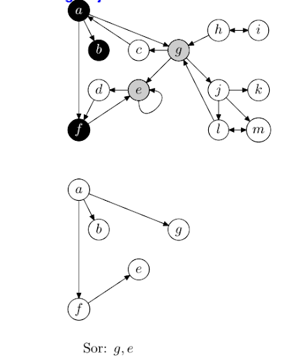
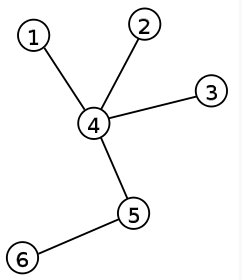

# 6. Tétel: Gráfok; Automaták I

## Gráf fogalma és megadásának módjai.

### Gráf fogalma:

- Gráfnak nevezzük pontoknak és éleknek a halmazát, ahol az élek pontokat kötnek össze, illetve az élekre pontok illeszkednek úgy, hogy minden élre legalább egy, legfeljebb két pont illeszkedik.
- A gráfok pontjait egyszerűen pontoknak, vagy csúcspontoknak, vagy csúcsoknak nevezzük. A gráf pontjait nagy betűkkel, az éleit kis betűkkel jelöljük.
- Hálós adatszerkezet.

## Egyszerű, irányított és irányítatlan gráfok.

### Egyszerű gráf:

- Egy gráf egyszerű, ha nincs benne sem többszörös él, sem hurokél.

### Irányított gráf:

- Az éleknek irányuk van, végpontok között nincs különbség.

### Irányítatlan gráf:

- Az éleknek nincs irány elrendelve, vagyis nem teszünk különbséget A-ból B-be, illetve B-ből A-ba menő élek között.

## Séta, út, összefüggőség.

### Gráf összefüggő:

- Ha bármelyik csúcsából el lehet jutni másik csúcsba élek mentén.

### Út:

- Élek olyan sorozata, melyben nem ismétlünk sem éleket, sem csúcsokat.

### Séta:

- Egy séta csúcsok és élek váltakozó sorozata, mely csúccsal kezdődik és csúcsban végződik..

### Gráffal végezhető műveletek:

- **Létrehozás**
  - Üres gráfot hozunk létre
- **Bővítés**
  - Az új elem értéke mellett meg kell adni a megelőzőinek és a rákövetkezőinek a listáját is.
- **Törlés**
  - fizikai
- **Csere**
- **Rendezés**
- **Keresés, elérés, feldolgozás**
- **Bejárás**
  - Szélességi vagy mélységi

### Szélességi bejárás:

- A bejárás során az adatelemeket fehér, szürke és fekete színűre fogjuk színezni, valamint egy sort fogunk használni a szürke színű adatelemek tárolására.
- A bejárás során a feldolgozott elemekből feszítőfákat építünk fel.

1. Színezzük a gráf adatelemeit fehér színűre és hozzuk létre az üres sort.
2. Ha minden adatelem fekete színű, a bejárás véget ér.
3. Ha a sor üres, válasszunk tetszőlegesen egy fehér színű elemet, színezzük szürkére, és helyezzük el a sorban. Ennek az elemnek a feldolgozásakor új feszítőfát fogunk elkezdeni építeni.
4. Ha a sorban van elem, vegyük ki a sor első elemét, fehér színű gyermekeit szürkére festve helyezzük el a sorban, majd az adatelemet fessük feketére, és helyezzük el a megfelelő feszítőfában.
5. Folytassuk az algoritmust a 2. lépéssel.

### Mélységi bejárás:

- A bejárás során az adatelemeket fehér, szürke és fekete színűre fogjuk színezni, valamint egy vermet fogunk használni a szürke színű adatelemek tárolására
- A bejárás során a feldolgozott elemekből feszítőfákat építünk fel.

1. Színezzük a gráf adatelemeit fehér színűre és hozzuk létre az üres sort.
2. Ha minden adatelem fekete színű, a bejárás véget ér.
3. Ha a sor üres, válasszunk tetszőlegesen egy fehér színű elemet, színezzük szürkére, és helyezzük el a sorban. Ennek az elemnek a feldolgozásakor új feszítőfát fogunk elkezdeni építeni.
4. Ha a veremben van elem, vegyük ki a verem első elemét, fehér színű gyermekeit szürkére festve helyezzük el a veremben, majd az adatelemet fessük feketére, és helyezzük el a megfelelő feszítőfában.
5. Folytassuk az algoritmust a 2. lépéssel.

## Nevezetes gráfok: páros gráf, teljes gráf, fa, kör, súlyozott gráf.

### Páros gráf:

- Páros gráfnak nevezünk egy G gráfot, ha G csúcsainak halmazát fel tudjuk úgy osztani egy A és B halmazra, hogy az összes G-beli élre teljesül, hogy az egyik végpontja A-ban van, a másik pedig B-ben.

### Teljes gráf:

- Egy olyan egyszerű gráf, amelynek minden csúcsa össze van kötve minden más csúccsal.

### Fa:

- Fának nevezzük azokat a gráfokat, amelynek bármely két csúcsát pontosan egy út köti össze, azaz a fák körmentes összefüggő gráfok.

### Kör:

- Körnek nevezzük azt az utat, amelynek kezdő és végpontja azonos, és az élek és pontok egynél többször nem szerepelhetnek.

### Súlyozott gráf:

- A gráf minden éléhez számértéket rendelünk, az él súlyát.
- Az élsúlyok legtöbbször valós számok.
- Egy út súlya az őt alkotó élek összsúlya.

---

## Generatív nyelvtanok, nyelvosztályok, a Chomsky-hierarchia.

### Generatív nyelvtan:

- Azon szabályok halmaza, amelyekkel minden, a nyelvben lehetséges jelsorozat előállítható, azaz leírja, hogyan lehet előállítani egy átírási eljárással a kitüntetett kezdő szimbólumból a többi jelsorozatot.
- A szabályokat egymás után kell alkalmazni a kezdő szimbólum átalakítására.

  - Pl:

- A $G = (N, T , S , H)$ rendezett négyest generatív nyelvtannak nevezzük, ha
  - $N$ és $T$ véges ábécék
  - $N$ elemei nemterminális jelnek nevezzük és nagybetűkkel jelöljük
  - $T$ elemei terminális jelnek nevezzük és általában kisbetűvel jelöljük
  - $H$ elemeit képző párokat helyettesítési szabályoknak nevezzük.
    - $p -> q$ jelöljük
  - $S$ a generálás kiinduló eleme

### Nyelvtan osztályok, Chomsky-hierarchia:

- A formális nyelveket osztályokra osztja növekvő kifejezőerő szerint.
- Ez annyit jelent, hogy minden egymás után következő osztály előállíthatja a formális nyelvnek egy az előtt álló osztálynál tágabb csoportját.
- Type-0 (**Kötetlen nyelvek**)
  - Minden formális nyelvet magába foglal.
  - Ő generálja az összes nyelvet, amit a turing gép felismer.
- Type-1 (**Környezetfüggő nyelvek**)
  - Vannak szabályai, bal oldalán nem terminális áll stringekkel, jobb oldalán csak stringek
  - (a string terminálisokból és/vagy nem terminálisokból épül fel)
  - Azok a nyelvek, melyeket egy lineáris korlátozott automata felismer.
- Type-2 (**Környezetfüggetlen nyelvek**)
  - Szabályai, bal oldalán nem terminális, jobb oldalán string
  - (a string terminálisokból és/vagy nem terminálisokból épül fel)
  - Azok a nyelvek, melyeket egy nemdeterminisztikus automata felismer.
- Type-3 (**Reguláris nyelvek**)
  - Szabályai, bal oldalán nem terminális, jobb oldalán terminális, amit követhet egy nem terminális is.
  - Az összes nyelv, amit véges automatával el lehet dönteni.

## Véges automaták, lineáris idejű felismerés, veremautomaták.

### Automata:

- Egy olyan absztrakt rendszer, mely belső állapotait megadott szabályok szerint változtatja külső ingerek hatására.
- Az ingerekre adott válasz függ mind az ingerektől mind pedig a pillanatnyi belső állapottól.
- Ebben az értelemben tehát nemcsak a gépek, hanem bármiféle élő vagy élettelen objektumok tekinthetők automatának, ha ezen séma szerint vizsgáljuk őket.

### Automata megadása:

- Egy automatát akkor tekintünk adottnak, ha a hozzá tartozó halmazok és függvények adottak.

### Reguláris nyelv:

- Minden esetben egy formális nyelv
- Leírható reguláris kifejezések alkalmazásával.
- Elfogadja egy determinisztikus véges állapotú gép
- Elfogadja egy nemdeterminisztikus véges állapotú gép
- Elfogadja egy csak olvasó turing-gép

### Nemdeterminisztikus automata:

- Egy **véges állapotú gép**, ahol bármelyik állapot-bejövő szimbólum párhoz több következő állapot is tartozhat.
- Nemdeterminisztikus kimenőjel nélküli automatának tekinthető a dobókocka, melynek egyetlen bemenő jele a feldobás.
- Ezen bemenő jel, azaz a feldobás hatására a dobókocka a hat lehetséges állapotából átmehet a hat lehetséges állapot bármelyikébe annak megfelelően, hogy a feldobás után éppen melyik lapjára esik.

### Determinisztikus automata:

- Egy **véges állapotú gép**, ahol minden állapot-bejövő szimbólum párhoz egy és csakis egy másik állapotba való átmenet tartozik.

### Lineáris idejű felismerés:

- A reguláris nyelvek esetén a szóprobléma nagyon hatékonyan megoldható.
- Ha megszerkesztünk egy az adott nyelvet elfogadó determinisztikus véges automatát, akkor annak segítségével a szót betűnként elolvasva végig követve az automata futását (legkésőbb) a szó végére érve megkapjuk a választ a kérdésre:
- ha végállapotba jutottunk a szó végén, akkor a szó benne van az adott reguláris nyelvben
- Ha nem végállapotba jutottunk, vagy (parciális automata esetén) időközben elakadtunk a feldolgozással, akkor a keresett szó nincs a nyelvben.
- Tehát a probléma valós időben megoldható, ahány betűből áll az input szó, annyi lépés után tudjuk a választ.

### Veremautomaták:

- Ha a véges automata definíciójában az állapothalmaz végességére vonatkozó követelményt elhagyjuk, akkor végtelen automata fogalmához jutunk.
- A véges bemenő szót egy inputszalagon kapja meg.
- Ha az input szalagon egy nem üresszó van, és a veremautomata úgy áll meg a végállapotban, hogy előzőleg input szalag utolsó betűjét is beolvasta, akkor azt mondjuk, hogy a veremautomata az input szalagon lévő szót elfogadta.
- Veremautomata üres szót is elfogad, ha van olyan futásmódja, ami elfogadja.
- Veremautomata által elfogadott nyelvek osztálya épp a környezetfüggetlen nyelvek osztálya.
- **Veremautomata alatt egy olyan rendezett hatost értünk**, amiben szerepel a:
  - **Állapotok halmaza** (Q)
  - **Kezdőállapot** (q0)
  - **Végállapotok halmaza** (F)
  - **Input ábécé** (Σ)
  - **Verem ábécé** (Γ)
  - **Átmenet függvény** (δ)

## További információk
